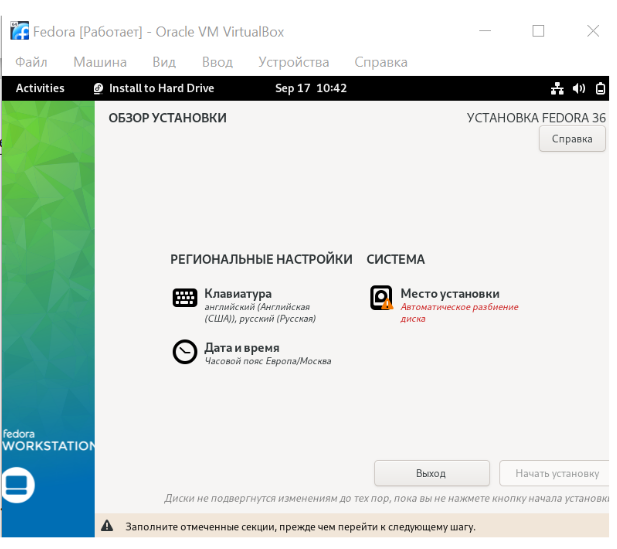

---
## Front matter
title: "Лабораторная работа № 1"
subtitle: "Операционные системы"
author: "Голованова Мария Константиновна"

## Generic otions
lang: ru-RU
toc-title: "Содержание"

## Bibliography
bibliography: bib/cite.bib
csl: pandoc/csl/gost-r-7-0-5-2008-numeric.csl

## Pdf output format
toc: true # Table of contents
toc-depth: 2
lof: true # List of figures
lot: true # List of tables
fontsize: 12pt
linestretch: 1.5
papersize: a4
documentclass: scrreprt
## I18n polyglossia
polyglossia-lang:
  name: russian
  options:
	- spelling=modern
	- babelshorthands=true
polyglossia-otherlangs:
  name: english
## I18n babel
babel-lang: russian
babel-otherlangs: english
## Fonts
mainfont: PT Serif
romanfont: PT Serif
sansfont: PT Sans
monofont: PT Mono
mainfontoptions: Ligatures=TeX
romanfontoptions: Ligatures=TeX
sansfontoptions: Ligatures=TeX,Scale=MatchLowercase
monofontoptions: Scale=MatchLowercase,Scale=0.9
## Biblatex
biblatex: true
biblio-style: "gost-numeric"
biblatexoptions:
  - parentracker=true
  - backend=biber
  - hyperref=auto
  - language=auto
  - autolang=other*
  - citestyle=gost-numeric
## Pandoc-crossref LaTeX customization
figureTitle: "Рис."
tableTitle: "Таблица"
listingTitle: "Листинг"
lofTitle: "Список иллюстраций"
lotTitle: "Список таблиц"
lolTitle: "Листинги"
## Misc options
indent: true
header-includes:
  - \usepackage{indentfirst}
  - \usepackage{float} # keep figures where there are in the text
  - \floatplacement{figure}{H} # keep figures where there are in the text
---

# Цель работы

Целью данной работы является приобретение практических навыков установки операционной системы на виртуальную машину, настройки минимально необходимых для дальнейшей работы сервисов.

# Задание

Установить операционную систему на виртуальную машину и осуществить настройку минимально необходимых для работы серверов.

# Теоретическое введение

# Выполнение лабораторной работы

## Настройка каталога для виртуальных машин

Я запустила терминал и создала каталог с именем пользователя.
Запустила виртуальную машину. Проверила в свойствах VirtualBox месторасположение каталога для виртуальных машин. (рис. [-@fig:001]).

{#fig:001 width=70%}

## Настройка хост-клавиши

Я сменила комбинацию для хост-клавиши, которая используется для освобождения курсора мыши, который может захватить виртуальная машина. Файл Свойства, вкладка Ввод Виртуальная машина (рис. [-@fig:002]).

{#fig:002 width=70%}

## Создание виртуальной машины

Я создала новую виртуальную машину, для этого в VirtualBox выбрала Машина Создать и указала имя виртуальной машины (мой логин в дисплейном классе), тип операционной системы – Linux, Fedora (рис. [-@fig:003]).

{#fig:003 width=70%}

Я указала размер основной памяти виртуальной машины – от 2048 МБ(рис. [-@fig:004]).

{#fig:004 width=70%}

Я задала конфигурацию жёсткого диска – загрузочный, VDI (BirtualBox Disk Image), динамический виртуальный диск(рис. [-@fig:005], рис. [-@fig:006], рис. [-@fig:007]).

{#fig:005 width=70%}

{#fig:006 width=70%}

{#fig:007 width=70%}

Задала размер диска (больше 80 ГБ), его расположение – в данном случае /var/tmp/имя_пользователя/fedora.vdi (рис. [-@fig:008]).

{#fig:008 width=70%}

В настройках виртуальной машины во вкладке Дисплей Экран увеличила доступный объем видеопамяти до 128 МБ (рис. [-@fig:009]).

{#fig:009 width=70%}

В настройках виртуальной машины во вкладке Носители я добавила новый привод оптических дисков и выбрала скачанный образ операционной системы Fedora (установка на собственной технике)(рис. [-@fig:010], рис. [-@fig:011])):https://getfedora.org/ru/workstation/download/Fedora-Workstation-Live-x86_64-36-1.5.

{#fig:010 width=70%}

{#fig:011 width=70%}

## Запуск приложения для установки системы

Я запустила виртуальную машину (Машина Запустить).После загрузки с виртуального оптического диска я увидела окно с двумя вариантами: Try Fedora — запустить систему без установки и Install to Hard Drive — установить систему на жестких диск (выбрала этот вариант)(рис. [-@fig:012]).

{#fig:012 width=70%}

## Установка системы на диск

Я скорректировала часовой пояс, раскладку клавиатуры (по умолчанию указала английский язык). Место установки ОС оставила без изменения. Последовательно проверила настройки даты и времени, клавиатуры, настройки сети и места установки (рис. [-@fig:013],рис. [-@fig:014],рис. [-@fig:015],рис. [-@fig:016]).

{#fig:013 width=70%}

{#fig:014 width=70%}

{#fig:015 width=70%}

{#fig:016 width=70%}

Место установки ОС я оставила без изменения(рис. [-@fig:017]).

{#fig:017 width=70%}

После того как установка началась, я задала пароль для пользователя root (суперпользователь администратор) и создала обычного пользователя с моим логином(рис. [-@fig:018], рис. [-@fig:019], рис. [-@fig:020]).

{#fig:018 width=70%}

{#fig:019 width=70%}

{#fig:020 width=70%}

После окончания установки я закрыла окно установщика и корректно выключила систему (рис. [-@fig:021]).

{#fig:021 width=70%}

## После установки

Я вошла в ОС под заданной вами при установке учётной записью, нажмала комбинацию Win+Enter для запуска терминала и переключилась на роль суперпользователя (рис. [-@fig:022]).

{#fig:022 width=70%}

Я обновила все пакеты(рис. [-@fig:023]).

{#fig:023 width=70%}

Я установила программы для удобства работы в консоли (рис. [-@fig:024]).

{#fig:024 width=70%}

Я установила программное обеспечение для автоматического обновления (рис. [-@fig:025]) 

{#fig:025 width=70%}

Я отключила систему безопасности SELinux, заменив в файле /etc/selinux/config значение SELINUX=enforcing на значение SELINUX=permissive, и перегрузила виртуальную машину (рис. [-@fig:026]).

{#fig:026 width=70%}

## Установка драйверов для VirtualBox

Установитла пакет DKMS: dnf -y install dkms

В меню виртуальной машины подключила образ диска дополнений гостевой ОС.

Я демонтировала диск (рис. [-@fig:027]).

{#fig:027 width=70%}

mount /dev/sr0 /media

Установила драйвера: /media/VBoxLinuxAdditions.run

Перегрузила виртуальную машину:

reboot

# Выводы

Я изучила идеологию и применение средств контроля версий и приобрела практические навыки по работе с системой git.

# Список литературы{.unnumbered}

::: {#refs}
:::
