---
## Front matter
lang: ru-RU
title: Лабораторная работа № 2
subtitle: Операционные системы
author:
  - Голованова Мария Константиновна
institute:
  - Российский университет дружбы народов, Москва, Россия
date: 18 февраля 2023

## i18n babel
babel-lang: russian
babel-otherlangs: english

## Formatting pdf
toc: false
toc-title: Содержание
slide_level: 2
aspectratio: 169
section-titles: true
theme: metropolis
header-includes:
 - \metroset{progressbar=frametitle,sectionpage=progressbar,numbering=fraction}
 - '\makeatletter'
 - '\beamer@ignorenonframefalse'
 - '\makeatother'
---

# Информация

## Докладчик

:::::::::::::: {.columns align=center}
::: {.column width="70%"}

  * Голованова Мария Константиновна
  * НММбд-01-22
  * 1132226478
  * Российский университет дружбы народов

:::
::: {.column width="30%"}

:::
::::::::::::::

# Вводная часть

## Актуальность

- Способ работы нескольких человек с разных устройств над одним проектом, наличие единого репозитория для хранения файлов.

## Объект и предмет исследования

- Система контроля версий git

## Цели и задачи

- Изучить идеологию и применение средств контроля версий.
- Освоить умения по работе с git.

## Материалы и методы

- Программное обеспечение git и gh
- Система контроля версий  GitHub

Выполнение лабораторной работы

## Установка программного обеспечения

Я установила git и gh (рис. [-@fig:001]).

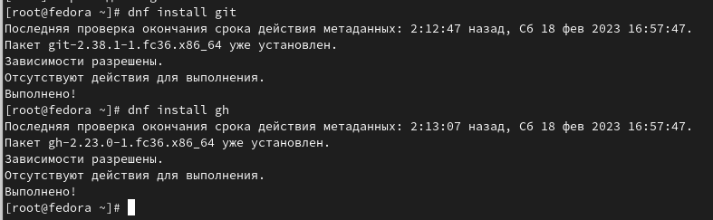{#fig:001 width=70%}

## Базовая настройка git

Я задала имя и email владельца репозитория (рис. [-@fig:002]).

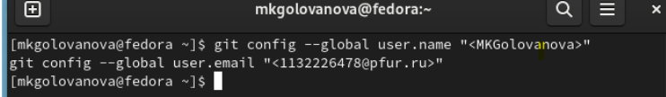{#fig:002 width=70%}

Я настроила utf-8 в выводе сообщений git (рис. [-@fig:003]).

{#fig:003 width=70%}

Я настроила верификацию и подписание коммитов git и задала имя начальной ветки (будем называть её master) (рис. [-@fig:004]).

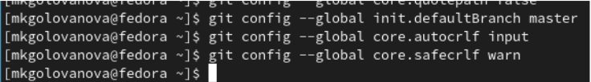{#fig:004 width=70%}

## Создание SSH ключа 

Для последующей идентификации пользователя на сервере репозиториев я сгенерировала пару ключей (приватный и открытый) (рис. [-@fig:005]):
ssh-keygen -C "Имя Фамилия <work@mail>"
Ключи сохранились в каталоге ~/.ssh/.

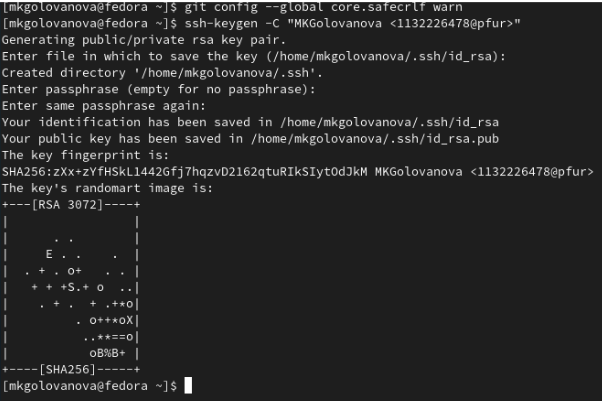{ #fig:005 width=70% }

Потом я загрузла сгенерированный открытый ключ. Для этого зашла на сайт http://github.org/ под своей учётной записью и перешла в меню Setting (рис. [-@fig:006]), выбрала в боковом меню SSH and GPG keys и нажала кнопку New SSH key (рис. [-@fig:007]).

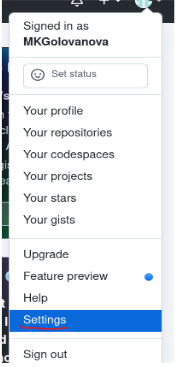{ #fig:006 width=50% }

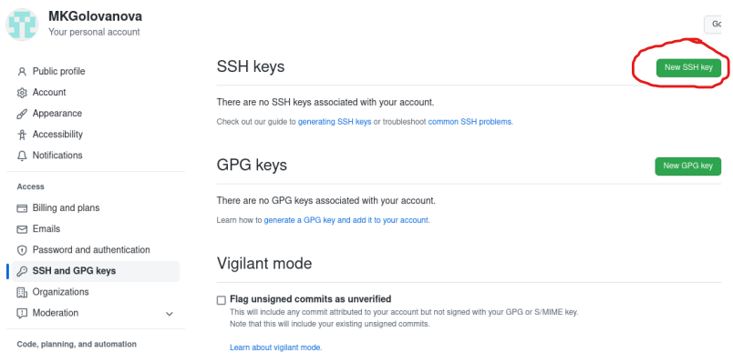{ #fig:007 width=70% }

Скопировав из локальной консоли ключ в буфер обмена cat ~/.ssh/id_rsa.pub | xclip -sel clip (рис. [-@fig:008]), я вставила ключ в появившееся на сайте поле и указала для ключа имя (Title) (рис. [-@fig:009]).

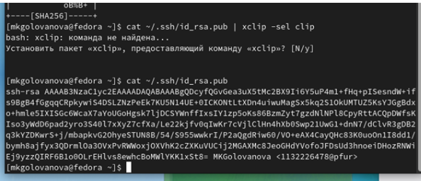{ #fig:008 width=70% }

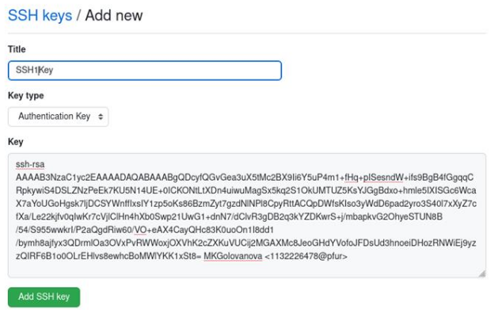{ #fig:009 width=70% }

## Создание GPG ключа 

Я сгенерировала ключ (рис. [-@fig:010], рис. [-@fig:011]).

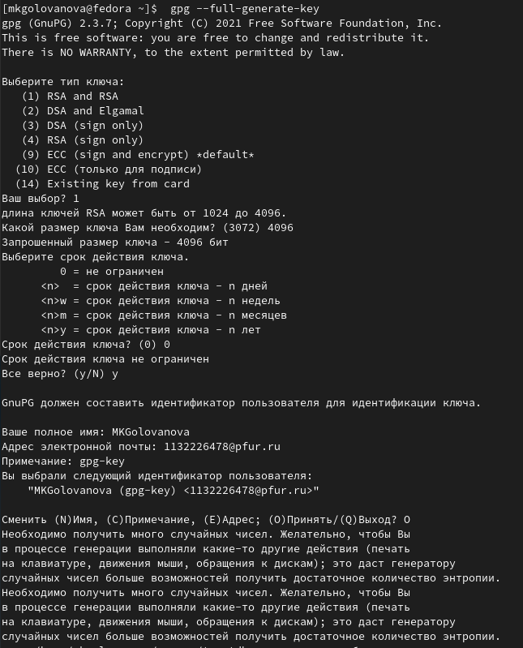{#fig:010 width=70%}

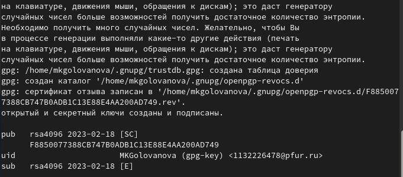{#fig:011 width=70%}

## Настройка github

Я создала учётную запись на https://github.com и заполнила основные данные (рис. [-@fig:012]).

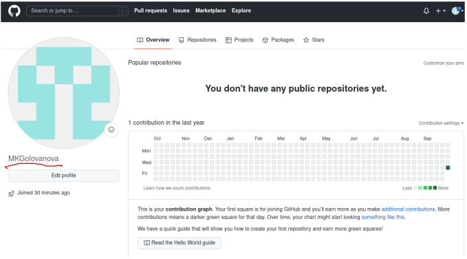{#fig:012 width=70%}

## Добавление PGP ключа в GitHub

Я вывела список ключей и скопировала отпечаток приватного ключа (рис. [-@fig:013]).

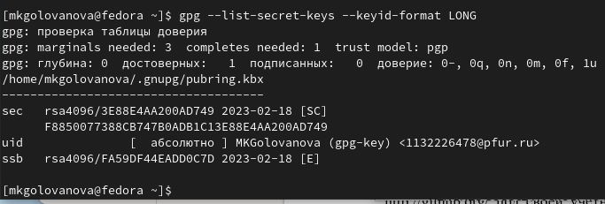{#fig:013 width=70%}

Я скопировала сгенерированный PGP ключ в буфер обмена (рис. [-@fig:014], рис. [-@fig:015]).

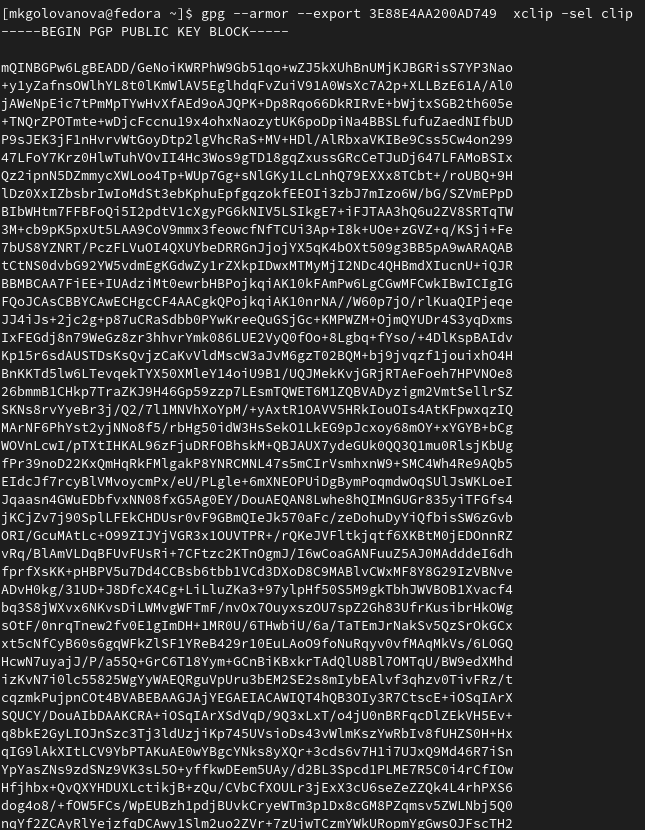{#fig:014 width=70%}

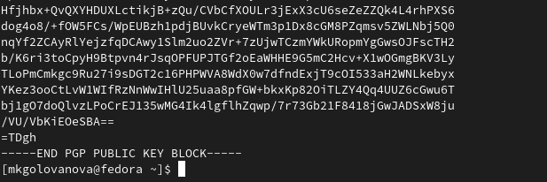{#fig:015 width=70%}

Я перешла в настройки GitHub (https://github.com/settings/keys), нажала на кнопку New GPG key и вставила полученный ключ в поле ввода (рис. [-@fig:016]).

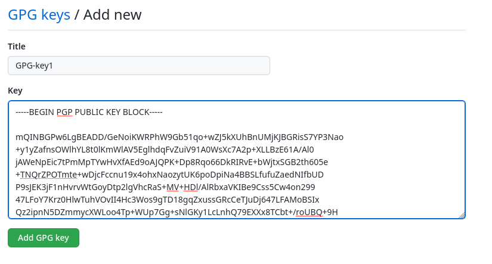{#fig:016 width=70%}

## Настройка автоматических подписей коммитов git

Используя введёный email, я указала Git применять его при подписи коммитов (рис. [-@fig:017]).

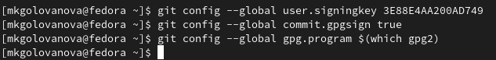{#fig:017 width=70%}

## Настройка gh

Я авторизовалась, утилита задала несколько наводящих вопросов (рис. [-@fig:018]).

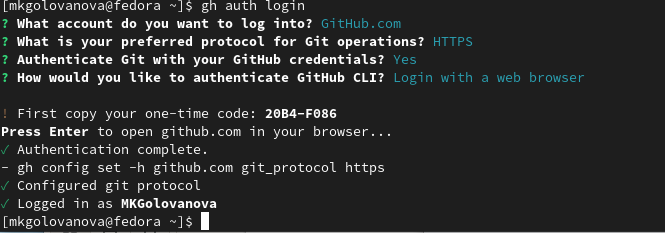{#fig:018 width=70%}

## Создание репозитория курса на основе шаблона

Я создала шаблон рабочего пространства репозитория (рис. [-@fig:019]).

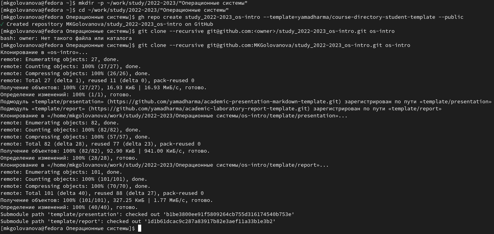{#fig:019 width=70%}

## Настройка каталога курса

Я перешла в каталог курса, удалила лишние файлы и создала необходимые каталоги (рис. [-@fig:020]).

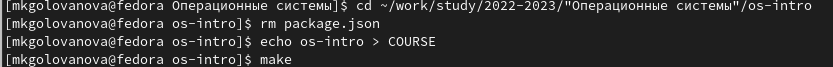{#fig:020 width=70%}
    
Я отправила файлы на сервер (рис. [-@fig:021], рис. [-@fig:022]).

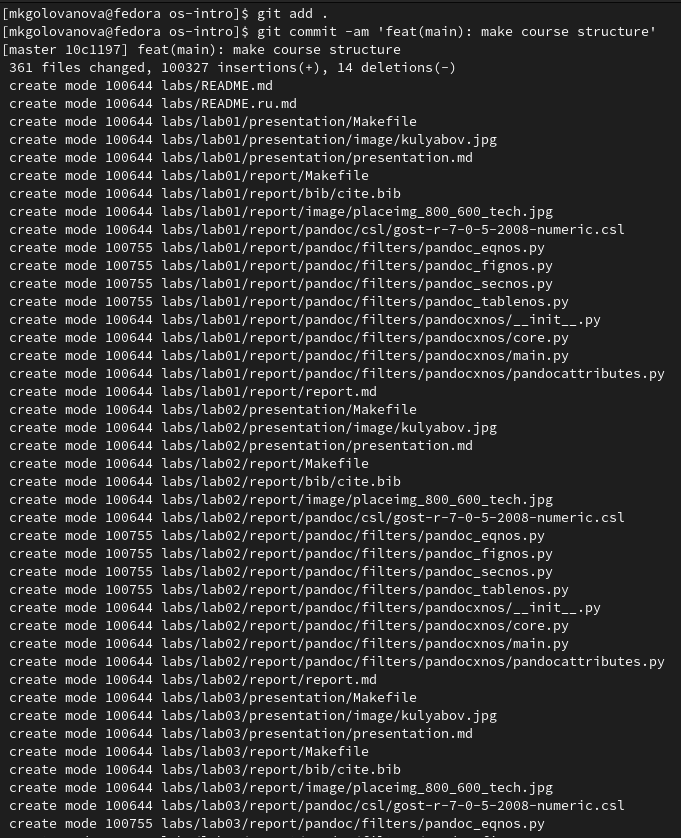{#fig:021 width=70%}

{#fig:022 width=70%}

# Результаты

- Я создала базовую конфигурацию для работы с git.
- Я создала ключ SSH.
- Я создалаключ PGP.
- Я создала подписи git.
- Я зарегистрировалась на Github.
- Я создала локальный каталог для выполнения заданий по предмету.

- Я изучила идеологию и применение средств контроля версий и приобрела практические навыки по работе с системой git.
