---
## Front matter
title: "Лабораторная работа № 2"
subtitle: "Операционные системы"
author: "Голованова Мария Константиновна"

## Generic otions
lang: ru-RU
toc-title: "Содержание"

## Bibliography
bibliography: bib/cite.bib
csl: pandoc/csl/gost-r-7-0-5-2008-numeric.csl

## Pdf output format
toc: true # Table of contents
toc-depth: 2
lof: true # List of figures
lot: true # List of tables
fontsize: 12pt
linestretch: 1.5
papersize: a4
documentclass: scrreprt
## I18n polyglossia
polyglossia-lang:
  name: russian
  options:
	- spelling=modern
	- babelshorthands=true
polyglossia-otherlangs:
  name: english
## I18n babel
babel-lang: russian
babel-otherlangs: english
## Fonts
mainfont: PT Serif
romanfont: PT Serif
sansfont: PT Sans
monofont: PT Mono
mainfontoptions: Ligatures=TeX
romanfontoptions: Ligatures=TeX
sansfontoptions: Ligatures=TeX,Scale=MatchLowercase
monofontoptions: Scale=MatchLowercase,Scale=0.9
## Biblatex
biblatex: true
biblio-style: "gost-numeric"
biblatexoptions:
  - parentracker=true
  - backend=biber
  - hyperref=auto
  - language=auto
  - autolang=other*
  - citestyle=gost-numeric
## Pandoc-crossref LaTeX customization
figureTitle: "Рис."
tableTitle: "Таблица"
listingTitle: "Листинг"
lofTitle: "Список иллюстраций"
lotTitle: "Список таблиц"
lolTitle: "Листинги"
## Misc options
indent: true
header-includes:
  - \usepackage{indentfirst}
  - \usepackage{float} # keep figures where there are in the text
  - \floatplacement{figure}{H} # keep figures where there are in the text
---

# Цель работы

Изучить идеологию и применение средств контроля версий, освоить умения по работе с git.

# Задание

Создать базовую конфигурацию для работы с git.
Создать ключ SSH.
Создать ключ PGP.
Настроить подписи git.
Зарегистрироваться на Github.
Создать локальный каталог для выполнения заданий по предмету.

# Теоретическое введение

Системы контроля версий (Version Control System, VCS) применяются при работе нескольких человек с разных компьютеров над одним проектом. Обычно основное дерево проекта хранится в локальном или удалённом репозитории, к которому настроен доступ для участников проекта. При внесении изменений в содержание проекта система контроля версий позволяет их фиксировать, совмещать изменения, произведённые разными участниками проекта, производить откат к любой более ранней версии проекта, если это требуется.
Git — распределённая система управления версиями, представляющая собой набор программ командной строки. Доступ к ним можно получить из терминала посредством ввода команды git с различными опциями.
Благодаря тому, что Git является распределённой системой контроля версий, резервную копию локального хранилища можно сделать простым копированием или архивацией.

# Выполнение лабораторной работы

## Установка программного обеспечения

Я установила git и gh (рис. [-@fig:001]).

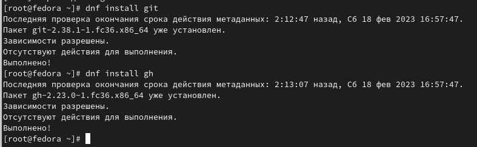{#fig:001 width=70%}

## Базовая настройка git

Я задала имя и email владельца репозитория (рис. [-@fig:002]).

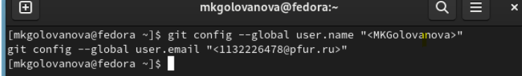{#fig:002 width=70%}

Я настроила utf-8 в выводе сообщений git (рис. [-@fig:003]).

{#fig:003 width=70%}

Я настроила верификацию и подписание коммитов git и задала имя начальной ветки (будем называть её master) (рис. [-@fig:004]).

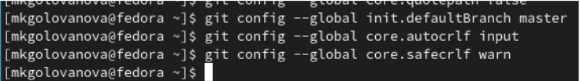{#fig:004 width=70%}

## Создание SSH ключа 

Для последующей идентификации пользователя на сервере репозиториев я сгенерировала пару ключей (приватный и открытый) (рис. [-@fig:005]).
Ключи сохранились в каталоге ~/.ssh/.

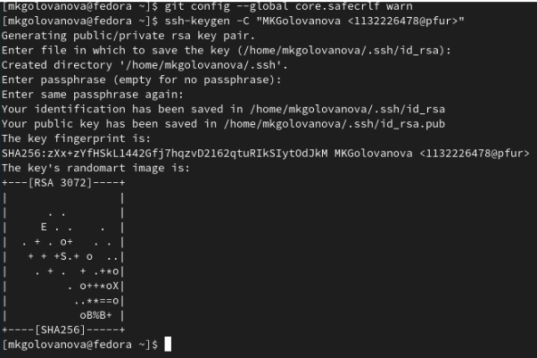{ #fig:005 width=70% }

Потом я загрузла сгенерированный открытый ключ. Для этого зашла на сайт http://github.org/ под своей учётной записью и перешла в меню Setting (рис. [-@fig:006]), выбрала в боковом меню SSH and GPG keys и нажала кнопку New SSH key (рис. [-@fig:007]).

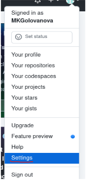{ #fig:006 width=50% }

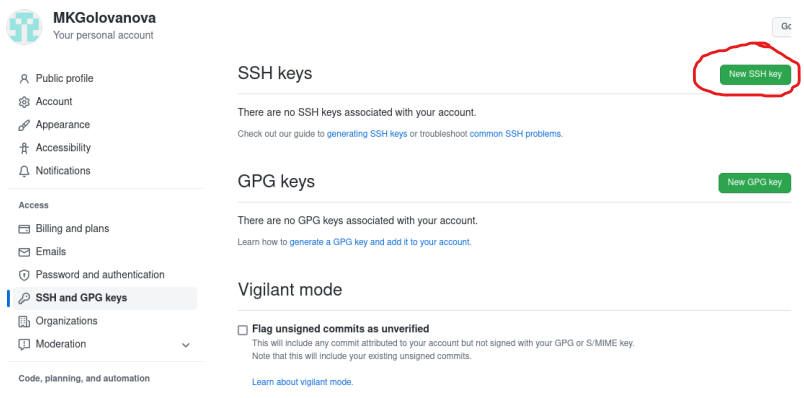{ #fig:007 width=70% }

Скопировав из локальной консоли ключ в буфер обмена cat ~/.ssh/id_rsa.pub | xclip -sel clip (рис. [-@fig:008]), я вставила ключ в появившееся на сайте поле и указала для ключа имя (Title) (рис. [-@fig:009]).

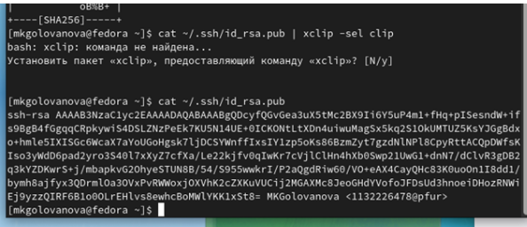{ #fig:008 width=70% }

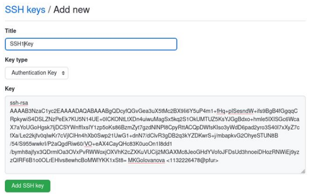{ #fig:009 width=70% }

## Создание GPG ключа 

Я сгенерировала ключ (рис. [-@fig:010], рис. [-@fig:011]).

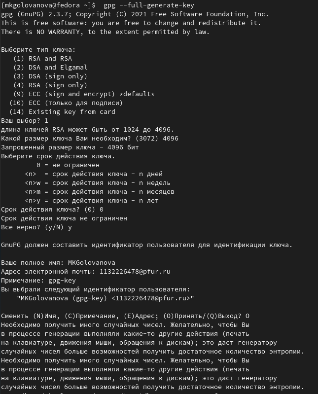{#fig:010 width=70%}

{#fig:011 width=70%}

## Настройка github

Я создала учётную запись на https://github.com и заполнила основные данные (рис. [-@fig:012]).

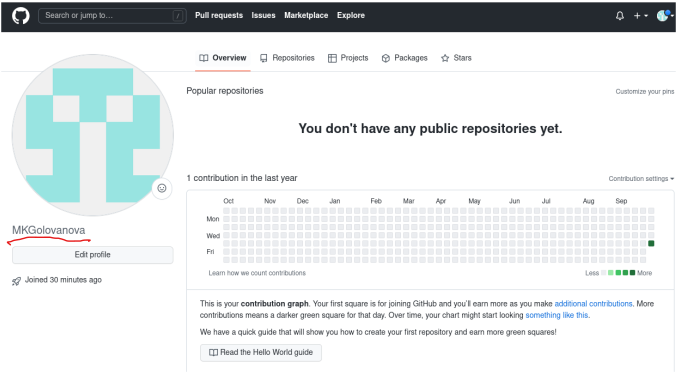{#fig:012 width=70%}

## Добавление PGP ключа в GitHub

Я вывела список ключей и скопировала отпечаток приватного ключа (рис. [-@fig:013]).

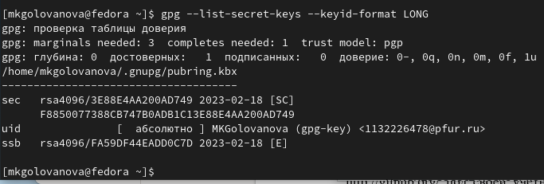{#fig:013 width=70%}

Я скопировала сгенерированный PGP ключ в буфер обмена (рис. [-@fig:014], рис. [-@fig:015]).

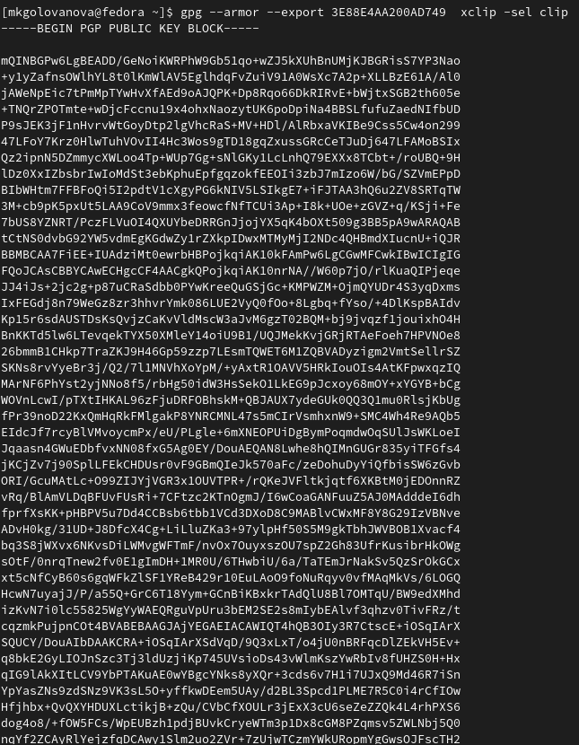{#fig:014 width=70%}

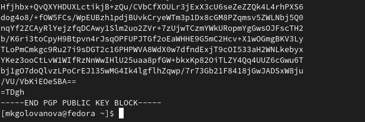{#fig:015 width=70%}

Я перешла в настройки GitHub (https://github.com/settings/keys), нажала на кнопку New GPG key и вставила полученный ключ в поле ввода (рис. [-@fig:016]).

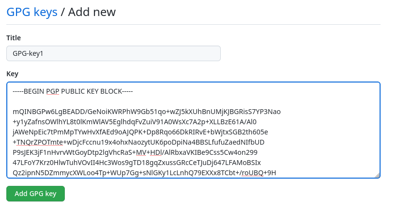{#fig:016 width=70%}

## Настройка автоматических подписей коммитов git

Используя введёный email, я указала Git применять его при подписи коммитов (рис. [-@fig:017]).

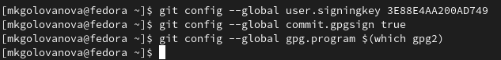{#fig:017 width=70%}

## Настройка gh

Я авторизовалась, утилита задала несколько наводящих вопросов (рис. [-@fig:018]).

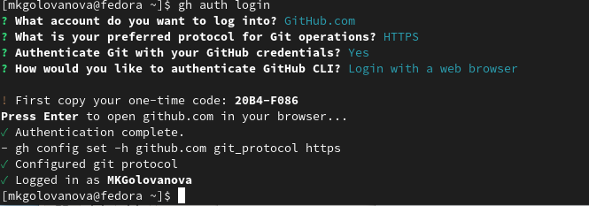{#fig:018 width=70%}

## Создание репозитория курса на основе шаблона

Я создала шаблон рабочего пространства репозитория (рис. [-@fig:019]).

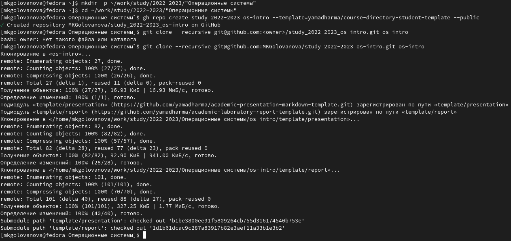{#fig:019 width=70%}

## Настройка каталога курса

Я перешла в каталог курса, удалила лишние файлы и создала необходимые каталоги (рис. [-@fig:020]).

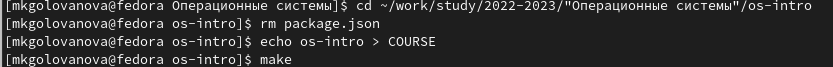{#fig:020 width=70%}
    
Я отправила файлы на сервер (рис. [-@fig:021], рис. [-@fig:022]).

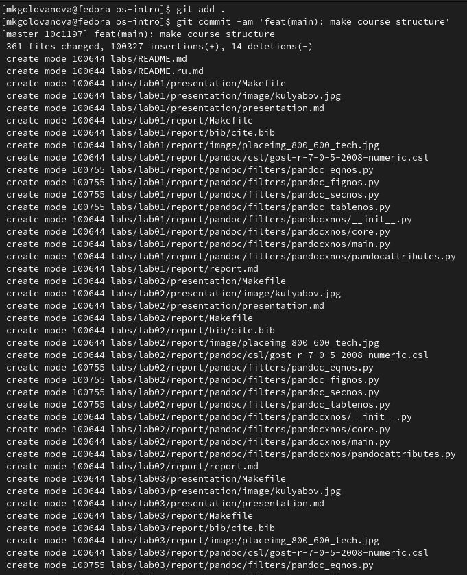{#fig:021 width=70%}

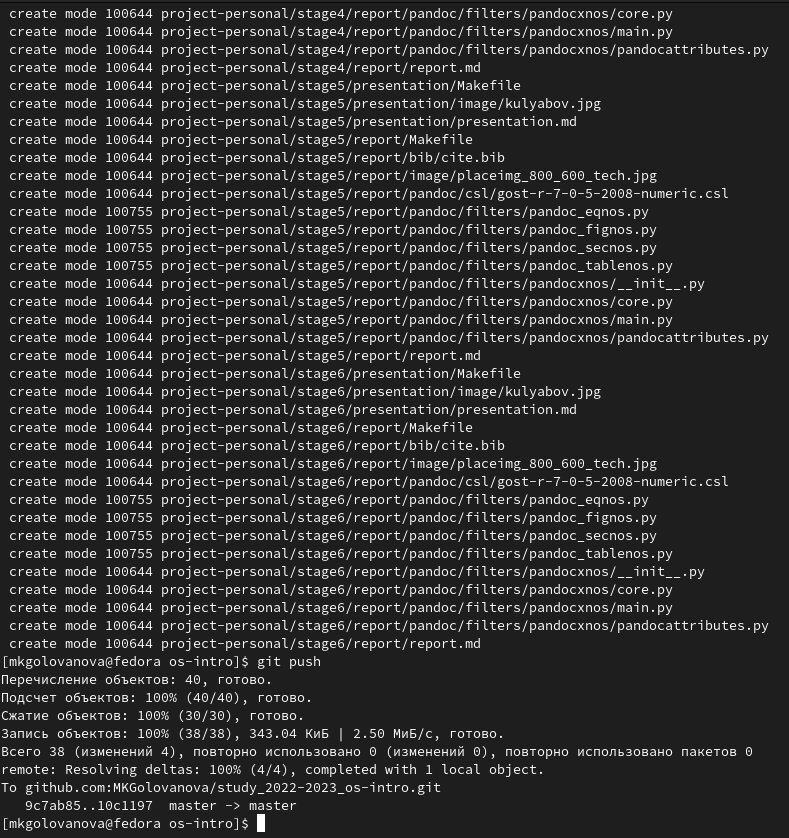{#fig:022 width=70%}

# Выводы

Я изучила идеологию и применение средств контроля версий и приобрела практические навыки по работе с системой git.

# Список литературы
