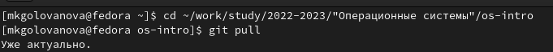
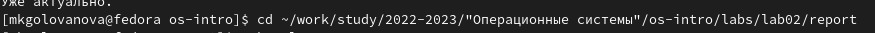
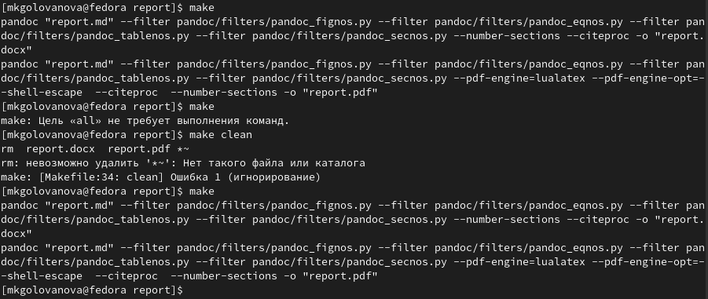
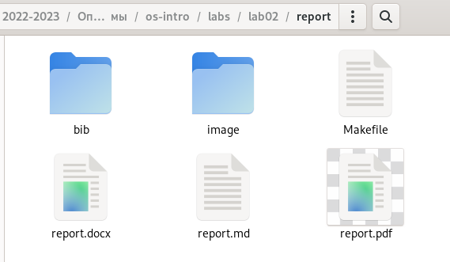
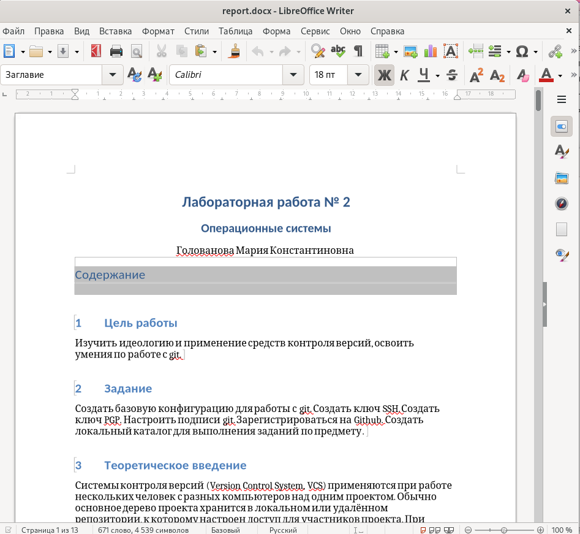
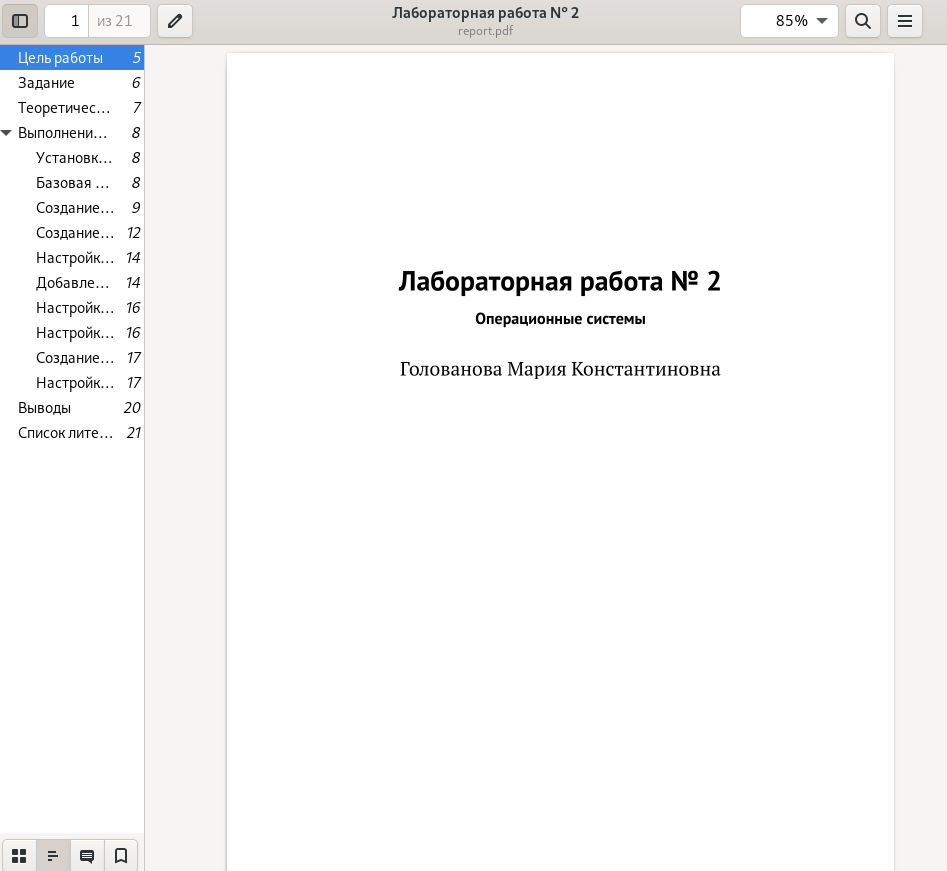
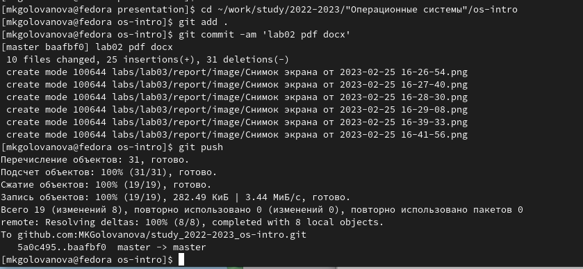

---
## Front matter
lang: ru-RU
title: Лабораторная работа № 3
subtitle: Операционные системы
author:
  - Голованова Мария Константиновна
institute:
  - Российский университет дружбы народов, Москва, Россия
date: 25 февраля 2023

## i18n babel
babel-lang: russian
babel-otherlangs: english

## Formatting pdf
toc: false
toc-title: Содержание
slide_level: 2
aspectratio: 169
section-titles: true
theme: metropolis
header-includes:
 - \metroset{progressbar=frametitle,sectionpage=progressbar,numbering=fraction}
 - '\makeatletter'
 - '\beamer@ignorenonframefalse'
 - '\makeatother'
---

# Информация

## Докладчик

:::::::::::::: {.columns align=center}
::: {.column width="70%"}

  * Голованова Мария Константиновна
  * НММбд-01-22, 1132226478
  * Факультет физико-математических и естественных наук
  * Российский университет дружбы народов
  
:::
::::::::::::::

# Вводная часть

- Markdown — это облегчённый язык  текстовой разметки, созданный с для обозначения форматирования текста с максимальным сохранением его читаемости человеком, являющийся инструментом преобразования кода в языки для продвинутых публикаций (HTML, Rich Text и других). Главной особенностью данного языка является максимально простой синтаксис, который служит для упрощения написания и чтения кода разметки, что, в свою очередь, позволяет легко его корректировать. 

## Цели и задачи

- Освоить процедуры оформления отчетов с помощью легковесного языка разметки Markdown.
- Сделайте отчёт по предыдущей лабораторной работе в формате Markdown.
- В качестве отчёта предоставить отчёты в 3 форматах: pdf, docx и md (в архиве, т.к. он должен содержать скриншоты, Makefile и т.д.)

## Материалы и методы

- Процессор `pandoc` для входного формата Markdown
- Результирующие форматы
	- `pdf`
	- `docx`
- Автоматизация процесса создания: `Makefile`

# Выполнение лабораторной работы

## Выполнение лабораторной работы

- Я открыла терминал и перешла в каталог курса, сформированный при выполнении предыдущей лабораторной работы, и обновила локальный репозиторий, скачав изменения из удалённого репозитория с помощью команды git pull (рис.1).

{.column width=70%}

 - Я перешла в каталог с отчётом по предыдущей лабораторной работе (рис.2).

{.column width=70%}

## Выполнение лабораторной работы

- Я провела компиляцию отчёта с использованием Makefile, введя команду make (рис.3).

{.column width=70%}

## Выполнение лабораторной работы

- В результате сгенерировались файлы report.pdf и report.docx (рис.4).

{.column width=70%}
 
## Выполнение лабораторной работы
 
 - Я открыла полученные файлы и проверила их корректность (рис.5, рис.6).
 
{.column width=40%}

## Выполнение лабораторной работы

{.column width=40%}

## Выполнение лабораторной работы

- Я загрузила полученные файлы на github (рис.7).

{.column width=70%}

# Выводы

- Я сделала отчёт по предыдущей лабораторной работе (№2) в формате Markdown.
- В качестве отчёта предоставить отчёты в 3 форматах: pdf, docx и md.
- Я освоила процедуры оформления отчетов с помощью легковесного языка разметки Markdown.
