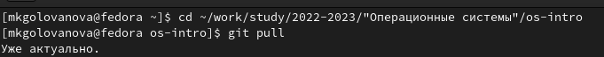
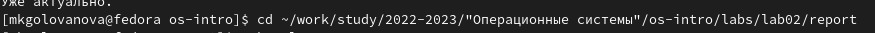
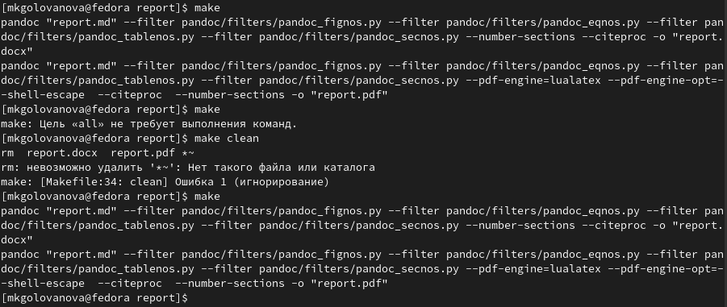
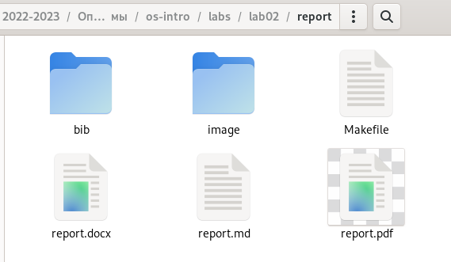
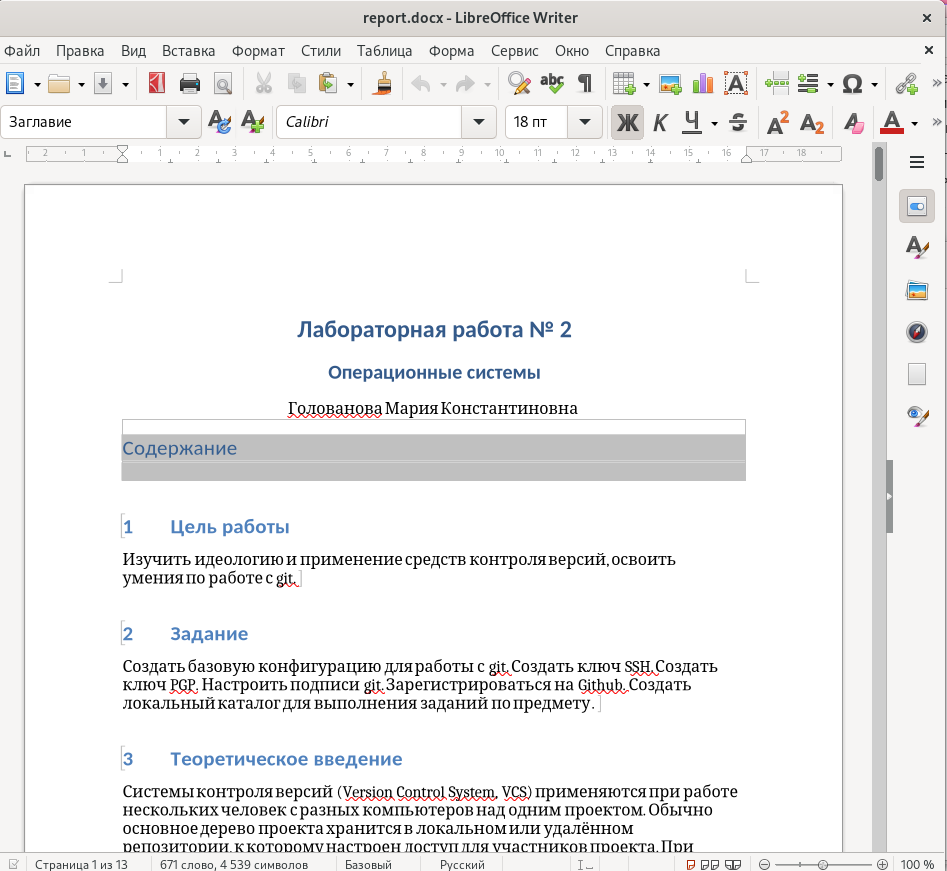
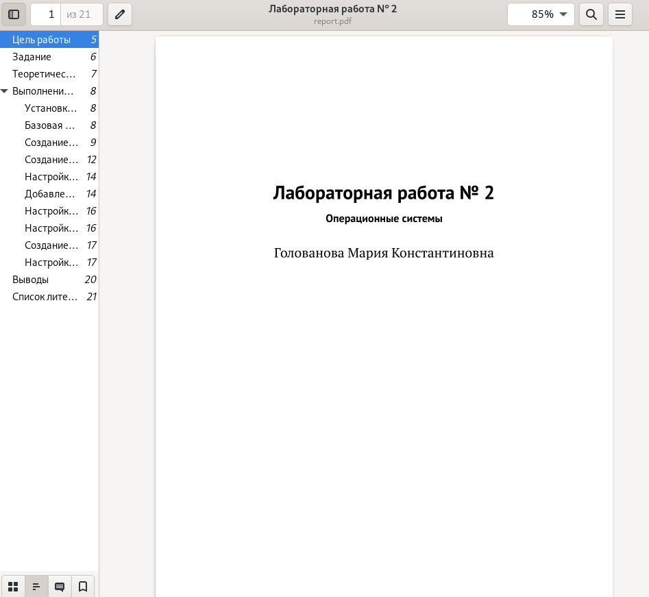
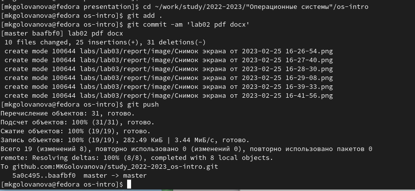

---
## Front matter
title: "Лабораторная работа № 3"
subtitle: "Операционные системы"
author: "Голованова Мария Константиновна"

## Generic otions
lang: ru-RU
toc-title: "Содержание"

## Bibliography
bibliography: bib/cite.bib
csl: pandoc/csl/gost-r-7-0-5-2008-numeric.csl

## Pdf output format
toc: true # Table of contents
toc-depth: 2
lof: true # List of figures
lot: true # List of tables
fontsize: 12pt
linestretch: 1.5
papersize: a4
documentclass: scrreprt
## I18n polyglossia
polyglossia-lang:
  name: russian
  options:
	- spelling=modern
	- babelshorthands=true
polyglossia-otherlangs:
  name: english
## I18n babel
babel-lang: russian
babel-otherlangs: english
## Fonts
mainfont: PT Serif
romanfont: PT Serif
sansfont: PT Sans
monofont: PT Mono
mainfontoptions: Ligatures=TeX
romanfontoptions: Ligatures=TeX
sansfontoptions: Ligatures=TeX,Scale=MatchLowercase
monofontoptions: Scale=MatchLowercase,Scale=0.9
## Biblatex
biblatex: true
biblio-style: "gost-numeric"
biblatexoptions:
  - parentracker=true
  - backend=biber
  - hyperref=auto
  - language=auto
  - autolang=other*
  - citestyle=gost-numeric
## Pandoc-crossref LaTeX customization
figureTitle: "Рис."
tableTitle: "Таблица"
listingTitle: "Листинг"
lofTitle: "Список иллюстраций"
lotTitle: "Список таблиц"
lolTitle: "Листинги"
## Misc options
indent: true
header-includes:
  - \usepackage{indentfirst}
  - \usepackage{float} # keep figures where there are in the text
  - \floatplacement{figure}{H} # keep figures where there are in the text
---

# Цель работы

Целью работы является освоение процедуры оформления отчетов с помощью легковесного языка разметки Markdown.

# Задание

Сделайте отчёт по предыдущей лабораторной работе в формате Markdown.
В качестве отчёта просьба предоставить отчёты в 3 форматах: pdf, docx и md (в архиве, поскольку он должен содержать скриншоты, Makefile и т.д.)

# Теоретическое введение

Markdown — это облегчённый язык  текстовой разметки, созданный с для обозначения форматирования текста с максимальным сохранением его читаемости человеком,являющийся инструментом преобразования кода в языки для продвинутых публикаций (HTML, Rich Text и других). Главной особенностью данного языка является максимально простой синтаксис, который служит для упрощения написания и чтения кода разметки, что, в свою очередь, позволяет легко его корректировать. 

# Выполнение лабораторной работы

Я открыла терминал и перешла в каталог курса, сформированный при выполнении предыдущей лабораторной работы, и обновила локальный репозиторий, скачав изменения из удалённого репозитория с помощью команды git pull, (рис. @fig:001).

{#fig:001 width=70%}

Я перешла в каталог с отчётом по предыдущей лабораторной работе (рис. @fig:002).

{#fig:002 width=70%}

Я провела компиляцию отчёта с использованием Makefile, введя команду make (рис. @fig:003).

{#fig:003 width=70%}

В результате сгенерировались файлы report.pdf и report.docx (рис. @fig:004). Я открыла полученные файлы и проверила их корректность (рис. @fig:005, рис. @fig:006).

{#fig:004 width=70%}

{#fig:005 width=70%}
 
{#fig:006 width=70%}

Я загрузила полученные файлы на github (рис. @fig:007).

{ #fig:007 width=70% }

# Выводы

Я освоила процедуры оформления отчетов с помощью легковесного языка разметки Markdown.

# Список литературы{.unnumbered}
