---
## Front matter
lang: ru-RU
title: Лабораторная работа № 4
subtitle: Операционные системы
author:
  - Голованова Мария Константиновна
institute:
  - Российский университет дружбы народов, Москва, Россия
date: 4 марта 2023

## i18n babel
babel-lang: russian
babel-otherlangs: english

## Formatting pdf
toc: false
toc-title: Содержание
slide_level: 2
aspectratio: 169
section-titles: true
theme: metropolis
header-includes:
 - \metroset{progressbar=frametitle,sectionpage=progressbar,numbering=fraction}
 - '\makeatletter'
 - '\beamer@ignorenonframefalse'
 - '\makeatother'
---

# Информация

## Докладчик

:::::::::::::: {.columns align=center}
::: {.column width="70%"}

  * Голованова Мария Константиновна
  * НММбд-01-22, 1132226478
  * Факультет физико-математических и естественных наук
  * Российский университет дружбы народов
  
:::
::: {.column width="30%"}

:::
::::::::::::::

# Вводная часть

## Цели и задачи

- Приобретение практических навыков взаимодействия пользователя с системой посредством командной строки.

## Теоретическое введение

В операционной системе GNU Linux взаимодействие пользователя с системой обычно осуществляется с помощью командной строки посредством построчного ввода команд. 
Основными командами являются:
Команда cd. Команда cd используется для перемещения по файловой системе операционной системы типа Linux.
Команда pwd. Для определения абсолютного пути к текущему каталогу используетсякоманда pwd (print working directory).
Команда ls. Команда ls используется для просмотра содержимого каталога.
Команда mkdir. Команда mkdir используется для создания каталогов.
Команда rm. Команда rm используется для удаления файлов и/или каталогов.
Команда history. Для вывода на экран списка ранее выполненных команд используется команда history. Выводимые на экран команды в списке нумеруются. К любой команде из выведенного на экран списка можно обратиться по её номеру в списке, воспользовавшись конструкцией !<номер_команды>.

# Выполнение лабораторной работы

## Выполнение лабораторной работы

- Я определила полное имя моего домашнего каталога.(рис. 1).

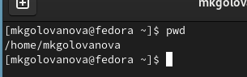{.column width=70%}

- Я перешла в каталог /tmp. (рис. 2).

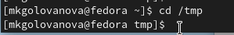{.column width=70%}

## Выполнение лабораторной работы

Я вывела на экран содержимое каталога /tmp, используя для этого  команду ls с различными опциями (рис. 3, рис. 4, рис. 5, рис. 6, рис. 7). Разница в выводимой на экран информации объясняется тем, что различные опции позволяют увидеть дополнительные данные, которые не отображаются без дополнительных указаний к команде ls.

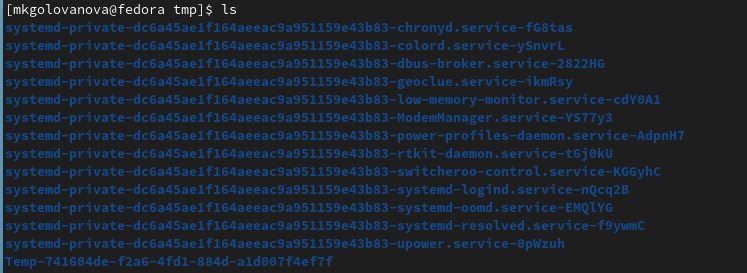{.column width=70%}

## Выполнение лабораторной работы

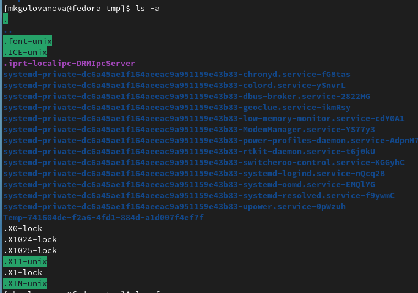{.column width=70%}

## Выполнение лабораторной работы

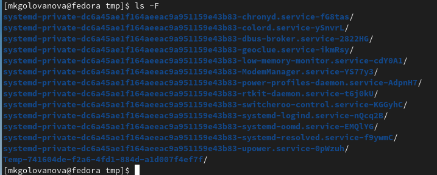{.column width=70%}

## Выполнение лабораторной работы

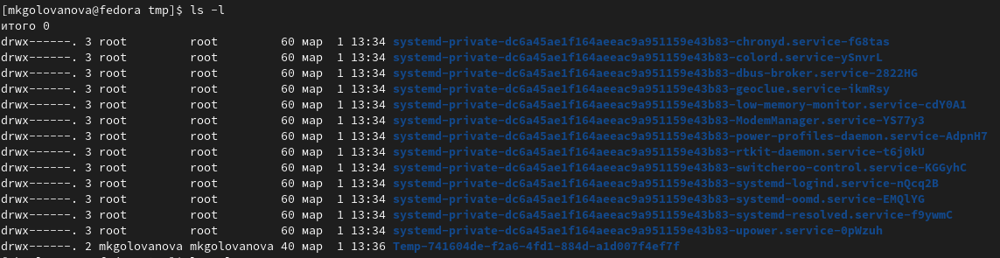{.column width=70%}

## Выполнение лабораторной работы

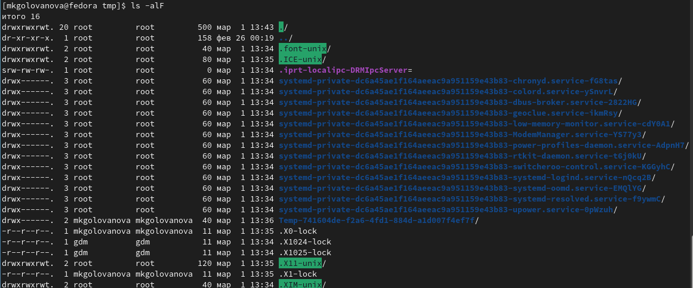{.column width=70%}

## Выполнение лабораторной работы

- Я перешла в каталог /var/spool и вывела на экран его содержимое, проверяя, есть ли там подкаталог с именем cron (рис. 8). В каталоге /var/spool нет подкаталога с именем cron. 

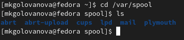{.column width=70%}

## Выполнение лабораторной работы

- Я перешла в домашний каталог, вывела на экран его содержимое и определила, кто является владельцем файлов и подкаталогов (mkgolovanova).(рис. 9).

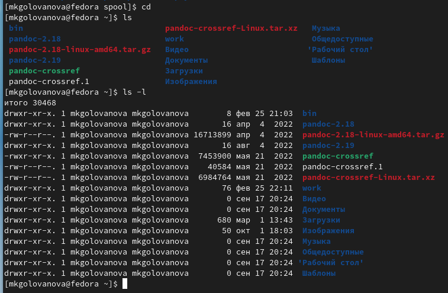{.column width=70%}

## Выполнение лабораторной работы

- Я создала в домашнем каталоге новый каталог с именем newdir (рис. 10).

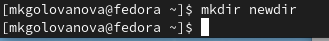{.column width=70%}

## Выполнение лабораторной работы

- В каталоге ~/newdir создайте новый каталог с именем morefun (рис. 11).

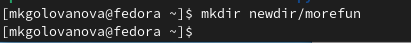{.column width=70%}

## Выполнение лабораторной работы

Я создала в домашнем каталоге одной командой три новых каталога с именами letters, memos, misk, а затем удалила эти каталоги одной командой (рис. 12, рис. 13).

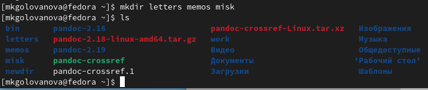{.column width=60%}

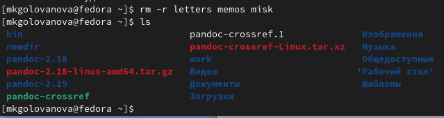{.column width=60%}

## Выполнение лабораторной работы

Я попробовала удалить ранее созданный каталог ~/newdir командой rm. Каталог не был удалён, так как для удаления каталогов необходимо использовать опцию рекурсивного удаления -r (рис. 14).

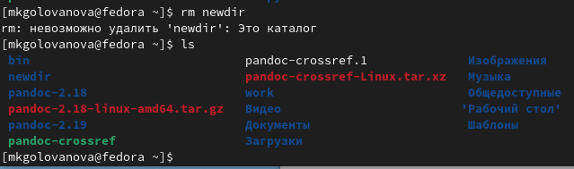{.column width=70%}

## Выполнение лабораторной работы

Я удалила каталог ~/newdir/morefun из домашнего каталога, и проверила, был ли он удалён (рис. 15).

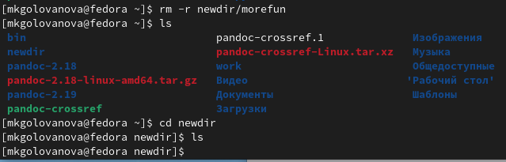{.column width=70%}

## Выполнение лабораторной работы

С помощью команды man я определила набор опций команды ls, позволяющий отсортировать по времени последнего изменения выводимый список содержимого каталога с развёрнутым описанием файлов (рис. 16, рис. 17, рис. 18, рис. 19, рис. 20). Это опции -t, -lt, -ltr

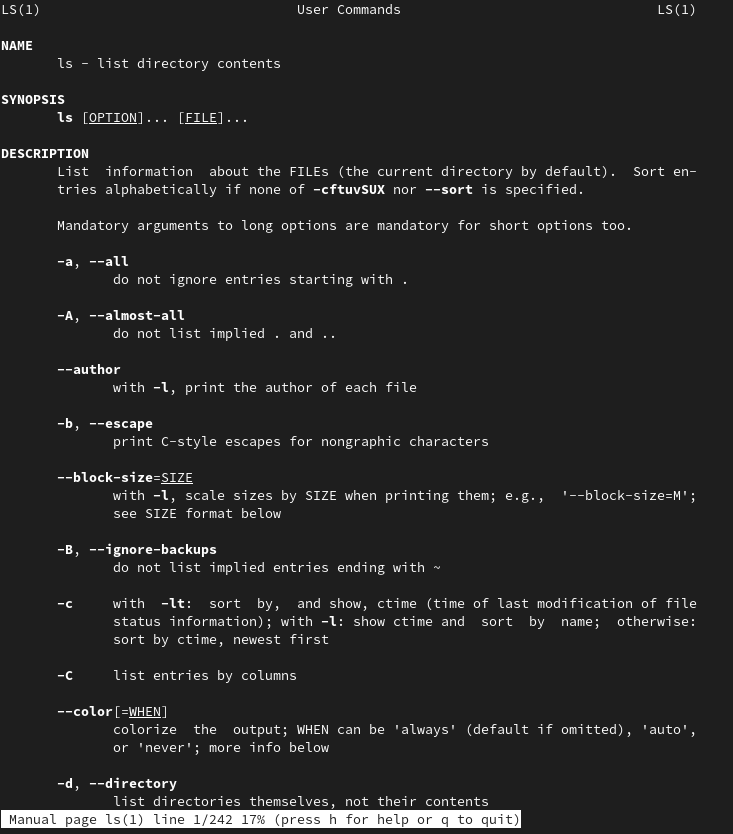{.column width=35%}

## Выполнение лабораторной работы

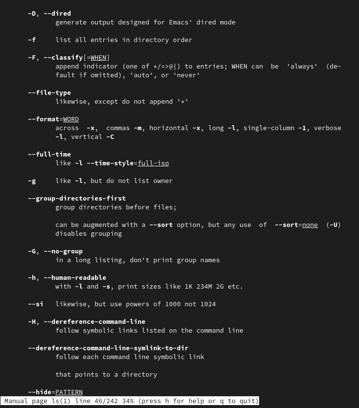{.column width=40%}

## Выполнение лабораторной работы

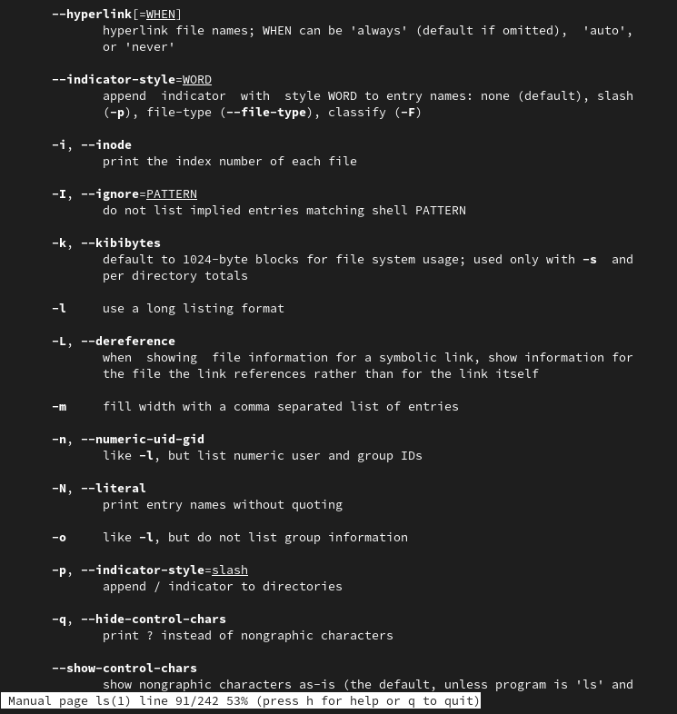{.column width=40%}

## Выполнение лабораторной работы

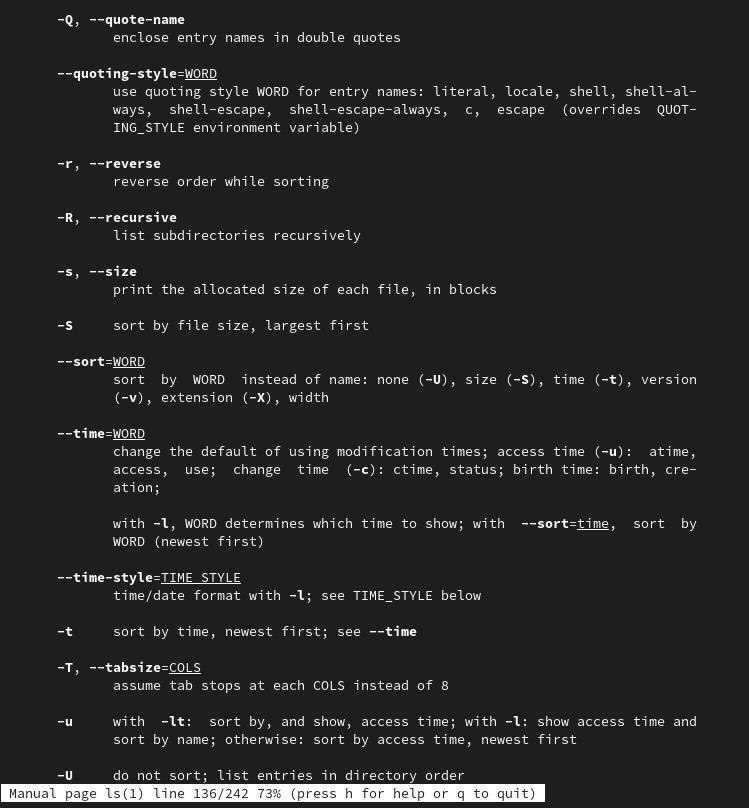{.column width=40%}

## Выполнение лабораторной работы

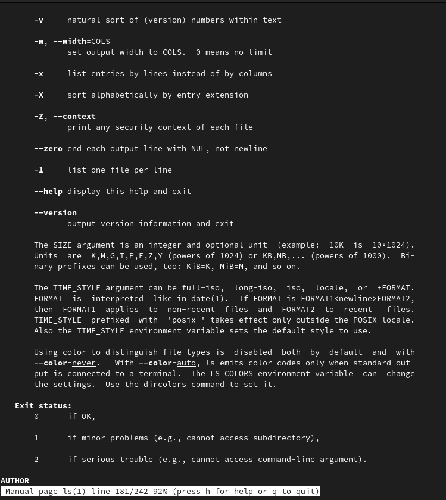{.column width=40%}

## Выполнение лабораторной работы

Я использовала команду man для просмотра описания команд cd, pwd, mkdir, rmdir, rm (рис. 21, рис. 22, рис. 23, рис. 24, рис. 25, рис. 26, рис. 27).

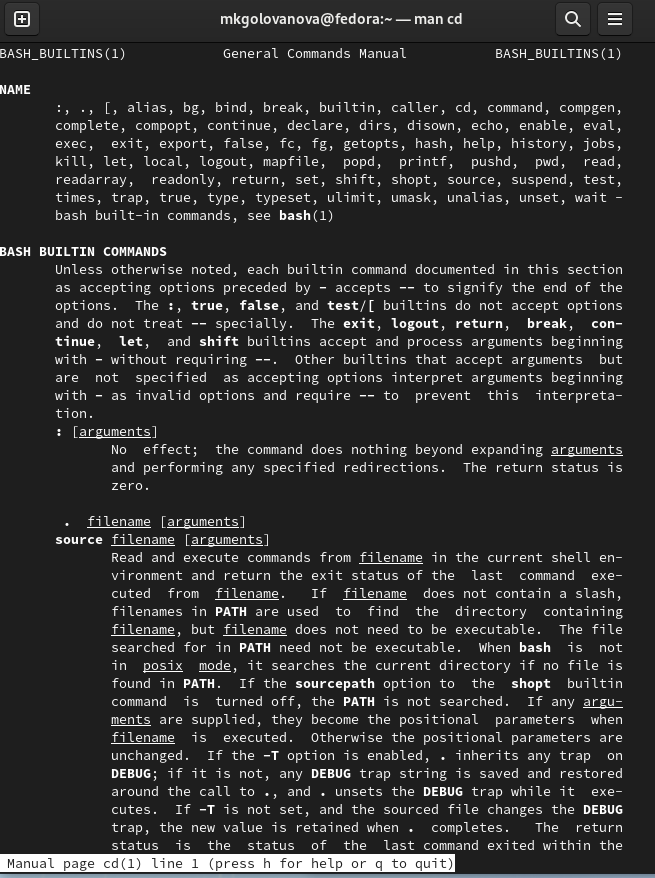{.column width=35%}

## Выполнение лабораторной работы

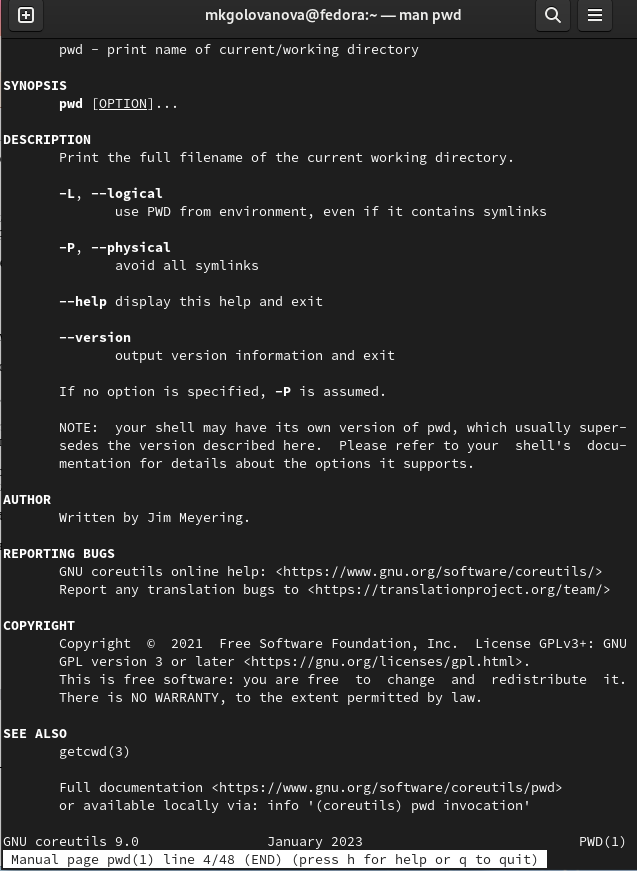{.column width=35%}

## Выполнение лабораторной работы

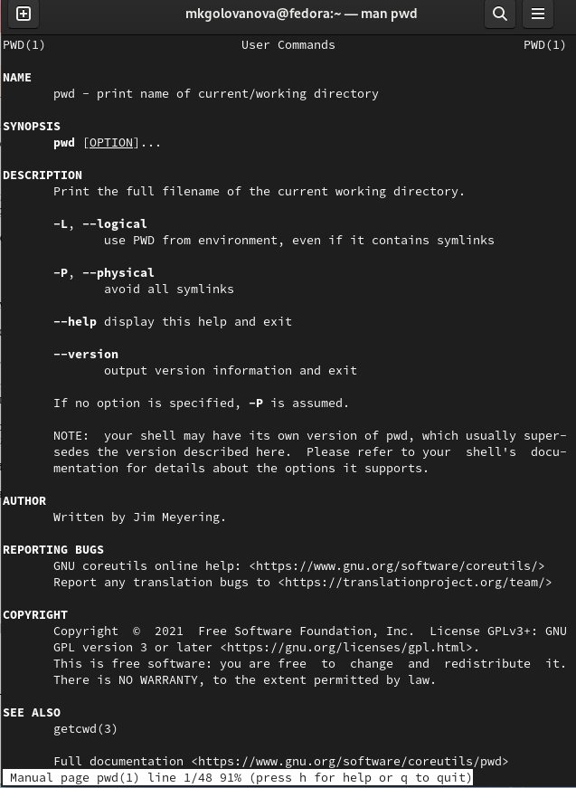{.column width=35%}

## Выполнение лабораторной работы

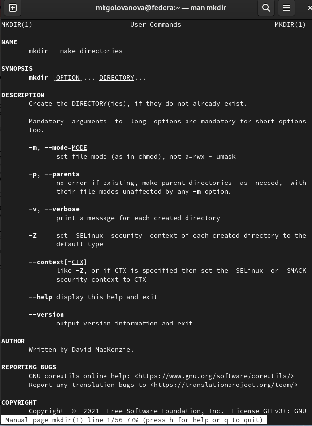{.column width=35%}

## Выполнение лабораторной работы

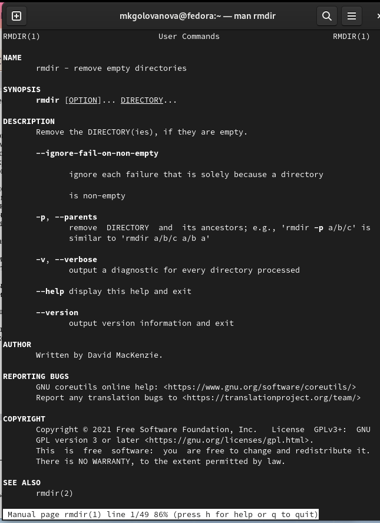{.column width=35%}

## Выполнение лабораторной работы

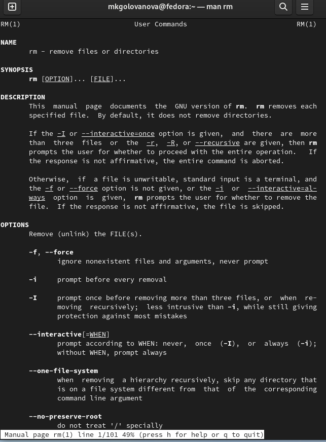{.column width=35%}

## Выполнение лабораторной работы

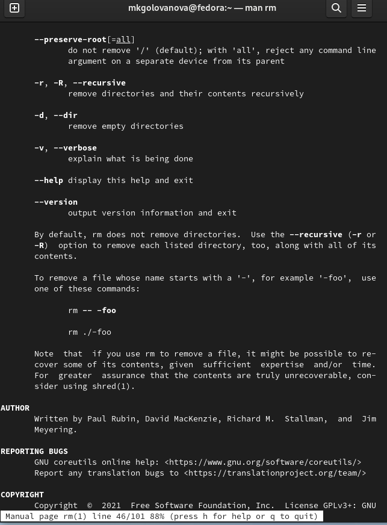{.column width=35%}

## Выполнение лабораторной работы

Используя информацию, полученную при помощи команды history (рис. 28), я выполнила модификацию и исполнение нескольких команд из буфера команд.(рис. 29, рис. 30, рис. 31).

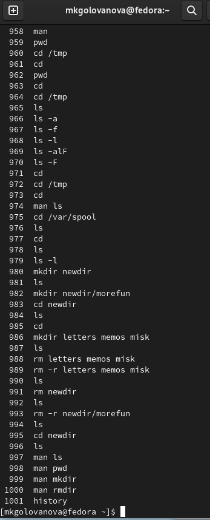{.column width=35%}

## Выполнение лабораторной работы

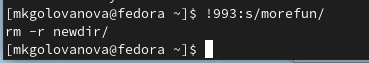{.column width=40%}

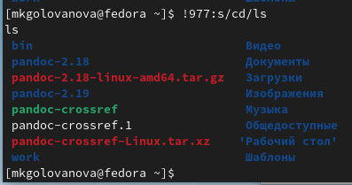{.column width=40%}

## Выполнение лабораторной работы

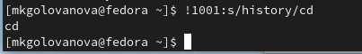{.column width=50%}

# Выводы

- Я приобретела практические навыки работы с операционной системой на уровне командной строки (организация файловой системы, навигация по файловой системе, создание и удаление файлов и директорий).

