---
## Front matter
title: "Лабораторная работа No 4"
subtitle: "Операционные системы"
author: "Голованова Мария Константиновна"

## Generic otions
lang: ru-RU
toc-title: "Содержание"

## Bibliography
bibliography: bib/cite.bib
csl: pandoc/csl/gost-r-7-0-5-2008-numeric.csl

## Pdf output format
toc: true # Table of contents
toc-depth: 2
lof: true # List of figures
lot: true # List of tables
fontsize: 12pt
linestretch: 1.5
papersize: a4
documentclass: scrreprt
## I18n polyglossia
polyglossia-lang:
  name: russian
  options:
	- spelling=modern
	- babelshorthands=true
polyglossia-otherlangs:
  name: english
## I18n babel
babel-lang: russian
babel-otherlangs: english
## Fonts
mainfont: PT Serif
romanfont: PT Serif
sansfont: PT Sans
monofont: PT Mono
mainfontoptions: Ligatures=TeX
romanfontoptions: Ligatures=TeX
sansfontoptions: Ligatures=TeX,Scale=MatchLowercase
monofontoptions: Scale=MatchLowercase,Scale=0.9
## Biblatex
biblatex: true
biblio-style: "gost-numeric"
biblatexoptions:
  - parentracker=true
  - backend=biber
  - hyperref=auto
  - language=auto
  - autolang=other*
  - citestyle=gost-numeric
## Pandoc-crossref LaTeX customization
figureTitle: "Рис."
tableTitle: "Таблица"
listingTitle: "Листинг"
lofTitle: "Список иллюстраций"
lotTitle: "Список таблиц"
lolTitle: "Листинги"
## Misc options
indent: true
header-includes:
  - \usepackage{indentfirst}
  - \usepackage{float} # keep figures where there are in the text
  - \floatplacement{figure}{H} # keep figures where there are in the text
---

# Цель работы

Приобретение практических навыков взаимодействия пользователя с системой посредством командной строки.

# Задание
Определить полное имя вашего домашнего каталога.
Выполнить следующие действия: 
перейти в каталог /tmp;
вывести на экран содержимое каталога /tmp. Для этого используйте команду ls с различными опциями, пояснить разницу в выводимой на экран информации;
определить, есть ли в каталоге /var/spool подкаталог с именем cron;
перейти в домашний каталог и выведите на экран его содержимое, определить, кто является владельцем файлов и подкаталогов.
Выполнить следующие действия: 
в домашнем каталоге создайть новый каталог с именем newdir;
в каталоге ~/newdir создайть новый каталог с именем morefun; 
в домашнем каталоге создать одной командой три новых каталога с именами letters, memos, misk, затем удалить эти каталоги одной командой;
попробовать удалить ранее созданный каталог ~/newdir командой rm, проверить, был ли каталог удалён.
С помощью команды man определить, какую опцию команды ls нужно использовать для просмотра содержимое не только указанного каталога, но и подкаталогов, входящих в него.
С помощью команды man определить набор опций команды ls, позволяющий отсортировать по времени последнего изменения выводимый список содержимого каталога с развёрнутым описанием файлов.
Использовать команду man для просмотра описания следующих команд: cd, pwd, mkdir, rmdir, rm. Пояснить основные опции этих команд.
Используя информацию, полученную при помощи команды history, выполнить модификацию и исполнение нескольких команд из буфера команд.

# Теоретическое введение

В операционной системе GNU Linux взаимодействие пользователя с системой обычно осуществляется с помощью командной строки посредством построчного ввода команд. 
Основными командами являются:
Команда cd. Команда cd используется для перемещения по файловой системе операционной системы типа Linux.
Команда pwd. Для определения абсолютного пути к текущему каталогу используетсякоманда pwd (print working directory).
Команда ls. Команда ls используется для просмотра содержимого каталога.
Команда mkdir. Команда mkdir используется для создания каталогов.
Команда rm. Команда rm используется для удаления файлов и/или каталогов.
Команда history. Для вывода на экран списка ранее выполненных команд используется команда history. Выводимые на экран команды в списке нумеруются. К любой команде из выведенного на экран списка можно обратиться по её номеру в списке, воспользовавшись конструкцией !<номер_команды>.

# Выполнение лабораторной работы

Я определила полное имя моего домашнего каталога.(рис. @fig:001).

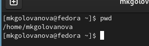{#fig:001 width=70%}

Я перешла в каталог /tmp. (рис. @fig:002).

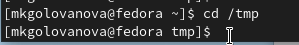{#fig:002 width=70%}

Я вывела на экран содержимое каталога /tmp, используя для этого  команду ls с различными опциями (рис. @fig:003, рис. @fig:004, рис. @fig:005, рис. @fig:006, рис. @fig:007). Разница в выводимой на экран информации объясняется тем, что различные опции позволяют увидеть дополнительные данные, которые не отображаются без дополнительных указаний к команде ls.

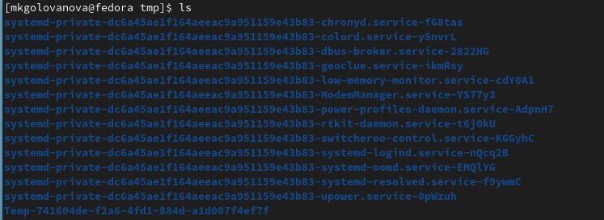{#fig:003 width=70%}

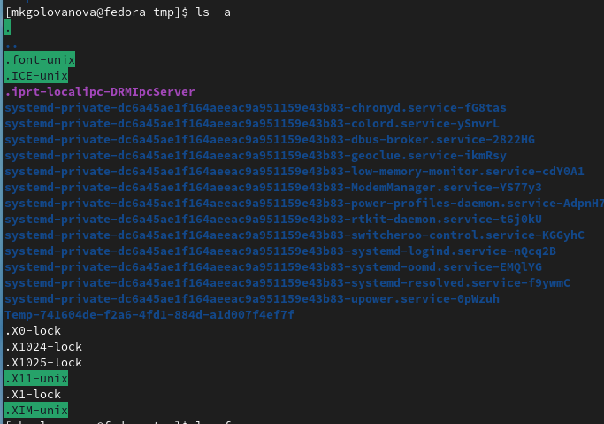{#fig:004 width=70%}

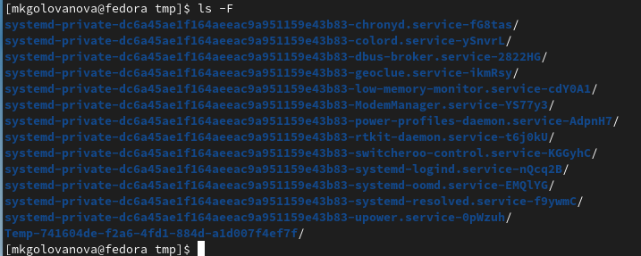{#fig:005 width=70%}

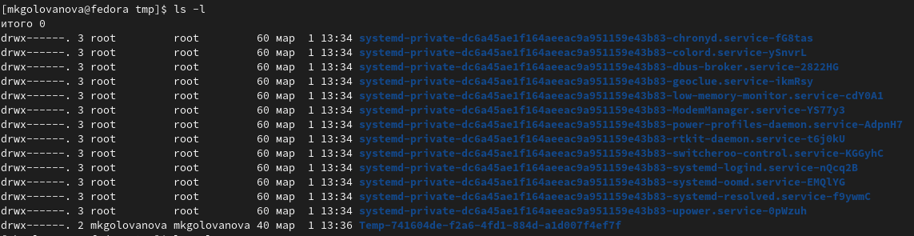{#fig:006 width=70%}

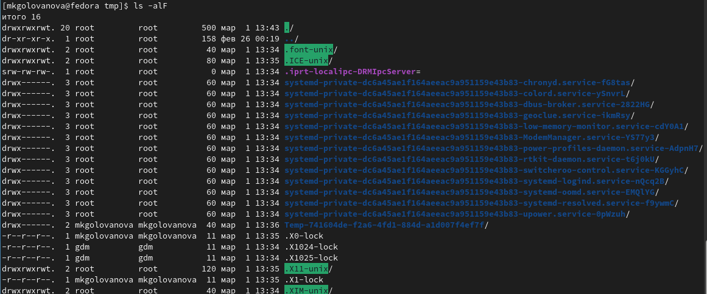{#fig:007 width=70%}

Я перешла в каталог /var/spool и вывела на экран его содержимое, проверяя, есть ли там подкаталог с именем cron (рис. @fig:008). В каталоге /var/spool нет подкаталога с именем cron. 

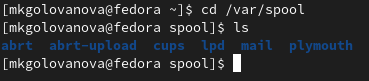{#fig:008 width=70%}

Я перешла в домашний каталог, вывела на экран его содержимое и определила, кто является владельцем файлов и подкаталогов (mkgolovanova).(рис. @fig:009).

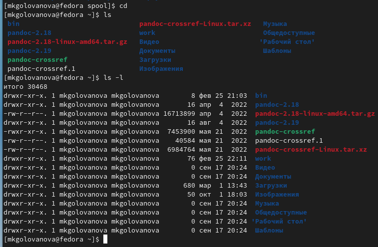{#fig:009 width=70%}

Я создала в домашнем каталоге новый каталог с именем newdir (рис. @fig:010).

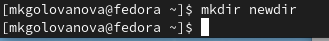{#fig:010 width=70%}

В каталоге ~/newdir создайте новый каталог с именем morefun (рис. @fig:011).

{#fig:011 width=70%}

Я создала в домашнем каталоге одной командой три новых каталога с именами letters, memos, misk, а затем удалила эти каталоги одной командой (рис. @fig:012, рис. @fig:013).

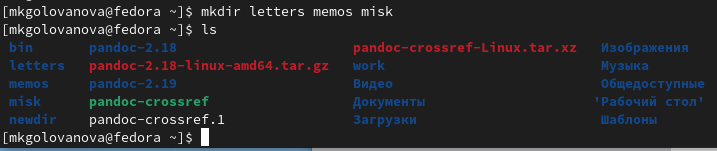{#fig:012 width=70%}

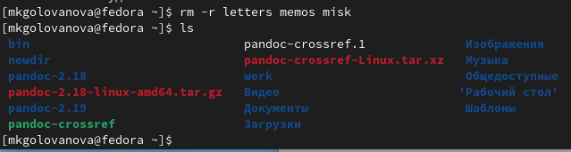{#fig:013 width=70%}

Я попробовала удалить ранее созданный каталог ~/newdir командой rm. Каталог не был удалён, так как для удаления каталогов необходимо использовать опцию рекурсивного удаления -r (рис. @fig:014).

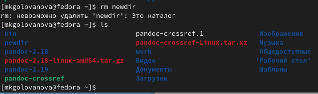{#fig:014 width=70%}

Я удалила каталог ~/newdir/morefun из домашнего каталога, и проверила, был ли он удалён (рис. @fig:015).

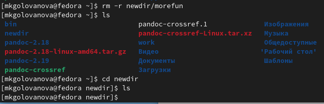{#fig:015 width=70%}

С помощью команды man я определила набор опций команды ls, позволяющий отсортировать по времени последнего изменения выводимый список содержимого каталога с развёрнутым описанием файлов (рис. @fig:016, рис. @fig:017, рис. @fig:018, рис. @fig:019, рис. @fig:020). Это опции -t, -lt, -ltr

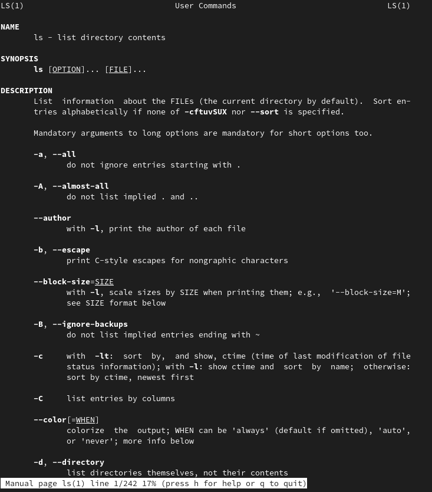{#fig:016 width=70%}

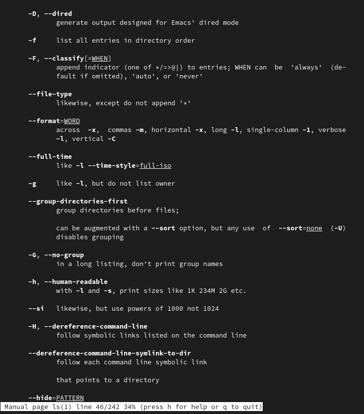{#fig:017 width=70%}

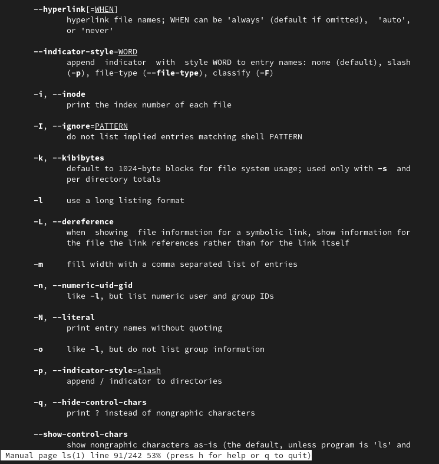{#fig:018 width=70%}

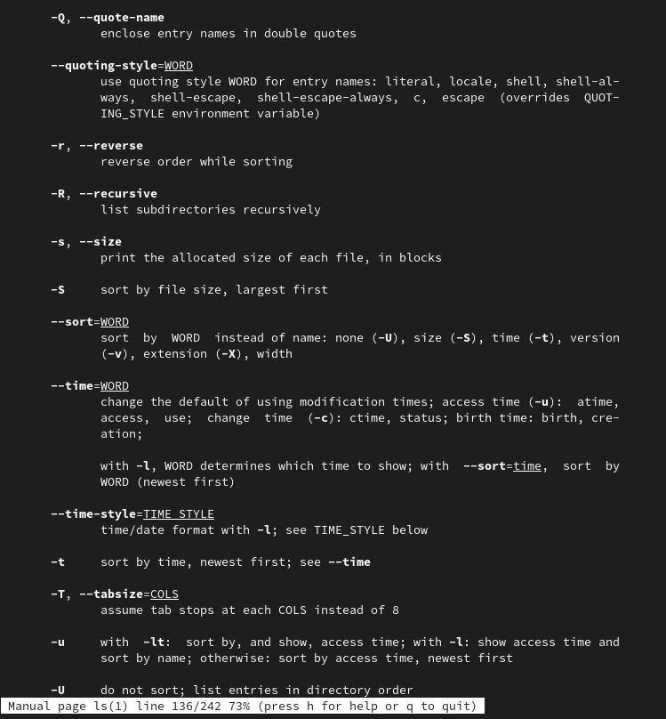{#fig:019 width=70%}

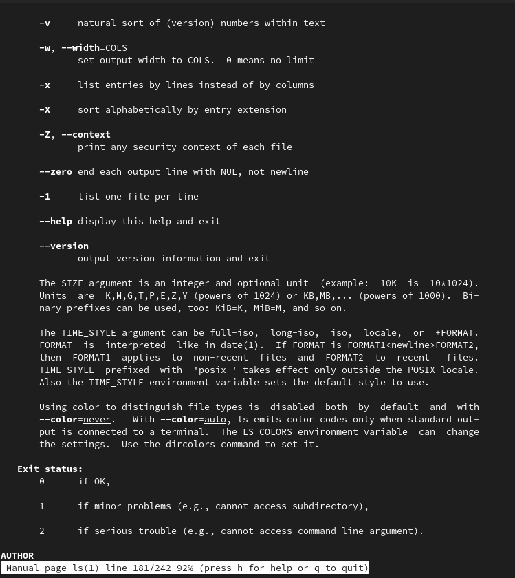{#fig:020 width=70%}

Я использовала команду man для просмотра описания команд cd, pwd, mkdir, rmdir, rm (рис. @fig:021, рис. @fig:022, рис. @fig:023, рис. @fig:024, рис. @fig:025, рис. @fig:026, рис. @fig:027).

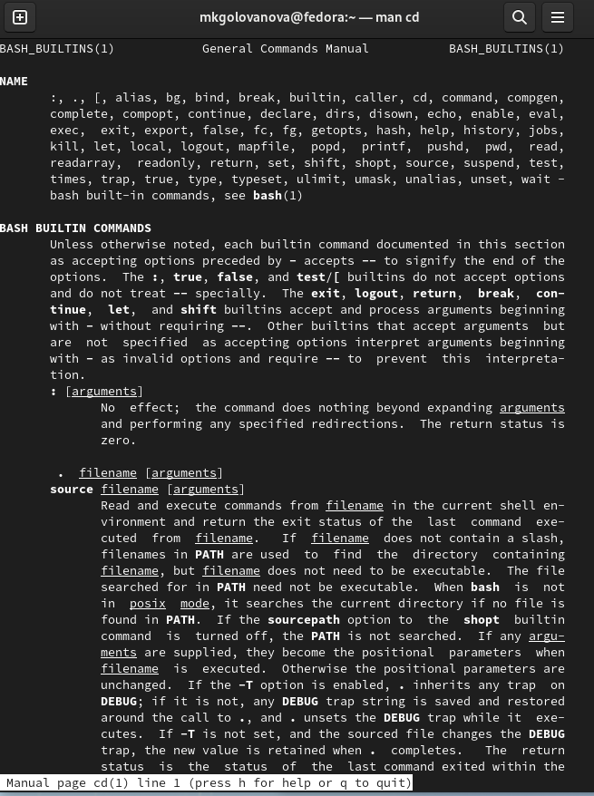{#fig:021 width=70%}

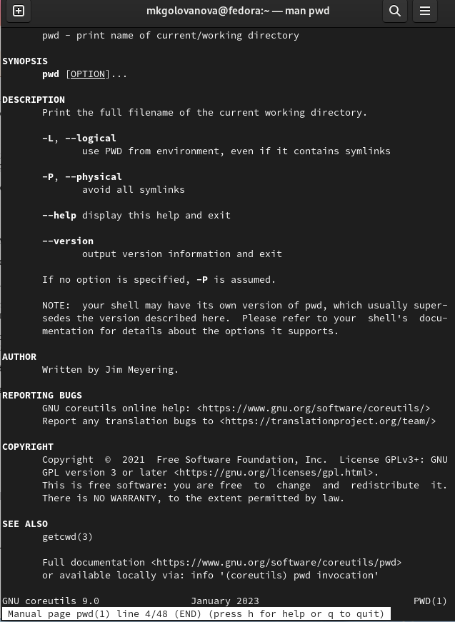{#fig:022 width=70%}

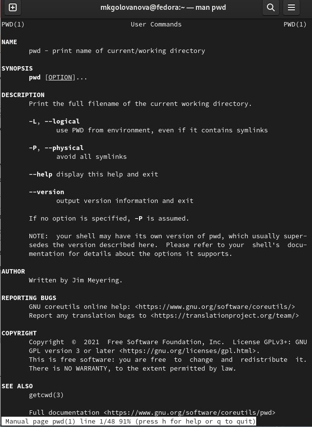{#fig:023 width=70%}

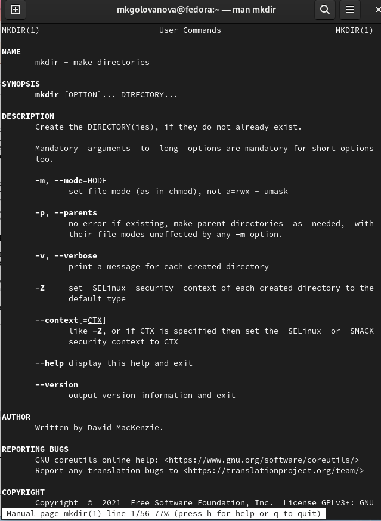{#fig:024 width=70%}

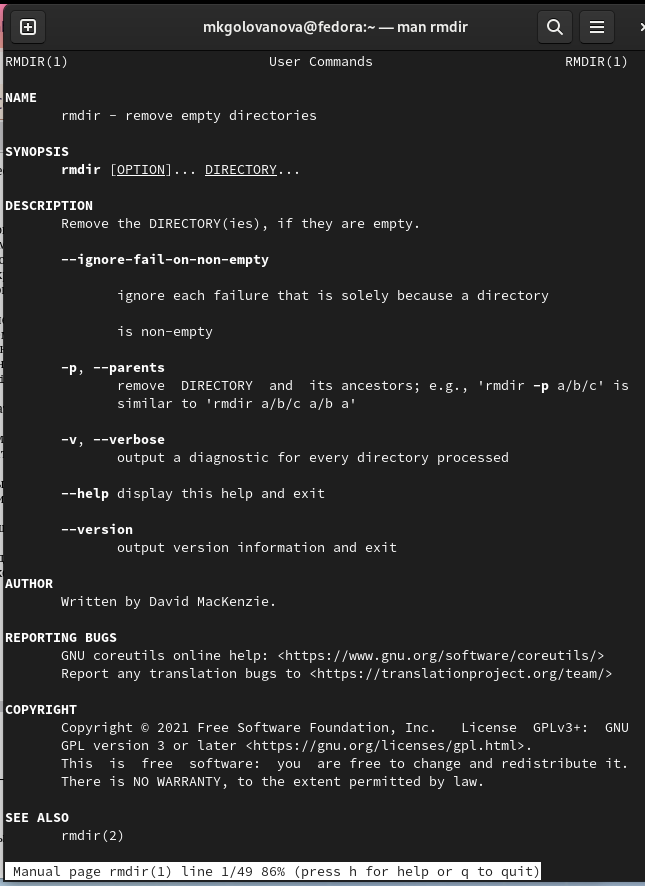{#fig:025 width=70%}

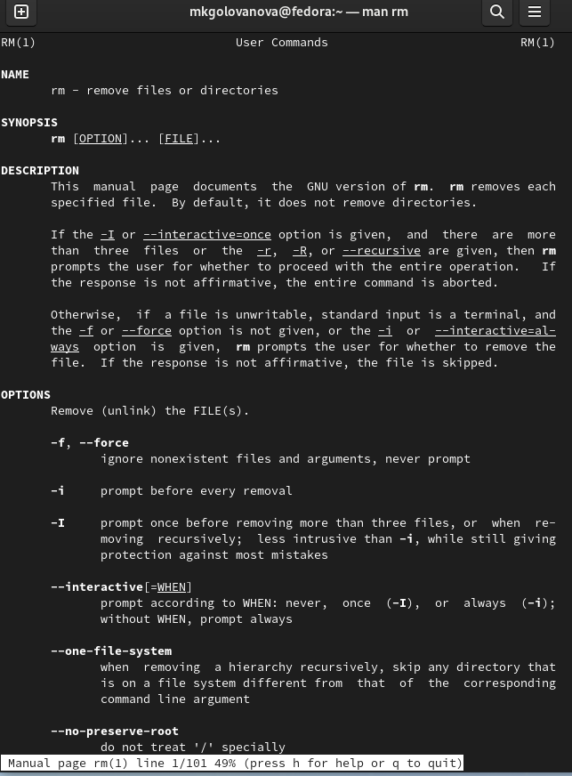{#fig:026 width=70%}

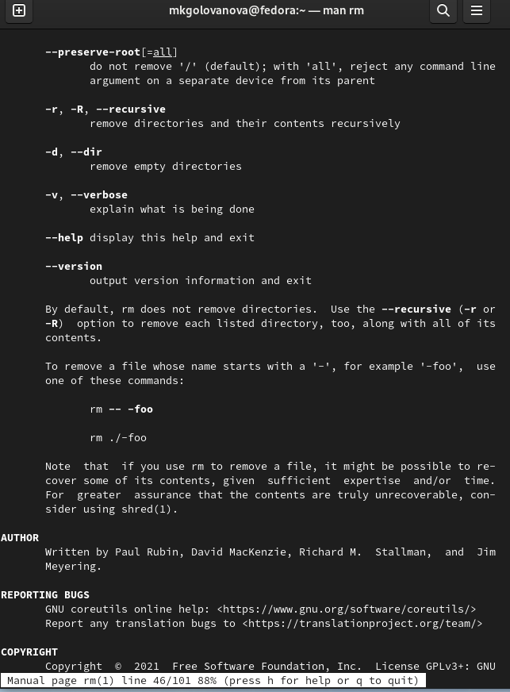{#fig:027 width=70%}

Используя информацию, полученную при помощи команды history (рис. @fig:028), я выполнила модификацию и исполнение нескольких команд из буфера команд.(рис. @fig:029, рис. @fig:030, рис. @fig:031).

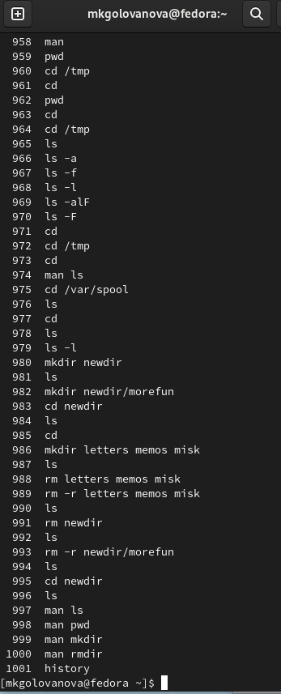{#fig:028 width=70%}

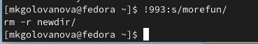{#fig:029 width=70%}

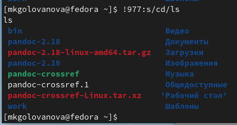{#fig:030 width=70%}

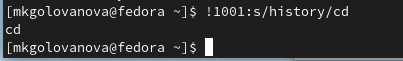{#fig:031 width=70%}

# Выводы

Я приобретела практические навыки работы с операционной системой на уровне командной строки (организация файловой системы, навигация по файловой системе, создание и удаление файлов и директорий).

# Список литературы{.unnumbered}

::: {#refs}
:::
