---
## Front matter
lang: ru-RU
title: Лабораторная работа № 4
subtitle: Операционные системы
author:
  - Голованова Мария Константиновна
institute:
  - Российский университет дружбы народов, Москва, Россия
date: 11 марта 2023

## i18n babel
babel-lang: russian
babel-otherlangs: english

## Formatting pdf
toc: false
toc-title: Содержание
slide_level: 2
aspectratio: 169
section-titles: true
theme: metropolis
header-includes:
 - \metroset{progressbar=frametitle,sectionpage=progressbar,numbering=fraction}
 - '\makeatletter'
 - '\beamer@ignorenonframefalse'
 - '\makeatother'
---

# Информация

## Докладчик

:::::::::::::: {.columns align=center}
::: {.column width="70%"}

  * Голованова Мария Константиновна
  * НММбд-01-22, 1132226478
  * Факультет физико-математических и естественных наук
  * Российский университет дружбы народов
  
:::
::: {.column width="30%"}

:::
::::::::::::::

# Вводная часть

## Цели и задачи

- Ознакомление с файловой системой Linux, её структурой, именами и содержанием каталогов. Приобретение практических навыков по применению команд для работы с файлами и каталогами, по управлению процессами (и работами), по проверке использования диска и обслуживанию файловой системы.

## Теоретическое введение

- В операционной системе GNU Linux взаимодействие пользователя с системой обычно осуществляется с помощью командной строки посредством построчного ввода команд. 
- Основными командами  для работы с файлами и каталогами являются:
- команда touch: используется для создания текстового файла;
- команда cat: просмотр файлов небольшого размера;
- команда less: постраничный просмотр файлов; 
- команда head: выводит по умолчанию первые 10 строк файла;
- команда tail: выводит по умолчанию 10 последних строк файла;
- команда cp: используется для копирования файлов и каталогов;
- команды mv и mvdir: предназначены для перемещения и переименования файлов и каталогов;
- команда chmod: меняет права доступа к файлу или каталогу, воспользоваться ей может владелец файла (или каталога) или пользователь с правами администратора.

# Выполнение лабораторной работы

## Выполнение лабораторной работы

- Я выполнила все примеры, приведённые в первой части описания лабораторной работы (рис. 1, рис. 2, рис. 3, рис. 4, рис. 5, рис. 6, рис. 7, рис. 8, рис. 9, рис. 10, рис. 11, рис. 12, рис. 13, рис. 14):

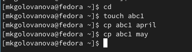{.column width=70%}

## Выполнение лабораторной работы

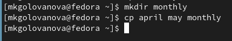{.column width=70%}

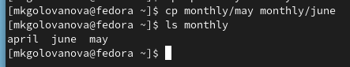{.column width=70%}

## Выполнение лабораторной работы

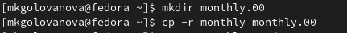{.column width=70%}

{.column width=70%}

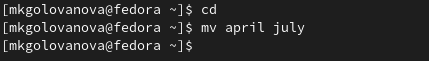{.column width=60%}

## Выполнение лабораторной работы

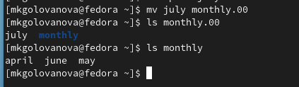{.column width=70%}

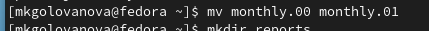{.column width=70%}

## Выполнение лабораторной работы

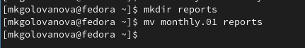{.column width=70%}

{.column width=70%}

## Выполнение лабораторной работы

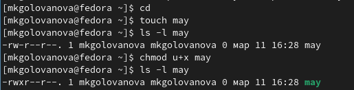{.column width=70%}

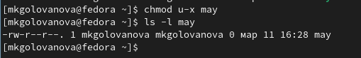{.column width=70%}

## Выполнение лабораторной работы

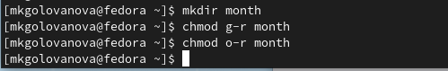{.column width=70%}

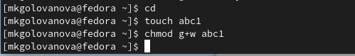{.column width=70%}

## Выполнение лабораторной работы

- Я скопировала файл /usr/include/sys/io.h в домашний каталог и назовите его equipment, предварительно проверив, есть ли файл io.h в каталоге /usr/include/sys/ (рис. 15).

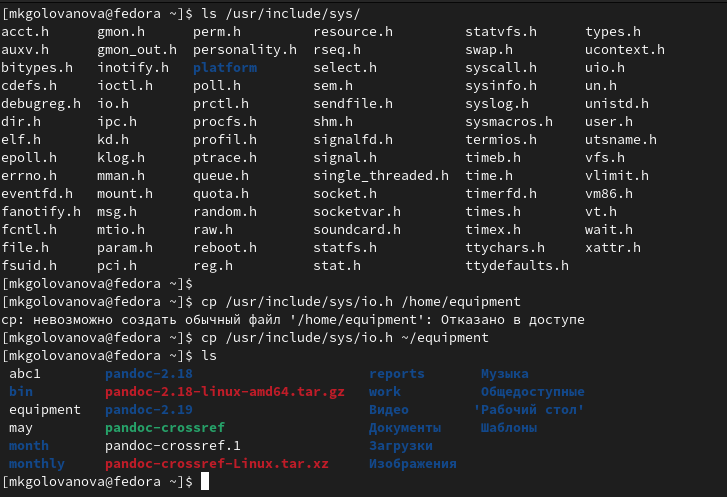{.column width=40%}

## Выполнение лабораторной работы

- Я создала в домашнем каталоге директорию ~/ski.plases (рис. 16).

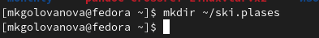{.column width=70%}

- Я переместила файл equipment в каталог ~/ski.plases (рис. 17).

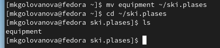{.column width=70%}

## Выполнение лабораторной работы

- Я переименовала файл ~/ski.plases/equipment в ~/ski.plases/equiplist (рис. 18).

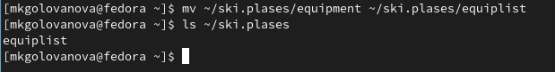{.column width=70%}

- Я создала в домашнем каталоге файл abc1 и скопировала его в каталог ~/ski.plases, назвав equiplist2 (рис. 19).

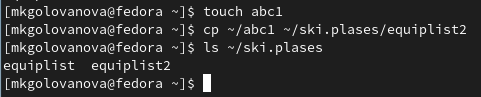{.column width=70%}

## Выполнение лабораторной работы

- Я создала каталог с именем equipment в каталоге ~/ski.plases (рис. 20).

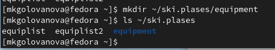{.column width=70%}

## Выполнение лабораторной работы

- Я переместила файлы ~/ski.plases/equiplist и equiplist2 в каталог ~/ski.plases/equipment (рис. 21).

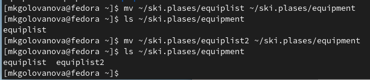{.column width=65%}

## Выполнение лабораторной работы

- Я создала и переместила каталог ~/newdir в каталог ~/ski.plases и назвала его plans (рис. 22).

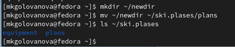{.column width=60%}

## Выполнение лабораторной работы

- Я создала каталоги australia, play и файлы my_os, feathers (рис. 23), а затем определила опции команды chmod, необходимые для того, чтобы присвоить им выделенные права доступа, считая, что в начале таких прав нет:
- drwxr--r-- ... australia (рис. 24).
- drwx--x--x ... play (рис. 25).
- -r-xr--r-- ... my_os (рис. 26).
- -rw-rw-r-- ... feathers (рис. 27).

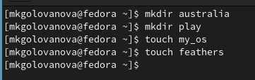{.column width=60%}

## Выполнение лабораторной работы

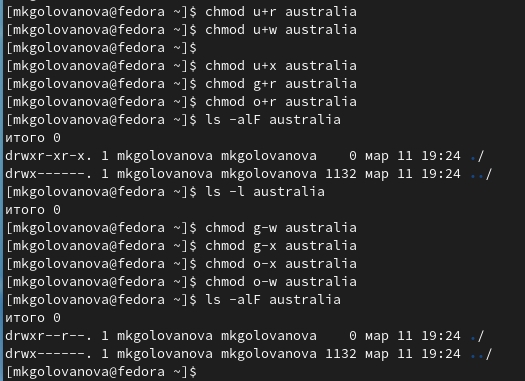{.column width=50%}

## Выполнение лабораторной работы

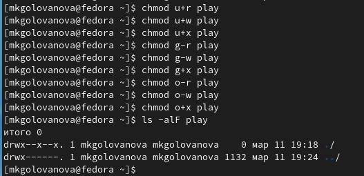{.column width=50%}

## Выполнение лабораторной работы

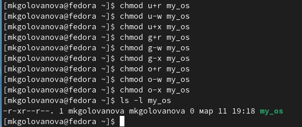{.column width=60%}

## Выполнение лабораторной работы

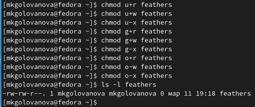{.column width=60%}

## Выполнение лабораторной работы

- Я попробовала просмотреть содержимое файла /etc/password, файл не был найден (рис. 28).

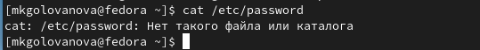{.column width=70%}

- Я скопировала файл ~/feathers в файл ~/file.old (рис. 29).

{.column width=70%}

## Выполнение лабораторной работы

- Я переместила файл ~/file.old в каталог ~/play (рис. 30).

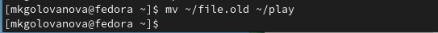{.column width=70%}

- Я скопировала каталог ~/play в каталог ~/fun (рис. 31).

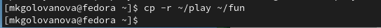{.column width=70%}

- Я переместила каталог ~/fun в каталог ~/play и назовите его games (рис. 32).

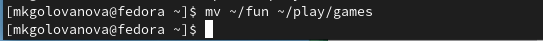{.column width=70%}

## Выполнение лабораторной работы

- Я лишила владельца файла ~/feathers права на чтение, а затем попыталась просмотреть файл командой cat и скопировать его (рис. 33). Мне было отказано в доступе. 

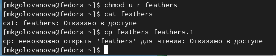{.column width=70%}

- Я дала владельцу файла ~/feathers право на чтение (рис. 34).

{.column width=70%}

## Выполнение лабораторной работы

- Я лишила владельца каталога ~/play права на выполнение, а затем и попыталась перейти в каталог ~/play. Мне было отказано в доступе (рис. 35).

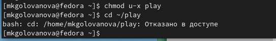{.column width=70%}

- Я дала владельцу каталога ~/play право на выполнение (рис. 36).

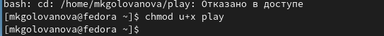{.column width=70%}

## Выполнение лабораторной работы

- Я прочитала man по командам mount, fsck, mkfs, kill (рис. 37, рис. 38, рис. 39, рис. 40). 
- Команда mount используется для присоединения файловой системы, найденной на каком-то устройстве, в большое файловое дерево, в котором расположены все файлы, доступные в системе Unix. 
- Команда fsck используется для проверки и, при необходимости, восстановления одного или нескольких файлов Linux; mkfs - для создания файловой системы Linux на устройстве, обычно на разделе жесткого диска. 
- Команда kill отправляет указанный сигнал указанным процессам или группам процессов. Сигнал KILL не может быть перехвачен и поэтому не дает целевому процессу возможности выполнить какую-либо очистку перед завершением. 

## Выполнение лабораторной работы

{.column width=40%}

## Выполнение лабораторной работы

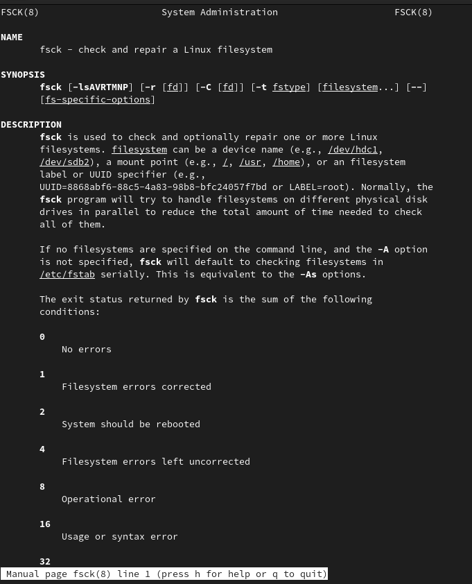{.column width=40%}

## Выполнение лабораторной работы

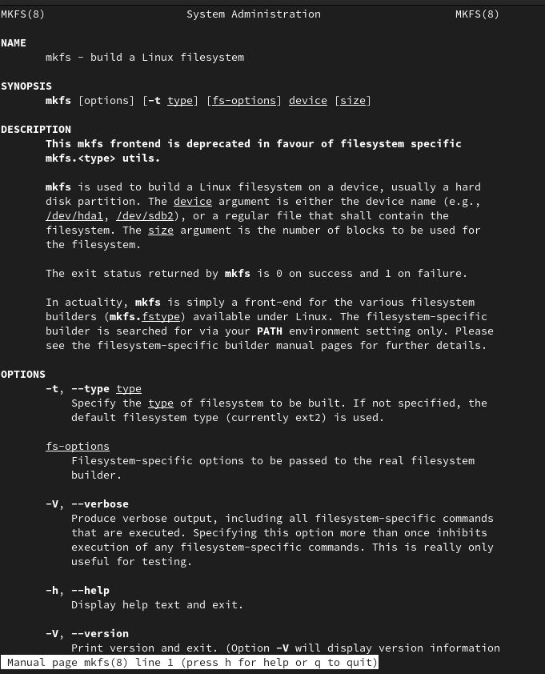{.column width=40%}

## Выполнение лабораторной работы

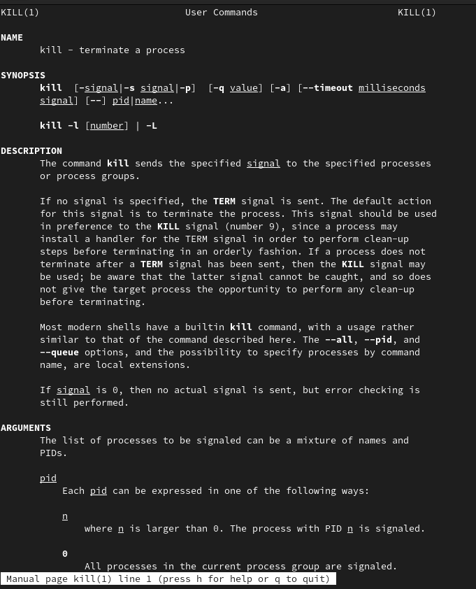{.column width=40%}

# Выводы

- Я ознакомилась с файловой системой Linux, её структурой, именами и содержанием каталогов и приобрела практические навыки по применению команд для работы с файлами и каталогами, по управлению процессами (и работами), по проверке использования диска и обслуживанию файловой системы.

