---
## Front matter
title: "Лабораторная работа No 5"
subtitle: "Операционные системы"
author: "Голованова Мария Константиновна"

## Generic otions
lang: ru-RU
toc-title: "Содержание"

## Bibliography
bibliography: bib/cite.bib
csl: pandoc/csl/gost-r-7-0-5-2008-numeric.csl

## Pdf output format
toc: true # Table of contents
toc-depth: 2
lof: true # List of figures
lot: true # List of tables
fontsize: 12pt
linestretch: 1.5
papersize: a4
documentclass: scrreprt
## I18n polyglossia
polyglossia-lang:
  name: russian
  options:
	- spelling=modern
	- babelshorthands=true
polyglossia-otherlangs:
  name: english
## I18n babel
babel-lang: russian
babel-otherlangs: english
## Fonts
mainfont: PT Serif
romanfont: PT Serif
sansfont: PT Sans
monofont: PT Mono
mainfontoptions: Ligatures=TeX
romanfontoptions: Ligatures=TeX
sansfontoptions: Ligatures=TeX,Scale=MatchLowercase
monofontoptions: Scale=MatchLowercase,Scale=0.9
## Biblatex
biblatex: true
biblio-style: "gost-numeric"
biblatexoptions:
  - parentracker=true
  - backend=biber
  - hyperref=auto
  - language=auto
  - autolang=other*
  - citestyle=gost-numeric
## Pandoc-crossref LaTeX customization
figureTitle: "Рис."
tableTitle: "Таблица"
listingTitle: "Листинг"
lofTitle: "Список иллюстраций"
lotTitle: "Список таблиц"
lolTitle: "Листинги"
## Misc options
indent: true
header-includes:
  - \usepackage{indentfirst}
  - \usepackage{float} # keep figures where there are in the text
  - \floatplacement{figure}{H} # keep figures where there are in the text
---

# Цель работы

Ознакомление с файловой системой Linux, её структурой, именами и содержанием каталогов. Приобретение практических навыков по применению команд для работы с файлами и каталогами, по управлению процессами (и работами), по проверке использования диска и обслуживанию файловой системы.

# Задание

1. Выполните все примеры, приведённые в первой части описания лабораторной работы.
2. Выполните следующие действия, зафиксировав в отчёте по лабораторной работе используемые при этом команды и результаты их выполнения:
2.1. Скопируйте файл /usr/include/sys/io.h в домашний каталог и назовите его equipment. Если файла io.h нет, то используйте любой другой файл в каталоге /usr/include/sys/ вместо него.
2.2. В домашнем каталоге создайте директорию ~/ski.plases.
2.3. Переместите файл equipment в каталог ~/ski.plases.
2.4. Переименуйте файл ~/ski.plases/equipment в ~/ski.plases/equiplist.
2.5. Создайте в домашнем каталоге файл abc1 и скопируйте его в каталог ~/ski.plases, назовите его equiplist2.
2.6. Создайте каталог с именем equipment в каталоге ~/ski.plases.
2.7. Переместите файлы ~/ski.plases/equiplist и equiplist2 в каталог ~/ski.plases/equipment.
2.8. Создайте и переместите каталог ~/newdir в каталог ~/ski.plases и назовите его plans.
3. Определите опции команды chmod, необходимые для того, чтобы присвоить перечисленным ниже файлам выделенные права доступа, считая, что в начале таких прав нет:
3.1. drwxr--r-- ... australia
3.2. drwx--x--x ... play
3.3. -r-xr--r-- ... my_os
3.4. -rw-rw-r-- ... feathers
При необходимости создайте нужные файлы.
4. Проделайте приведённые ниже упражнения, записывая в отчёт по лабораторной работе используемые при этом команды:
4.1. Просмотрите содержимое файла /etc/password.
4.2. Скопируйте файл ~/feathers в файл ~/file.old.
4.3. Переместите файл ~/file.old в каталог ~/play.
4.4. Скопируйте каталог ~/play в каталог ~/fun.
4.5. Переместите каталог ~/fun в каталог ~/play и назовите его games.
4.6. Лишите владельца файла ~/feathers права на чтение.
4.7. Что произойдёт, если вы попытаетесь просмотреть файл ~/feathers командой cat?
4.8. Что произойдёт, если вы попытаетесь скопировать файл ~/feathers?
4.9. Дайте владельцу файла ~/feathers право на чтение.
4.10. Лишите владельца каталога ~/play права на выполнение.
4.11. Перейдите в каталог ~/play. Что произошло?
4.12. Дайте владельцу каталога ~/play право на выполнение.
5. Прочитайте man по командам mount, fsck, mkfs, kill и кратко их охарактеризуйте, приведя примеры.

# Теоретическое введение

В операционной системе GNU Linux взаимодействие пользователя с системой обычно осуществляется с помощью командной строки посредством построчного ввода команд. 
Основными командами  для работы с файлами и каталогами являются:
команда touch: используется для создания текстового файла;
команда cat: просмотр файлов небольшого размера;
команда less: постраничный просмотр файлов; 
команда head: выводит по умолчанию первые 10 строк файла;
команда tail: выводит по умолчанию 10 последних строк файла;
команда cp: используется для копирования файлов и каталогов;
команды mv и mvdir: предназначены для перемещения и переименования файлов и каталогов;
команда chmod: меняет права доступа к файлу или каталогу, воспользоваться ей может владелец файла (или каталога) или пользователь с правами администратора.

# Выполнение лабораторной работы

## 

Я выполнила все примеры, приведённые в первой части описания лабораторной работы (рис. @fig:001, рис. @fig:002, рис. @fig:003, рис. @fig:004, рис. @fig:005, рис. @fig:006, рис. @fig:007, рис. @fig:008, рис. @fig:009, рис. @fig:010, рис. @fig:011, рис. @fig:012, рис. @fig:013, рис. @fig:014):

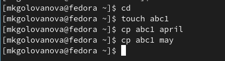{#fig:001 width=70%}

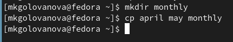{#fig:002 width=70%}

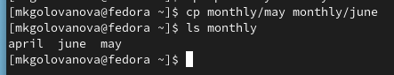{#fig:003 width=70%}

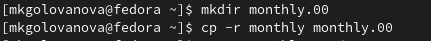{#fig:004 width=70%}

{#fig:005 width=70%}

{#fig:006 width=70%}

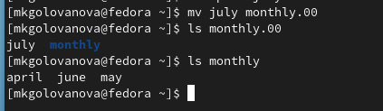{#fig:007 width=70%}

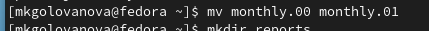{#fig:008 width=70%}

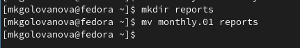{#fig:009 width=70%}

{#fig:010 width=70%}

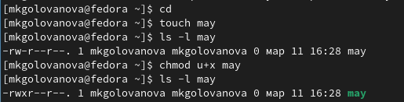{#fig:011 width=70%}

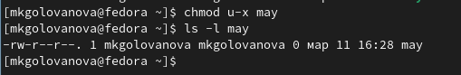{#fig:012 width=70%}

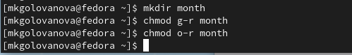{#fig:013 width=70%}

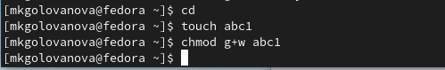{#fig:014 width=70%}

## 

Я скопировала файл /usr/include/sys/io.h в домашний каталог и назовите его equipment, предварительно проверив, есть ли файл io.h в каталоге /usr/include/sys/ (рис. @fig:015).

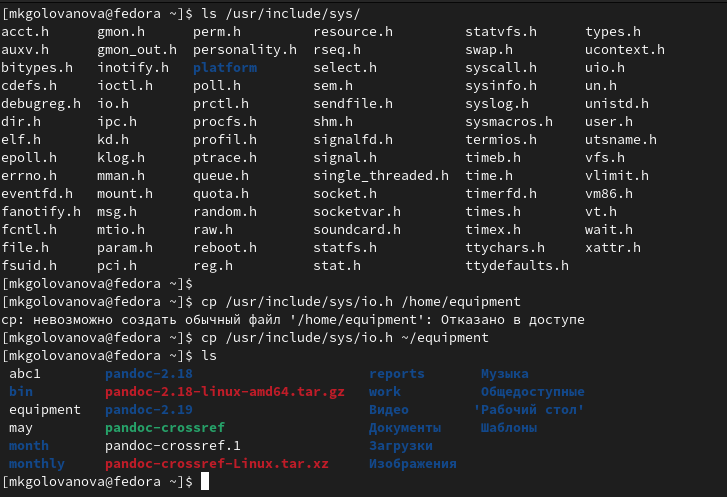{#fig:015 width=70%}

Я создала в домашнем каталоге директорию ~/ski.plases (рис. @fig:016).

{#fig:016 width=70%}

Я переместила файл equipment в каталог ~/ski.plases (рис. @fig:017).

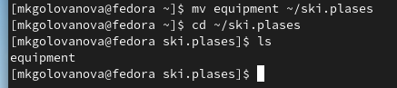{#fig:017 width=70%}

Я переименовала файл ~/ski.plases/equipment в ~/ski.plases/equiplist (рис. @fig:018).

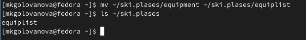{#fig:018 width=70%}

Я создала в домашнем каталоге файл abc1 и скопировала его в каталог ~/ski.plases, назвав equiplist2 (рис. @fig:019).

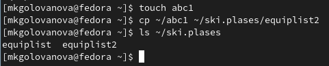{#fig:019 width=70%}

Я создала каталог с именем equipment в каталоге ~/ski.plases (рис. @fig:020).

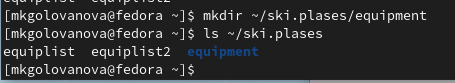{#fig:020 width=70%}

Я переместила файлы ~/ski.plases/equiplist и equiplist2 в каталог ~/ski.plases/equipment (рис. @fig:021).

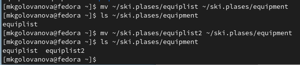{#fig:021 width=70%}

Я создала и переместила каталог ~/newdir в каталог ~/ski.plases и назвала его plans (рис. @fig:022).

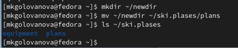{#fig:022 width=70%}

## 

Я создала каталоги australia, play и файлы my_os, feathers (рис. @fig:023), а затем определила опции команды chmod, необходимые для того, чтобы присвоить им выделенные права доступа, считая, что в начале таких прав нет:
3.1. drwxr--r-- ... australia (рис. @fig:024).
3.2. drwx--x--x ... play (рис. @fig:025).
3.3. -r-xr--r-- ... my_os (рис. @fig:026).
3.4. -rw-rw-r-- ... feathers (рис. @fig:027).

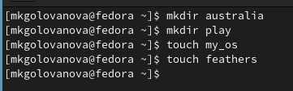{#fig:023 width=70%}

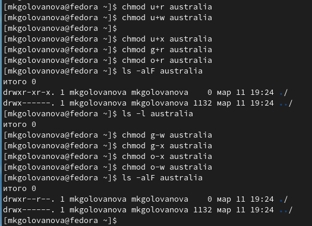{#fig:024 width=70%}

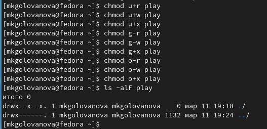{#fig:025 width=70%}

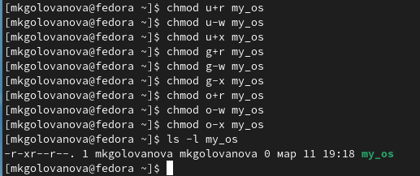{#fig:026 width=70%}

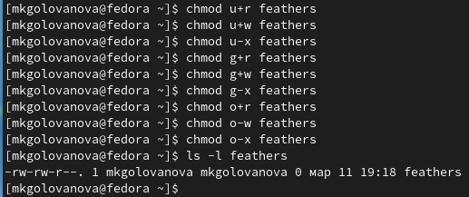{#fig:027 width=70%}

## 

Я попробовала просмотреть содержимое файла /etc/password, файл не был найден (рис. @fig:028).

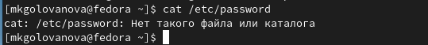{#fig:028 width=70%}

Я скопировала файл ~/feathers в файл ~/file.old (рис. @fig:029).

{#fig:029 width=70%}

Я переместила файл ~/file.old в каталог ~/play (рис. @fig:030).

{#fig:030 width=70%}

Я скопировала каталог ~/play в каталог ~/fun (рис. @fig:031).

{#fig:031 width=70%}

Я переместила каталог ~/fun в каталог ~/play и назовите его games (рис. @fig:032).

{#fig:032 width=70%}

Я лишила владельца файла ~/feathers права на чтение, а затем попыталась просмотреть файл командой cat и скопировать его (рис. @fig:033). Мне было отказано в доступе. 

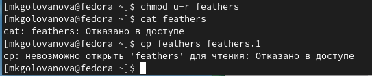{#fig:033 width=70%}

Я дала владельцу файла ~/feathers право на чтение (рис. @fig:034).

{#fig:034 width=70%}

Я лишила владельца каталога ~/play права на выполнение, а затем и попыталась перейти в каталог ~/play. Мне было отказано в доступе (рис. @fig:035).

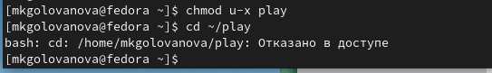{#fig:035 width=70%}

Я дала владельцу каталога ~/play право на выполнение (рис. @fig:036).

{#fig:036 width=70%}

## 5

Я прочитала man по командам mount, fsck, mkfs, kill (рис. @fig:037, рис. @fig:038, рис. @fig:039, рис. @fig:040). Команда mount используется для присоединения файловой системы, найденной на
каком-то устройстве, в большое файловое дерево, в котором расположены все файлы, доступные в системе Unix. Команда fsck используется для проверки и, при необходимости, восстановления одного или нескольких файлов Linux; mkfs - для создания файловой системы Linux на устройстве, обычно на разделе жесткого диска. Команда kill отправляет указанный сигнал указанным процессам или группам процессов. Сигнал KILL не может быть перехвачен и поэтому не дает целевому процессу возможности выполнить какую-либо очистку перед завершением. 

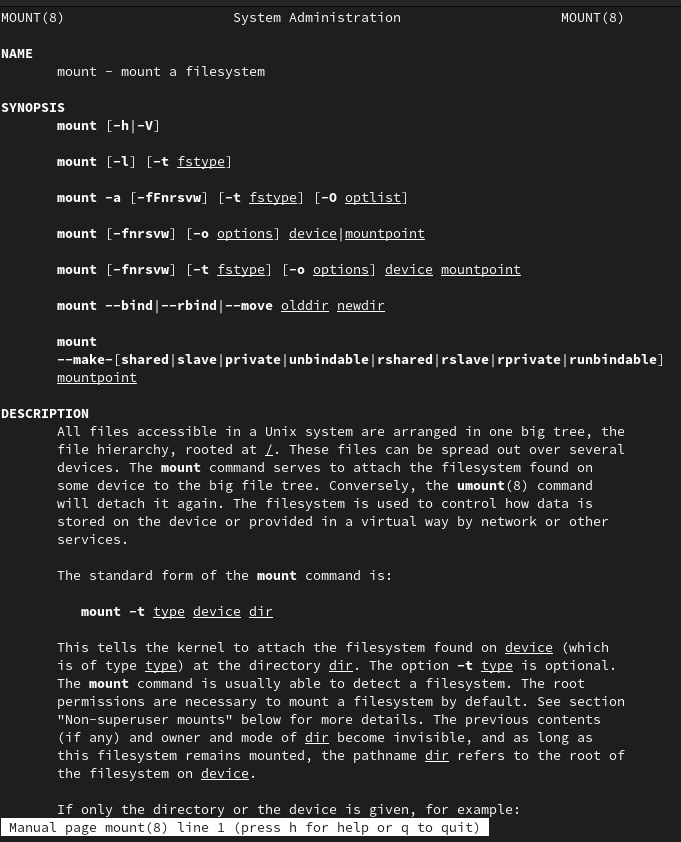{#fig:037 width=70%}

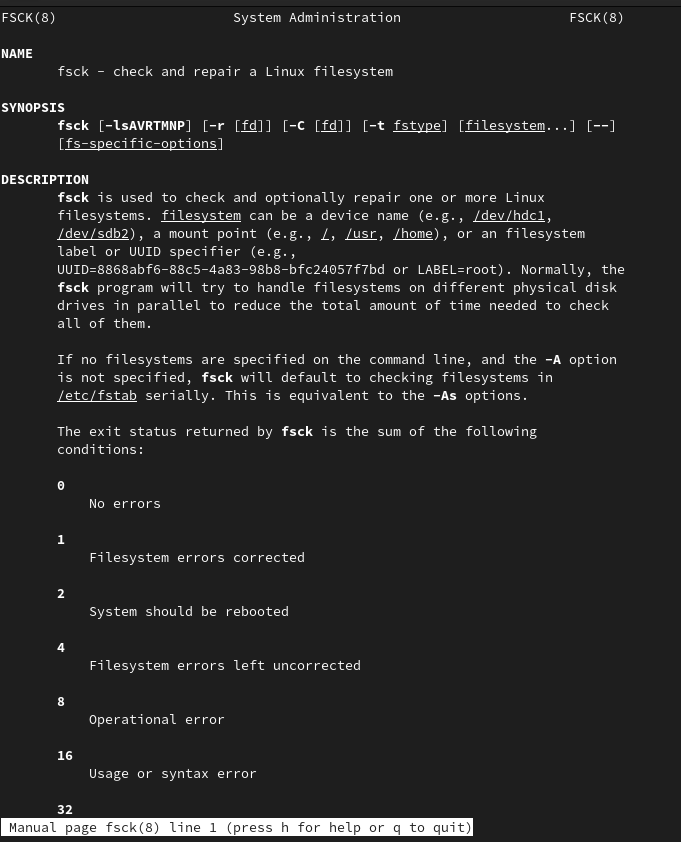{#fig:038 width=70%}

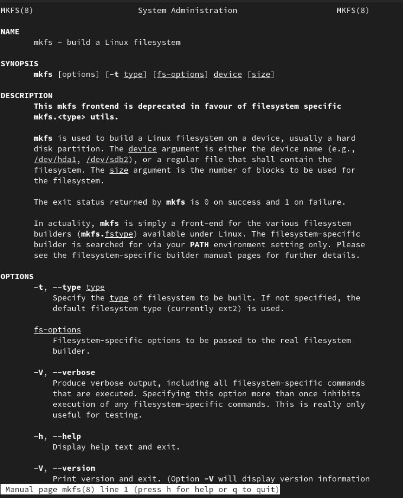{#fig:039 width=70%}

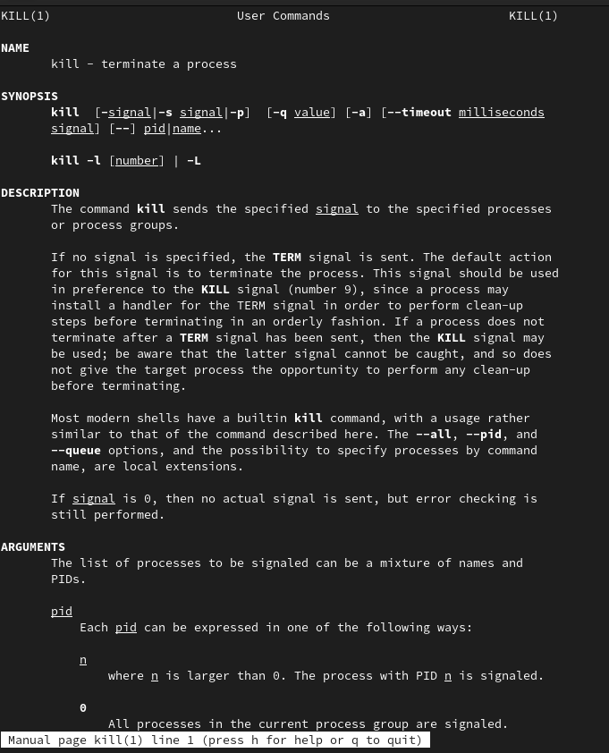{#fig:040 width=70%}

# Выводы

Я ознакомилась с файловой системой Linux, её структурой, именами и содержанием каталогов и приобрела практические навыки по применению команд для работы с файлами и каталогами, по управлению процессами (и работами), по проверке использования диска и обслуживанию файловой системы.

# Список литературы{.unnumbered}

::: {#refs}
:::
