---
## Front matter
lang: ru-RU
title: Лабораторная работа № 6
subtitle: Операционные системы
author:
  - Голованова Мария Константиновна
institute:
  - Российский университет дружбы народов, Москва, Россия
date: 18 марта 2023

## i18n babel
babel-lang: russian
babel-otherlangs: english

## Formatting pdf
toc: false
toc-title: Содержание
slide_level: 2
aspectratio: 169
section-titles: true
theme: metropolis
header-includes:
 - \metroset{progressbar=frametitle,sectionpage=progressbar,numbering=fraction}
 - '\makeatletter'
 - '\beamer@ignorenonframefalse'
 - '\makeatother'
---

# Информация

## Докладчик

:::::::::::::: {.columns align=center}
::: {.column width="70%"}

  * Голованова Мария Константиновна
  * НММбд-01-22, 1132226478
  * Факультет физико-математических и естественных наук
  * Российский университет дружбы народов
  
:::
::: {.column width="30%"}

# Вводная часть

## Цели и задачи

- Ознакомление с инструментами поиска файлов и фильтрации текстовых данных. 
- Приобретение практических навыков: по управлению процессами (и заданиями), по проверке использования диска и обслуживанию файловых систем.

## Задание

- Осуществите вход в систему, используя соответствующее имя пользователя.
- Запишите в файл file.txt названия файлов, содержащихся в каталоге /etc. Допишите в этот же файл названия файлов, содержащихся в вашем домашнем каталоге.
- Выведите имена всех файлов из file.txt, имеющих расширение .conf, после чего запишите их в новый текстовой файл conf.txt.
- Определите, какие файлы в вашем домашнем каталоге имеют имена, начинавшиеся с символа c? Предложите несколько вариантов, как это сделать.
- Выведите на экран (по странично) имена файлов из каталога /etc, начинающиеся с символа h.
- Запустите в фоновом режиме процесс, который будет записывать в файл ~/logfile файлы, имена которых начинаются с log.
- Удалите файл ~/logfile.
- Запустите из консоли в фоновом режиме редактор gedit.
- Определите идентификатор процесса gedit, используя команду ps, конвейер и фильтр grep. Как ещё можно определить идентификатор процесса?
- Прочтите справку (man) команды kill, после чего используйте её для завершения процесса gedit.
- Выполните команды df и du, предварительно получив более подробную информацию об этих командах, с помощью команды man.
- Воспользовавшись справкой команды find, выведите имена всех директорий, имеющихся в вашем домашнем каталоге.

## Теоретическое введение

В системе linux ля поиска файлов и фильтрации текстовых данных существуют специальные команды. Наиболее распространённые из них:
- команда find (используется для поиска и отображения на экран имён файлов, соответствующих заданной строке символов)
- команда grep (позволяет найти в текстовом файле указанную строку символов)
Для проверки использования диска применяются команды df и du:
- команда df (показывает размер каждого смонтированного раздела диска)
- команда du показывает число килобайт, используемое каждым файлом или каталогом.
и приобрела практические навыки по управлению процессами и заданиями, по проверке использования диска и обслуживанию файловых систем.
Для получения информации о процессах  используется команда ps используется 
Чтобы объединенить простых команды или утилиты в цепочки, в которых результат работы предыдущей команды передаётся последующей используется конвейер (pipe), имеющий следующий формат:
команда 1 | команда 2 (вывод команды 1 передастся на ввод команде 2)

# Выполнение лабораторной работы

## Выполнение лабораторной работы

- Я осуществила вход в систему, используя соответствующее имя пользователя (рис. 1).

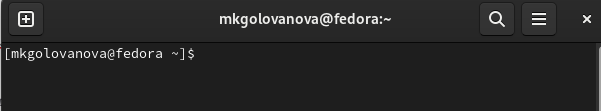{.column width=70%}

- Я записала в файл file.txt названия файлов, содержащихся в каталоге /etc (рис. 2, рис. 3), а затем дописала в этот же файл названия файлов, содержащихся в моём домашнем каталоге (рис. 4, рис. 5).

{.column width=70%}

## Выполнение лабораторной работы

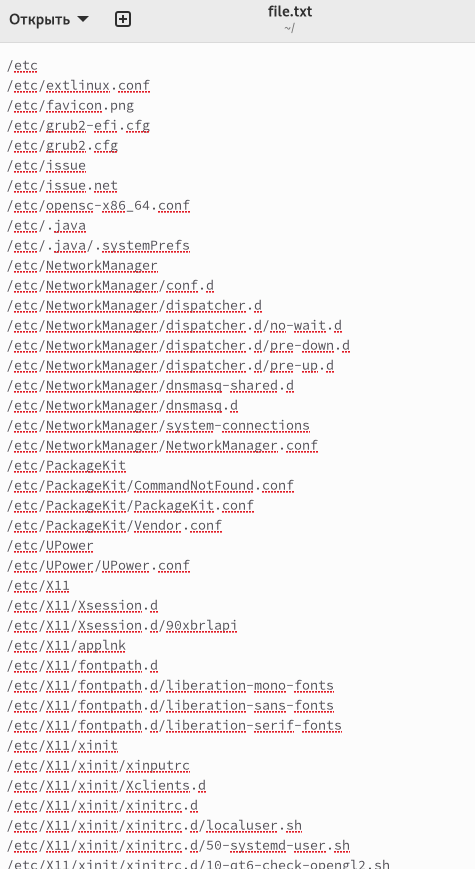{.column width=30%}

## Выполнение лабораторной работы

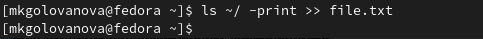{.column width=70%}

## Выполнение лабораторной работы

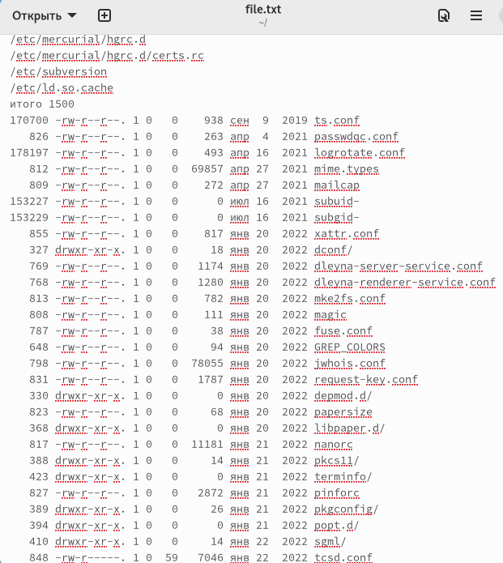{.column width=40%}

## Выполнение лабораторной работы

- Я вывела имена всех файлов из file.txt, имеющих расширение .conf, после чего запишите их в новый текстовой файл conf.txt (рис. 6, рис. 7, рис. 8).

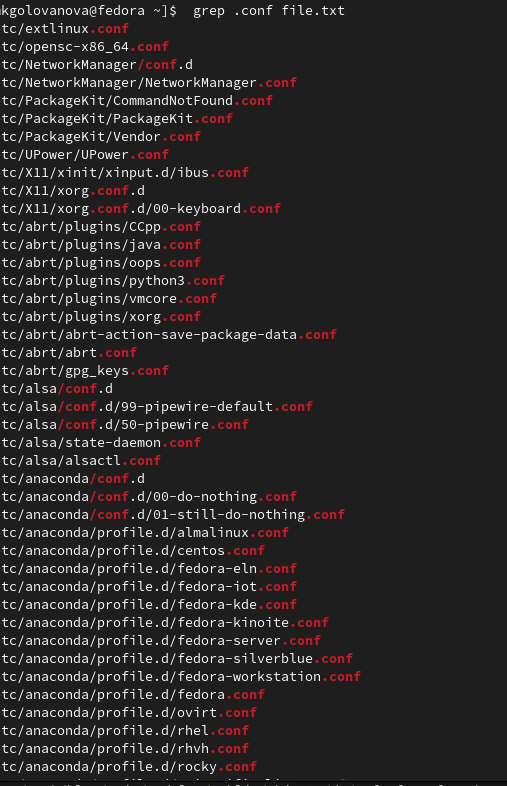{.column width=30%}

## Выполнение лабораторной работы

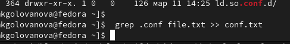{.column width=70%}

## Выполнение лабораторной работы

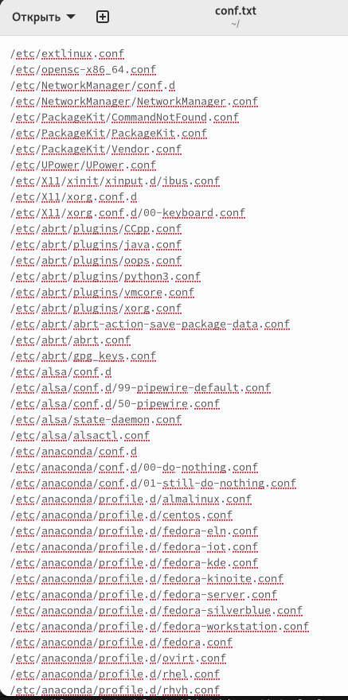{.column width=30%}

## Выполнение лабораторной работы

- Я определила, какие файлы в моём домашнем каталоге имеют имена, начинавшиеся с символа c, воспользовавшись командой find и командой grep (рис. 9, рис. 10).

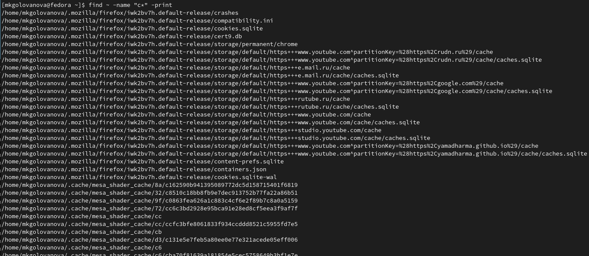{.column width=50%}

## Выполнение лабораторной работы

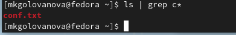{.column width=70%}

- Я вывела на экран имена файлов из каталога /etc, начинающиеся с символа h (рис. 11).

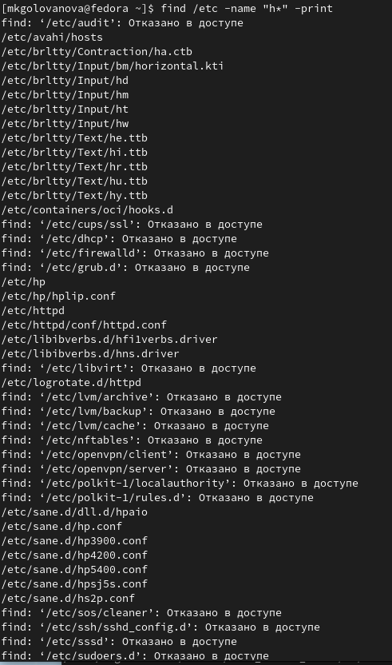{.column width=30%}

## Выполнение лабораторной работы

- Я запустила в фоновом режиме процесс, который будет записывать в файл ~/logfile файлы, имена которых начинаются с log (рис. 12, рис. 13).

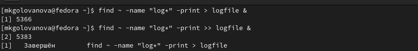{.column width=70%}

## Выполнение лабораторной работы

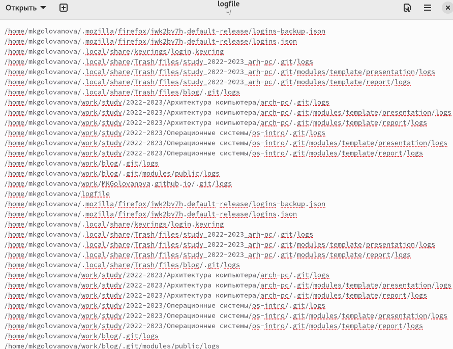{.column width=50%}

## Выполнение лабораторной работы

- Я удалила файл ~/logfile (рис. 14).

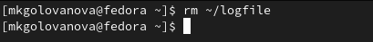{.column width=70%}

## Выполнение лабораторной работы

- Я запустила из консоли в фоновом режиме редактор gedit (рис. 15).

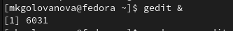{.column width=70%}

- Я определила идентификатор процесса gedit, используя команду ps, конвейер и фильтр grep (рис. 16).

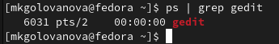{.column  width=70%}

## Выполнение лабораторной работы

- Я прочитала справку (man) команды kill, после чего использовала команду для завершения процесса gedit (рис. 17, рис. 18).

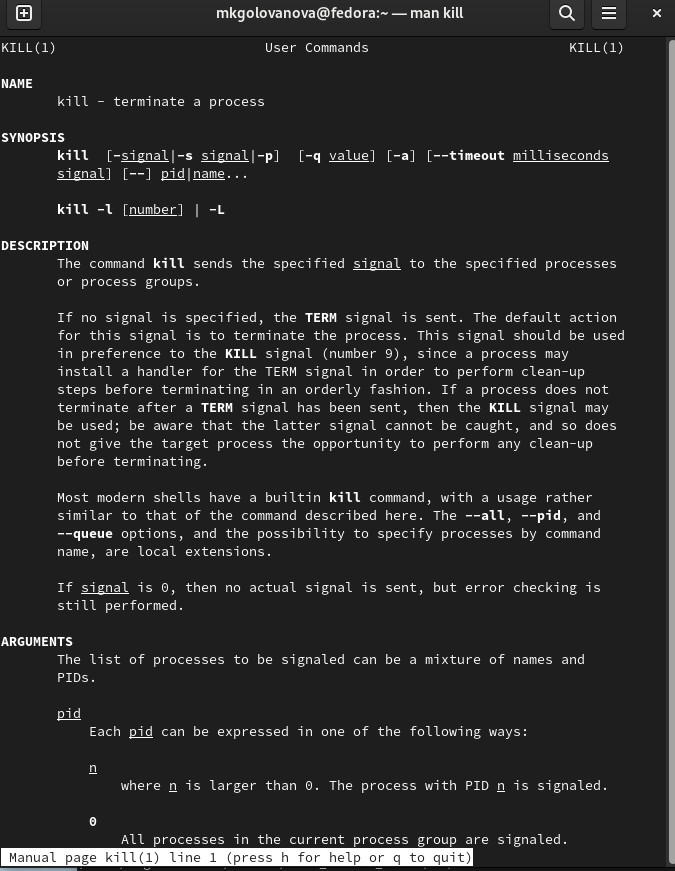{.column width=35%}

## Выполнение лабораторной работы

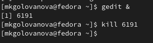{.column width=70%}

## Выполнение лабораторной работы

- Я выполнила команды df и du, предварительно получив более подробную информацию об этих командах, с помощью команды man (рис. 19, рис. 20, рис. 21, рис. 22).

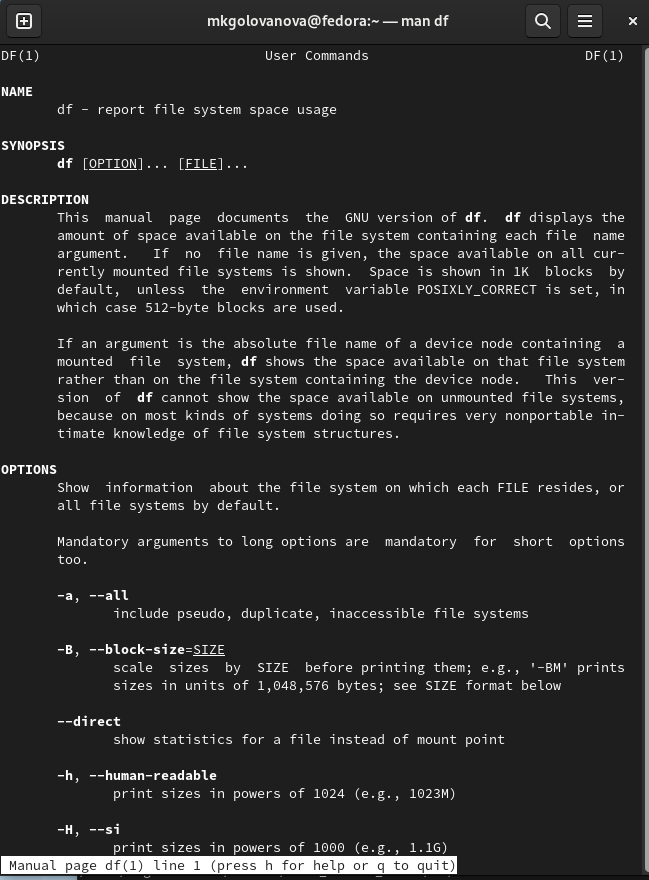{.column width=27%}

## Выполнение лабораторной работы

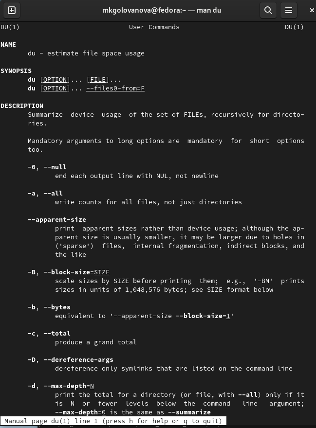{.column width=30%}

## Выполнение лабораторной работы

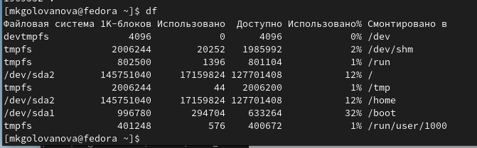{.column width=70%}

## Выполнение лабораторной работы

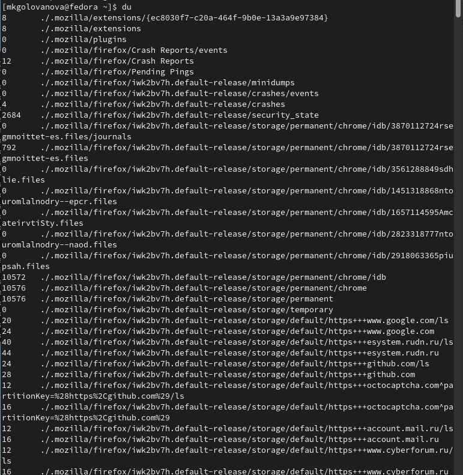{.column width=30%}

## Выполнение лабораторной работы

- Воспользовавшись справкой команды grep, я вывела имена всех директорий, имеющихся в моём домашнем каталоге (рис. 23, рис. 24).

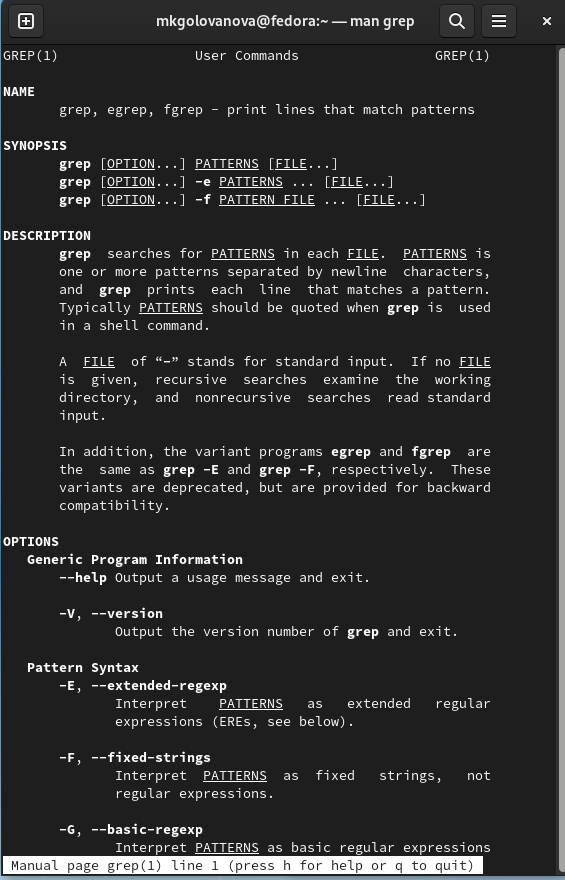{.column width=26%}

## Выполнение лабораторной работы

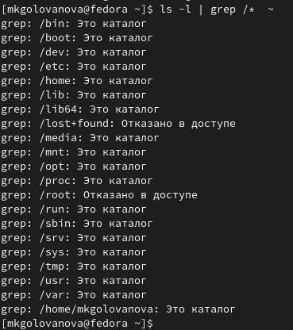{.column width=30%}

# Выводы

## Выводы

- Я ознакомилась с инструментами поиска файлов и фильтрации текстовых данных и приобрела практические навыки по управлению процессами и заданиями, по проверке использования диска и обслуживанию файловых систем.

