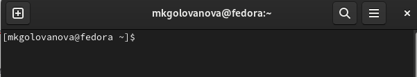

---
## Front matter
title: "Лабораторная работа No 6"
subtitle: "Операционные системы"
author: "Голованова Мария Константиновна"

## Generic otions
lang: ru-RU
toc-title: "Содержание"

## Bibliography
bibliography: bib/cite.bib
csl: pandoc/csl/gost-r-7-0-5-2008-numeric.csl

## Pdf output format
toc: true # Table of contents
toc-depth: 2
lof: true # List of figures
lot: true # List of tables
fontsize: 12pt
linestretch: 1.5
papersize: a4
documentclass: scrreprt
## I18n polyglossia
polyglossia-lang:
  name: russian
  options:
	- spelling=modern
	- babelshorthands=true
polyglossia-otherlangs:
  name: english
## I18n babel
babel-lang: russian
babel-otherlangs: english
## Fonts
mainfont: PT Serif
romanfont: PT Serif
sansfont: PT Sans
monofont: PT Mono
mainfontoptions: Ligatures=TeX
romanfontoptions: Ligatures=TeX
sansfontoptions: Ligatures=TeX,Scale=MatchLowercase
monofontoptions: Scale=MatchLowercase,Scale=0.9
## Biblatex
biblatex: true
biblio-style: "gost-numeric"
biblatexoptions:
  - parentracker=true
  - backend=biber
  - hyperref=auto
  - language=auto
  - autolang=other*
  - citestyle=gost-numeric
## Pandoc-crossref LaTeX customization
figureTitle: "Рис."
tableTitle: "Таблица"
listingTitle: "Листинг"
lofTitle: "Список иллюстраций"
lotTitle: "Список таблиц"
lolTitle: "Листинги"
## Misc options
indent: true
header-includes:
  - \usepackage{indentfirst}
  - \usepackage{float} # keep figures where there are in the text
  - \floatplacement{figure}{H} # keep figures where there are in the text
---

# Цель работы

Ознакомление с инструментами поиска файлов и фильтрации текстовых данных. Приобретение практических навыков: по управлению процессами (и заданиями), по проверке использования диска и обслуживанию файловых систем.

# Задание

1. Осуществите вход в систему, используя соответствующее имя пользователя.
2. Запишите в файл file.txt названия файлов, содержащихся в каталоге /etc. Допишите в этот же файл названия файлов, содержащихся в вашем домашнем каталоге.
3. Выведите имена всех файлов из file.txt, имеющих расширение .conf, после чего запишите их в новый текстовой файл conf.txt.
4. Определите, какие файлы в вашем домашнем каталоге имеют имена, начинавшиеся с символа c? Предложите несколько вариантов, как это сделать.
5. Выведите на экран (по странично) имена файлов из каталога /etc, начинающиеся с символа h.
6. Запустите в фоновом режиме процесс, который будет записывать в файл ~/logfile файлы, имена которых начинаются с log.
7. Удалите файл ~/logfile.
8. Запустите из консоли в фоновом режиме редактор gedit.
9. Определите идентификатор процесса gedit, используя команду ps, конвейер и фильтр grep. Как ещё можно определить идентификатор процесса?
10. Прочтите справку (man) команды kill, после чего используйте её для завершения процесса gedit.
11. Выполните команды df и du, предварительно получив более подробную информацию об этих командах, с помощью команды man.
12. Воспользовавшись справкой команды find, выведите имена всех директорий, имеющихся в вашем домашнем каталоге.

# Теоретическое введение

В системе linux ля поиска файлов и фильтрации текстовых данных существуют специальные команды. Наиболее распространённые из них:
- команда find (используется для поиска и отображения на экран имён файлов, соответствующих заданной строке символов)
- команда grep (позволяет найти в текстовом файле указанную строку символов)
Для проверки использования диска применяются команды df и du:
- команда df (показывает размер каждого смонтированного раздела диска)
- команда du показывает число килобайт, используемое каждым файлом или каталогом.
и приобрела практические навыки по управлению процессами и заданиями, по проверке использования диска и обслуживанию файловых систем.
Для получения информации о процессах  используется команда ps используется 
Чтобы объединенить простых команды или утилиты в цепочки, в которых результат работы предыдущей команды передаётся последующей используется конвейер (pipe), имеющий следующий формат:
команда 1 | команда 2 (вывод команды 1 передастся на ввод команде 2)

# Выполнение лабораторной работы

## Выполнение лабораторной работы

1. Я осуществила вход в систему, используя соответствующее имя пользователя (рис. 1).

{.column width=70%}

2. Я записала в файл file.txt названия файлов, содержащихся в каталоге /etc (рис. 2, рис. 3), а затем дописала в этот же файл названия файлов, содержащихся в моём домашнем каталоге (рис. @fig:004, рис. @fig:005).

{.column width=70%}

## Выполнение лабораторной работы

{.column width=30%}

## Выполнение лабораторной работы

{.column width=70%}

## Выполнение лабораторной работы

{.column width=30%}

3. Я вывела имена всех файлов из file.txt, имеющих расширение .conf, после чего запишите их в новый текстовой файл conf.txt (рис. 6, рис. 7, рис. 8).

{.column width=30%}

## Выполнение лабораторной работы

{.column width=70%}

## Выполнение лабораторной работы

{.column width=30%}

## Выполнение лабораторной работы

4. Я определила, какие файлы в моём домашнем каталоге имеют имена, начинавшиеся с символа c, воспользовавшись командой find и командой grep (рис. 9,рис. 10).

{.column width=70%}

{.column width=70%}

5. Я вывела на экран имена файлов из каталога /etc, начинающиеся с символа h (рис. 11).

{.column width=70%}

6. Я запустила в фоновом режиме процесс, который будет записывать в файл ~/logfile файлы, имена которых начинаются с log (рис. 12, рис. 13).

{.column width=70%}

{.column width=70%}

7. Я удалила файл ~/logfile (рис. 14).

{.column width=70%}

8. Я запустила из консоли в фоновом режиме редактор gedit (рис. @fig:015).

{.column width=70%}

9. Я определила идентификатор процесса gedit, используя команду ps, конвейер и фильтр grep (рис. @fig:016).

{#fig:016 width=70%}

10. Я прочитала справку (man) команды kill, после чего использовала команду для завершения процесса gedit (рис. @fig:017, рис. @fig:018).

{#fig:017 width=70%}

{#fig:018 width=70%}

11. Я выполнила команды df и du, предварительно получив более подробную информацию об этих командах, с помощью команды man (рис. @fig:019, рис. @fig:020, рис. @fig:021, рис. @fig:022).

{#fig:019 width=70%}

{#fig:020 width=70%}

{#fig:021 width=70%}

{#fig:022 width=70%}

12. Воспользовавшись справкой команды grep, я вывела имена всех директорий, имеющихся в моём домашнем каталоге (рис. @fig:023, рис. @fig:024).

{#fig:023 width=70%}

{#fig:024 width=70%}

# Выводы

Я ознакомилась с инструментами поиска файлов и фильтрации текстовых данных и приобрела практические навыки по управлению процессами и заданиями, по проверке использования диска и обслуживанию файловых систем.

# Список литературы{.unnumbered}

::: {#refs}
:::
