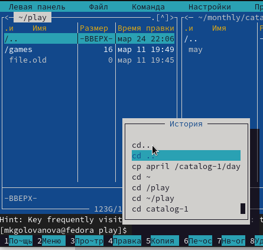

---
## Front matter
lang: ru-RU
title: Лабораторная работа № 7
subtitle: Операционные системы
author:
  - Голованова Мария Константиновна
institute:
  - Российский университет дружбы народов, Москва, Россия
date: 25 марта 2023

## i18n babel
babel-lang: russian
babel-otherlangs: english

## Formatting pdf
toc: false
toc-title: Содержание
slide_level: 2
aspectratio: 169
section-titles: true
theme: metropolis
header-includes:
 - \metroset{progressbar=frametitle,sectionpage=progressbar,numbering=fraction}
 - '\makeatletter'
 - '\beamer@ignorenonframefalse'
 - '\makeatother'
---

# Информация

## Докладчик

  * Голованова Мария Константиновна
  * НММбд-01-22, 1132226478
  * Факультет физико-математических и естественных наук
  * Российский университет дружбы народов
  

# Вводная часть

## Цель работы

Освоение основных возможностей командной оболочки Midnight Commander. Приобретение навыков практической работы по просмотру каталогов и файлов; манипуляций с ними.

## Задание: по mc

1. Изучите информацию о mc, вызвав в командной строке man mc.
2. Запустите из командной строки mc, изучите его структуру и меню.
3. Выполните несколько операций в mc, используя управляющие клавиши (операции с панелями; выделение/отмена выделения файлов, копирование/перемещение файлов, получение информации о размере и правах доступа на файлы и/или каталоги и т.п.)
4. Выполните основные команды меню левой (или правой) панели. Оцените степень подробности вывода информации о файлах.

## Задание: по mc

5. Используя возможности подменю Файл , выполните:
- просмотр содержимого текстового файла;
- редактирование содержимого текстового файла (без сохранения результатов редактирования);
- создание каталога;
- копирование файлов в созданный каталог.
6. С помощью соответствующих средств подменю Команда осуществите:
- поиск в файловой системе файла с заданными условиями (например, файла с расширением .c или .cpp, содержащего строку main);
- выбор и повторение одной из предыдущих команд;
- переход в домашний каталог;
- анализ файла меню и файла расширений.
7. Вызовите подменю Настройки . Освойте операции, определяющие структуру экрана mc (Full screen, Double Width, Show Hidden Files и т.д.)

## Задание: по встроенному редактору mc

1. Создайте текстовой файл text.txt.
2. Откройте этот файл с помощью встроенного в mc редактора.
3. Вставьте в открытый файл небольшой фрагмент текста, скопированный из любого другого файла или Интернета.
4. Проделайте с текстом следующие манипуляции, используя горячие клавиши:
- Удалите строку текста.
- Выделите фрагмент текста и скопируйте его на новую строку.
- Выделите фрагмент текста и перенесите его на новую строку.
- Сохраните файл.
- Отмените последнее действие.
- Перейдите в конец файла (нажав комбинацию клавиш) и напишите некоторый текст.
- Перейдите в начало файла (нажав комбинацию клавиш) и напишите некоторый текст.
- Сохраните и закройте файл.

## Задание: по встроенному редактору mc

5. Откройте файл с исходным текстом на некотором языке программирования (например C или Java)
6. Используя меню редактора, включите подсветку синтаксиса, если она не включена, или выключите, если она включена.

## Теоретическое введение

Midnight Commander (или mc) — это консольный файловый менеджер для Linux. Он является программой, позволяющей просматривать структуру каталогов и выполнять основные операции по управлению файловой системой. Midnight Commander позволяет сделать работу с файлами более удобной и наглядной.

# Выполнение лабораторной работы

## Задание по mc

1. Я изучила информацию о mc, вызвав в командной строке man mc (рис. 1).

{.column width=50%}

## Задание по mc

2. Я запустила из командной строки mc и изучилате его структуру и меню (рис. 2, рис. 3).

{.column width=70%}

## Задание по mc

{.column width=60%}

## Задание по mc

3. Выполните несколько операций в mc, используя управляющие клавиши: операции с панелями; выделение/отмена выделения файлов, копирование/перемещение файлов, получение информации о размере и правах доступа на файлы и/или каталоги (рис. 4, рис. 5, рис. 6, рис. 7, рис. 8).

{.column width=70%}

## Задание по mc

{.column width=70%}

## Задание по mc

{.column width=70%}

## Задание по mc

{.column width=70%}

## Задание по mc

{.column width=70%}

## Задание по mc

4. Я выполнила основные команды меню левой панели (рис. 9, рис. 10, рис. 11, рис. 12)

{.column width=50%}

## Задание по mc

{.column width=50%}

## Задание по mc

{.column width=50%}

## Задание по mc

{.column width=750%}

## Задание по mc

5. Используя возможности подменю Файл , я выполнила: просмотр содержимого текстового файла, редактирование содержимого текстового файла (без сохранения результатов редактирования), создание каталога, копирование файлов в созданный каталог (рис. 13, рис. 14, рис. 15, рис. 16, рис. 17, рис. 18).

{.column width=55%}

## Задание по mc

{.column width=70%}

## Задание по mc

{.column width=70%}

## Задание по mc

{.column width=70%}

## Задание по mc

{.column width=70%}

## Задание по mc

{.column width=70%}

## Задание по mc

6. С помощью соответствующих средств подменю Команда я осуществила:
– поиск в файловой системе файла с заданными условиями (файла с расширением .c или .cpp, содержащего строку main)(рис. 19, рис. 20);
– выбор и повторение одной из предыдущих команд (рис. 21, рис. 22);
– переход в домашний каталог (рис. 23, рис. 24);
– анализ файла меню и файла расширений.(рис. 25, рис. 26, рис. 27, рис. 28).

{.column width=50%}

## Задание по mc

{.column width=50%}

## Задание по mc

{.column width=50%}

## Задание по mc

{.column width=70%}

## Задание по mc

{.column width=70%}

## Задание по mc

{.column width=70%}

## Задание по mc

{.column width=70%}

## Задание по mc

{.column width=50%}

## Задание по mc

{.column width=60%}

## Задание по mc

{.column width=60%}

## Задание по mc

7. Я вызвала подменю Настройки и изучила операции, определяющие структуру экрана mc (Full screen, Double Width, Show Hidden Files)(рис. 29, рис. 30, рис. 31)

{.column width=70%}

## Задание по mc

{.column width=70%}

## Задание по mc

{.column width=65%}

## Задание по встроенному редактору mc

1. Я создала текстовой файл text.txt (рис. 32).

{.column width=70%}

## Задание по встроенному редактору mc

2. Я открыла этот файл с помощью встроенного в mc редактора (рис. 33).

{.column width=60%}

## Задание по встроенному редактору mc

3. Я вставила в открытый файл небольшой фрагмент текста, скопированный из другого файла (рис. 34).

{.column width=70%}

## Задание по встроенному редактору mc

4. Я проделала с текстом следующие манипуляции, используя горячие клавиши:
- удалила строку текста (рис. 35);
- выделила фрагмент текста и скопировала его на новую строку (рис. 36);
- выделила фрагмент текста и перенесла его на новую строку (рис. 37, рис. 38);
- сохранила файл (рис. 39);
- отменила последнее действие (рис. 40);
- перешла в конец файла (нажав комбинацию клавиш) и написала некоторый текст (рис. 41, рис. 42);
- перешла в начало файла (нажав комбинацию клавиш) и написала некоторый текст (рис. 43, рис. 44);
- сохранила и закрыла файл (рис. 45);

## Задание по встроенному редактору mc

{.column width=70%}

## Задание по встроенному редактору mc

{.column width=70%}

## Задание по встроенному редактору mc

{.column width=70%}

## Задание по встроенному редактору mc

{.column width=70%}

## Задание по встроенному редактору mc

{.column width=70%}

## Задание по встроенному редактору mc

{.column width=70%}

## Задание по встроенному редактору mc

{.column width=40%}

## Задание по встроенному редактору mc

{.column width=70%}

## Задание по встроенному редактору mc

{.column width=40%}

## Задание по встроенному редактору mc

{.column width=70%}

## Задание по встроенному редактору mc

{.column width=70%}

## Задание по встроенному редактору mc

5. Я открыла файл с исходным текстом на некотором языке программирования (Java)(рис. 46).

{.column width=70%}

## Задание по встроенному редактору mc

6. Используя меню редактора, я включила подсветку синтаксиса (рис. 47).

{.column width=70%}

# Выводы

## Выводы

Я освоила основные возможности командной оболочки Midnight Commander и приобрела навыки практической работы по просмотру каталогов и файлов и манипуляций с ними.

