---
## Front matter
title: "Лабораторная работа № 7"
subtitle: "Операционные системы"
author: "Голованова Мария Константиновна"

## Generic otions
lang: ru-RU
toc-title: "Содержание"

## Bibliography
bibliography: bib/cite.bib
csl: pandoc/csl/gost-r-7-0-5-2008-numeric.csl

## Pdf output format
toc: true # Table of contents
toc-depth: 2
lof: true # List of figures
lot: true # List of tables
fontsize: 12pt
linestretch: 1.5
papersize: a4
documentclass: scrreprt
## I18n polyglossia
polyglossia-lang:
  name: russian
  options:
	- spelling=modern
	- babelshorthands=true
polyglossia-otherlangs:
  name: english
## I18n babel
babel-lang: russian
babel-otherlangs: english
## Fonts
mainfont: PT Serif
romanfont: PT Serif
sansfont: PT Sans
monofont: PT Mono
mainfontoptions: Ligatures=TeX
romanfontoptions: Ligatures=TeX
sansfontoptions: Ligatures=TeX,Scale=MatchLowercase
monofontoptions: Scale=MatchLowercase,Scale=0.9
## Biblatex
biblatex: true
biblio-style: "gost-numeric"
biblatexoptions:
  - parentracker=true
  - backend=biber
  - hyperref=auto
  - language=auto
  - autolang=other*
  - citestyle=gost-numeric
## Pandoc-crossref LaTeX customization
figureTitle: "Рис."
tableTitle: "Таблица"
listingTitle: "Листинг"
lofTitle: "Список иллюстраций"
lotTitle: "Список таблиц"
lolTitle: "Листинги"
## Misc options
indent: true
header-includes:
  - \usepackage{indentfirst}
  - \usepackage{float} # keep figures where there are in the text
  - \floatplacement{figure}{H} # keep figures where there are in the text
---

# Цель работы

Освоение основных возможностей командной оболочки Midnight Commander. Приобретение навыков практической работы по просмотру каталогов и файлов; манипуляций с ними.

# Задание

## Задание по mc

1. Изучите информацию о mc, вызвав в командной строке man mc.
2. Запустите из командной строки mc, изучите его структуру и меню.
3. Выполните несколько операций в mc, используя управляющие клавиши (операции с панелями; выделение/отмена выделения файлов, копирование/перемещение файлов, получение информации о размере и правах доступа на файлы и/или каталоги и т.п.)
4. Выполните основные команды меню левой (или правой) панели. Оцените степень подробности вывода информации о файлах.
5. Используя возможности подменю Файл , выполните:
просмотр содержимого текстового файла;
редактирование содержимого текстового файла (без сохранения результатов редактирования);
создание каталога;
копирование файлов в созданный каталог.
6. С помощью соответствующих средств подменю Команда осуществите:
поиск в файловой системе файла с заданными условиями (например, файла с расширением .c или .cpp, содержащего строку main);
выбор и повторение одной из предыдущих команд;
переход в домашний каталог;
анализ файла меню и файла расширений.
7. Вызовите подменю Настройки . Освойте операции, определяющие структуру экрана mc (Full screen, Double Width, Show Hidden Files и т.д.)

## Задание по встроенному редактору mc

1. Создайте текстовой файл text.txt.
2. Откройте этот файл с помощью встроенного в mc редактора.
3. Вставьте в открытый файл небольшой фрагмент текста, скопированный из любого другого файла или Интернета.
4. Проделайте с текстом следующие манипуляции, используя горячие клавиши:
Удалите строку текста.
Выделите фрагмент текста и скопируйте его на новую строку.
Выделите фрагмент текста и перенесите его на новую строку.
Сохраните файл.
Отмените последнее действие.
Перейдите в конец файла (нажав комбинацию клавиш) и напишите некоторый текст.
Перейдите в начало файла (нажав комбинацию клавиш) и напишите некоторый текст.
Сохраните и закройте файл.
5. Откройте файл с исходным текстом на некотором языке программирования (например C или Java)
6. Используя меню редактора, включите подсветку синтаксиса, если она не включена, или выключите, если она включена.

# Теоретическое введение

Midnight Commander (или mc) — это консольный файловый менеджер для Linux. Он является программой, позволяющей просматривать структуру каталогов и выполнять основные операции по управлению файловой системой. Midnight Commander позволяет сделать работу с файлами более удобной и наглядной.

# Выполнение лабораторной работы

## Задание по mc

1. Я изучила информацию о mc, вызвав в командной строке man mc (рис. @fig:001).

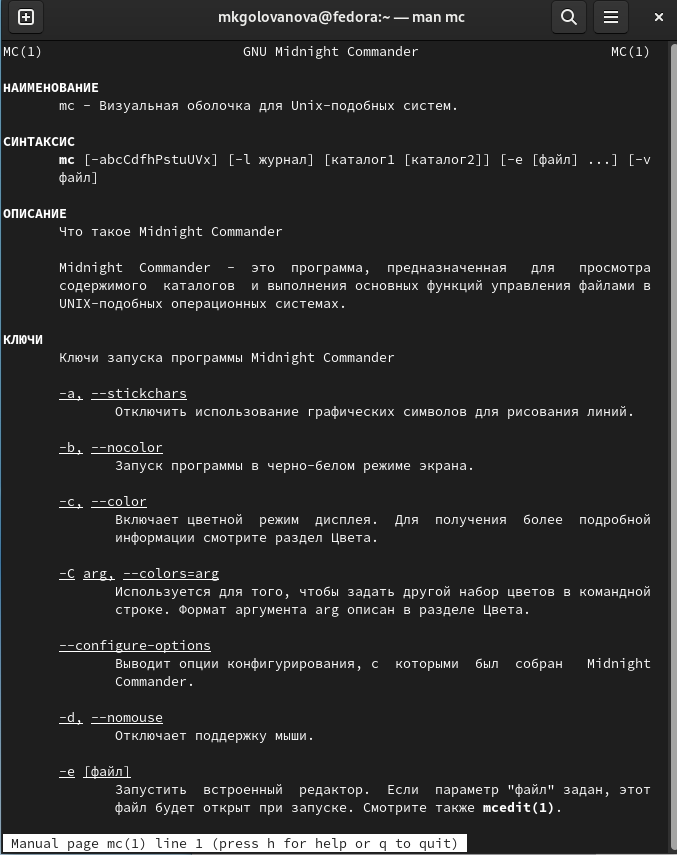{#fig:001 width=70%}

2. Я запустила из командной строки mc и изучилате его структуру и меню (рис. @fig:002, рис. @fig:003).

{#fig:002 width=70%}

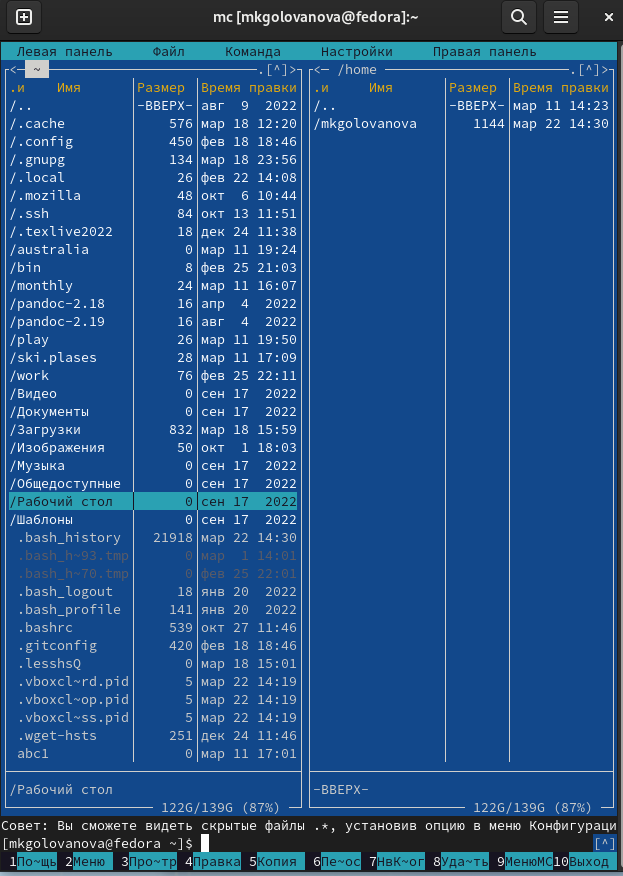{#fig:003 width=70%}

3. Выполните несколько операций в mc, используя управляющие клавиши: операции с панелями; выделение/отмена выделения файлов, копирование/перемещение файлов, получение информации о размере и правах доступа на файлы и/или каталоги (рис. @fig:004, рис. @fig:005, рис. @fig:006, рис. @fig:007, рис. @fig:008).

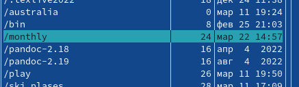{#fig:004 width=70%}

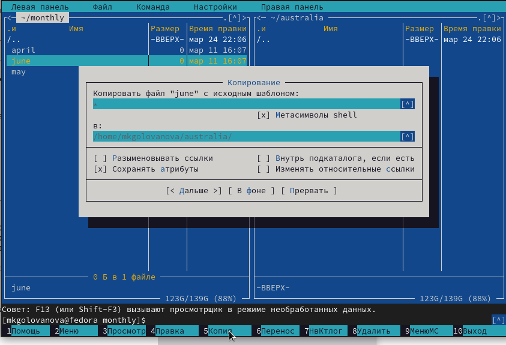{#fig:005 width=70%}

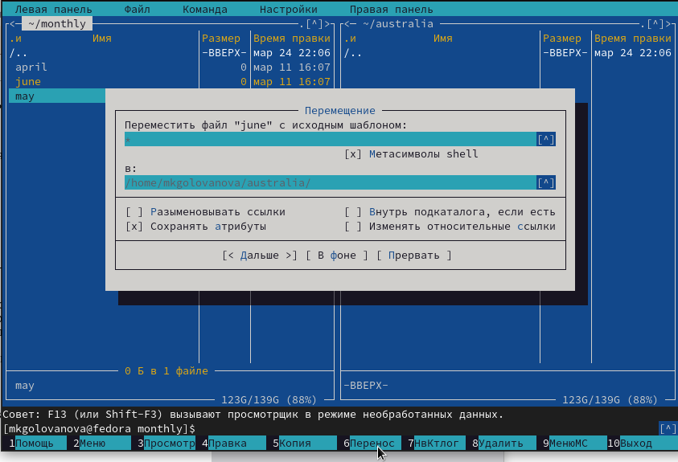{#fig:006 width=70%}

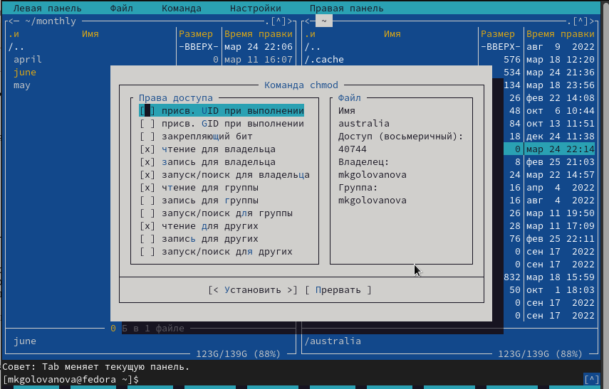{#fig:007 width=70%}

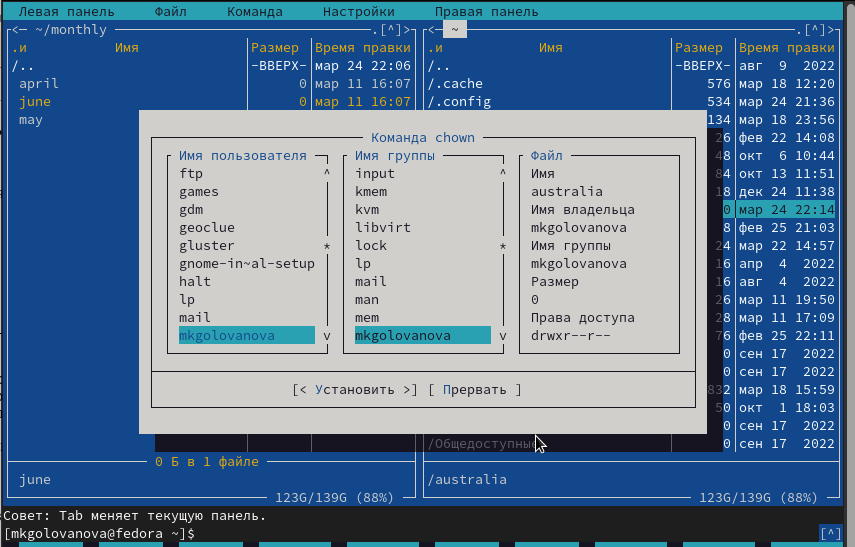{#fig:008 width=70%}

4. Я выполнила основные команды меню левой панели (рис. @fig:009, рис. @fig:010, рис. @fig:011, рис. @fig:012)

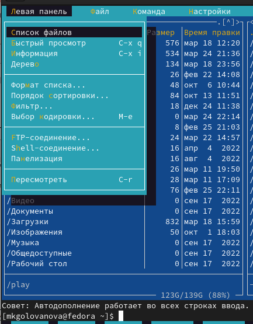{#fig:009 width=70%}

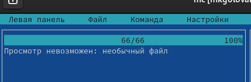{#fig:010 width=70%}

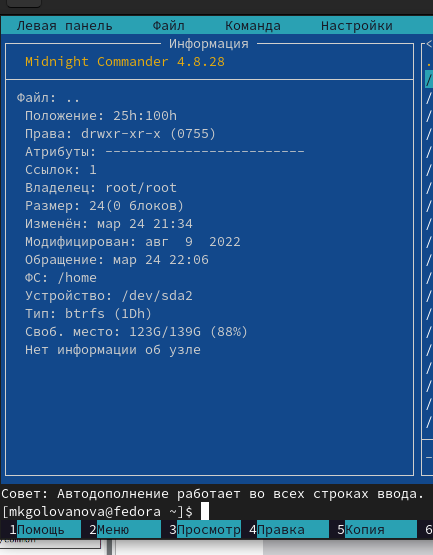{#fig:011 width=70%}

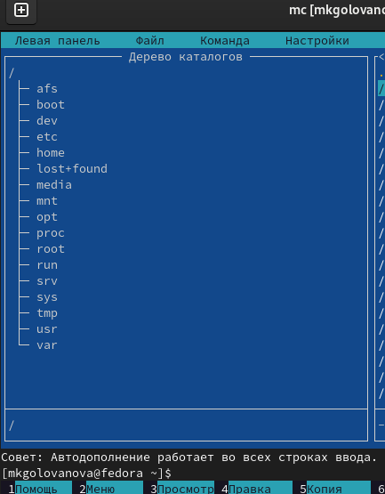{#fig:012 width=70%}

5. Используя возможности подменю Файл , я выполнила: просмотр содержимого текстового файла, редактирование содержимого текстового файла (без сохранения результатов редактирования), создание каталога, копирование файлов в созданный каталог (рис. @fig:013, рис. @fig:014, рис. @fig:015, рис. @fig:016, рис. @fig:017, рис. @fig:018).

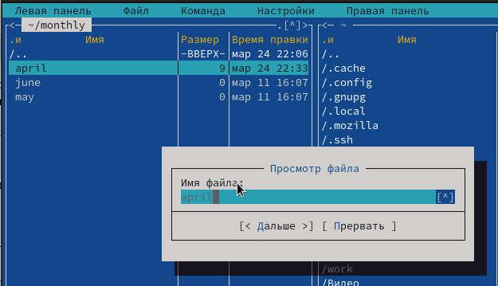{#fig:013 width=70%}

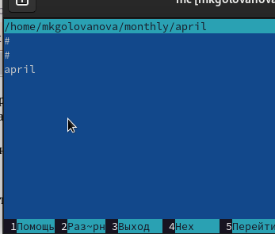{#fig:014 width=70%}

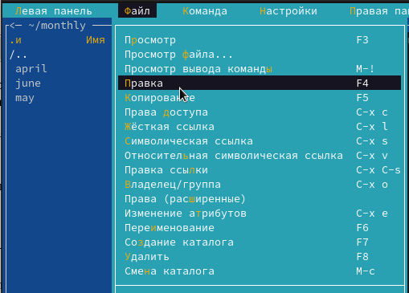{#fig:015 width=70%}

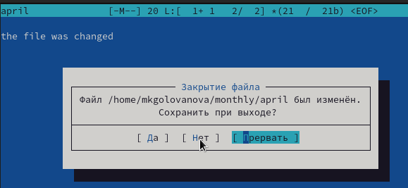{#fig:016 width=70%}

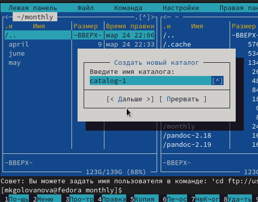{#fig:017 width=70%}

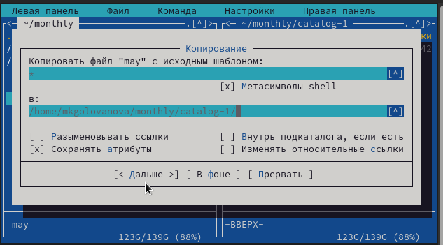{#fig:018 width=70%}

6. С помощью соответствующих средств подменю Команда я осуществила:
поиск в файловой системе файла с заданными условиями (файла с расширением .c или .cpp, содержащего строку main)(рис. @fig:019, рис. @fig:020);
выбор и повторение одной из предыдущих команд (рис. @fig:021, рис. @fig:022);
переход в домашний каталог (рис. @fig:023, рис. @fig:024);
анализ файла меню и файла расширений.(рис. @fig:025, рис. @fig:026, рис. @fig:027, рис. @fig:028).

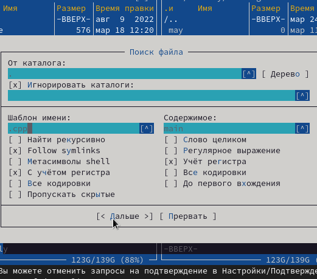{#fig:019 width=70%}

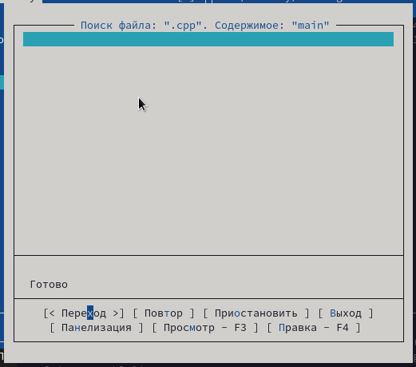{#fig:020 width=70%}

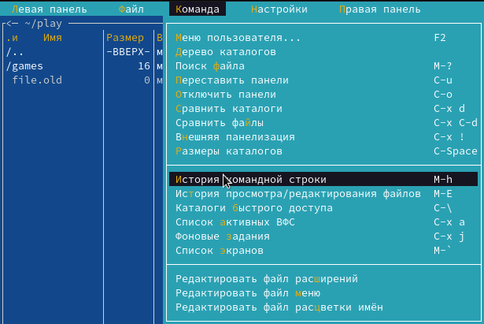{#fig:021 width=70%}

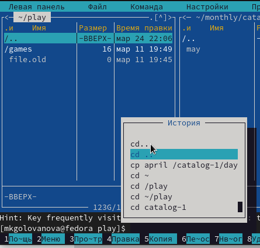{#fig:022 width=70%}

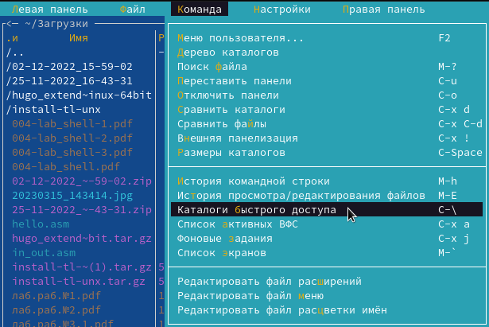{#fig:023 width=70%}

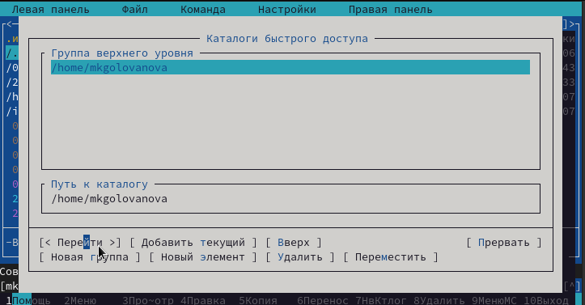{#fig:024 width=70%}

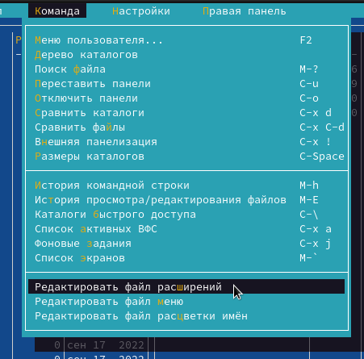{#fig:025 width=70%}

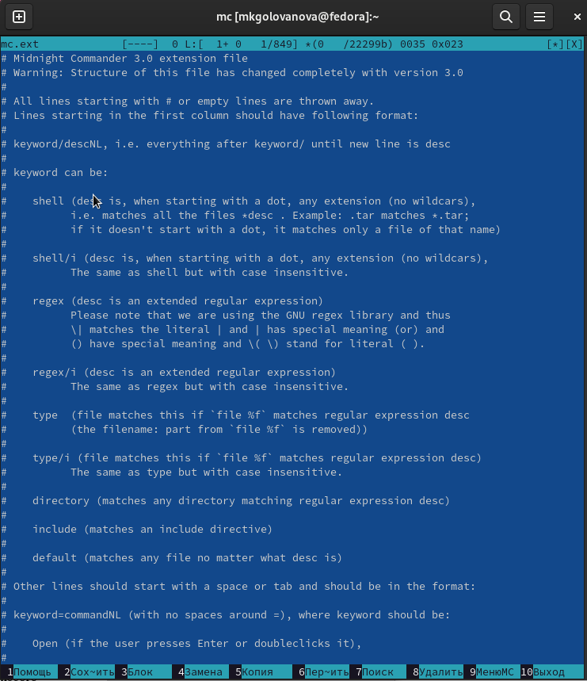{#fig:026 width=70%}

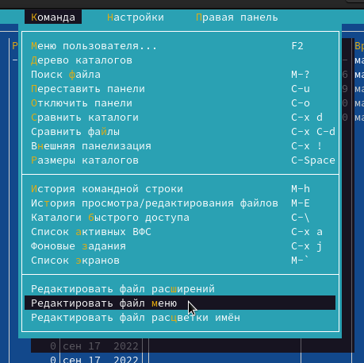{#fig:027 width=70%}

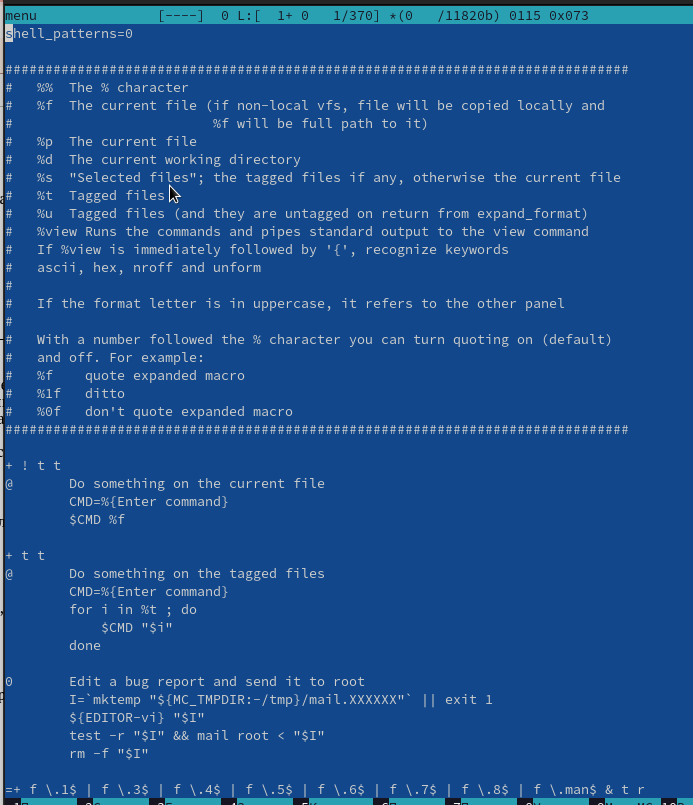{#fig:028 width=70%}

7. Я вызвала подменю Настройки и изучила операции, определяющие структуру экрана mc (Full screen, Double Width, Show Hidden Files)(рис. @fig:029, рис. @fig:030, рис. @fig:031)

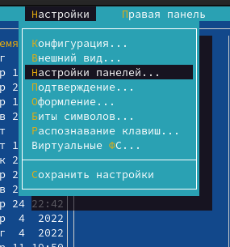{#fig:029 width=70%}

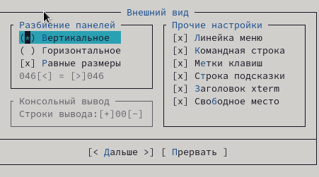{#fig:030 width=70%}

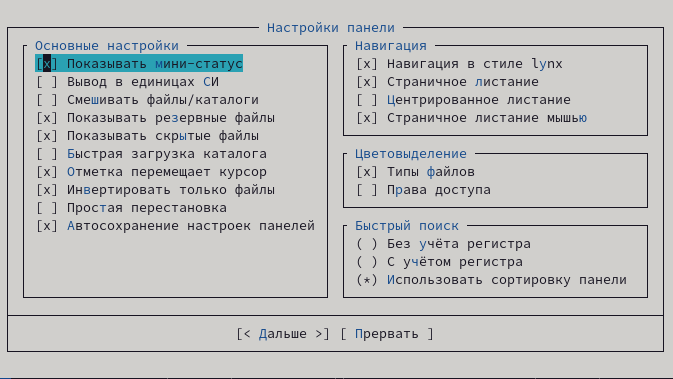{#fig:031 width=70%}

## Задание по встроенному редактору mc

1. Я создала текстовой файл text.txt (рис. @fig:032).

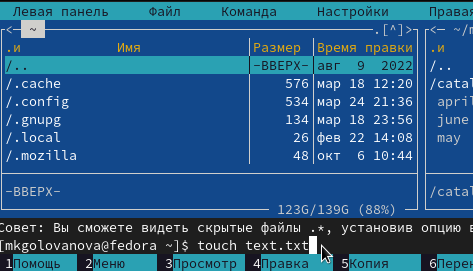{#fig:032 width=70%}

2. Я открыла этот файл с помощью встроенного в mc редактора (рис. @fig:033).

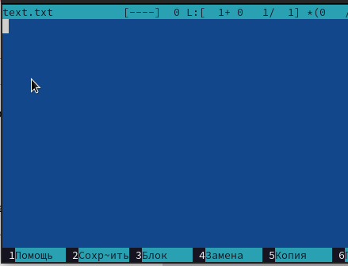{#fig:033 width=70%}

3. Я вставила в открытый файл небольшой фрагмент текста, скопированный из другого файла (рис. @fig:034).

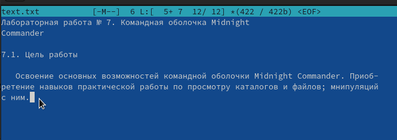{#fig:034 width=70%}

4. Я проделала с текстом следующие манипуляции, используя горячие клавиши:
удалила строку текста (рис. @fig:035);
выделила фрагмент текста и скопировала его на новую строку (рис. @fig:036);
выделила фрагмент текста и перенесла его на новую строку (рис. @fig:037, рис. @fig:038);
сохранила файл (рис. @fig:039);
отменила последнее действие (рис. @fig:040);
перешла в конец файла (нажав комбинацию клавиш) и написала некоторый текст (рис. @fig:041, рис. @fig:042);
перешла в начало файла (нажав комбинацию клавиш) и написала некоторый текст (рис. @fig:043, рис. @fig:044);
сохранила и закрыла файл (рис. @fig:045);

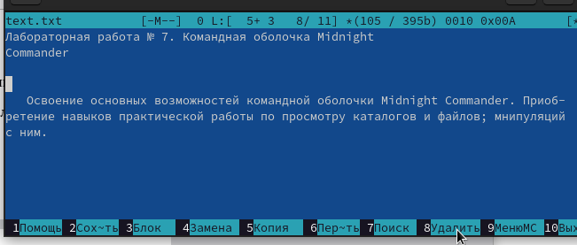{#fig:035 width=70%}

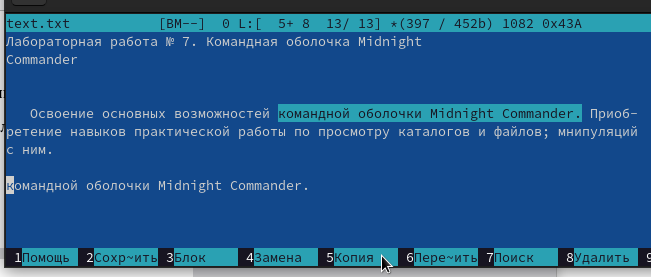{#fig:036 width=70%}

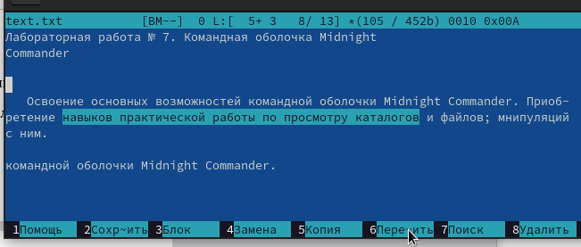{#fig:037 width=70%}

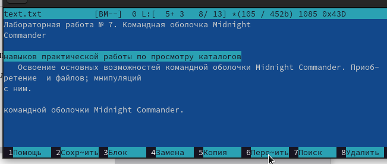{#fig:038 width=70%}

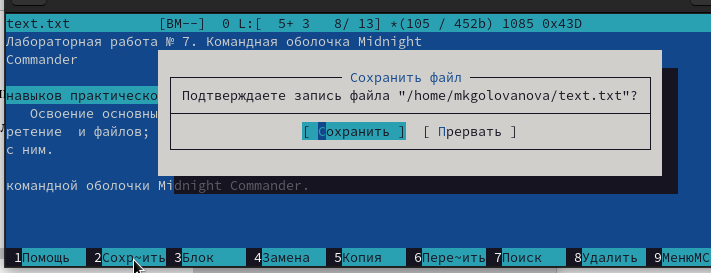{#fig:039 width=70%}

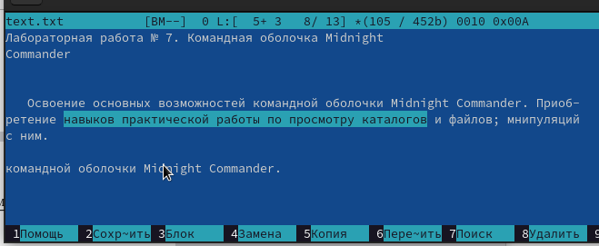{#fig:040 width=70%}

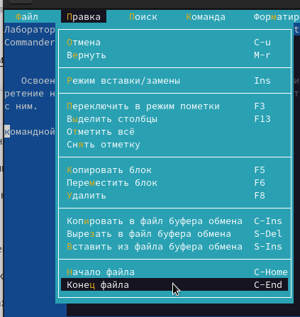{#fig:041 width=70%}

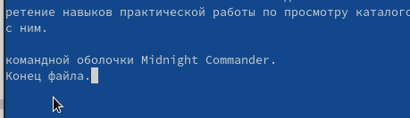{#fig:042 width=70%}

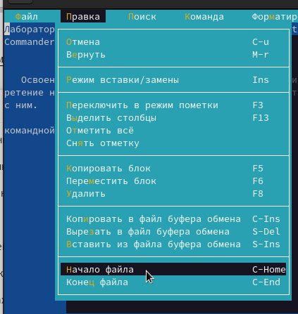{#fig:043 width=70%}

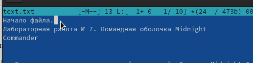{#fig:044 width=70%}

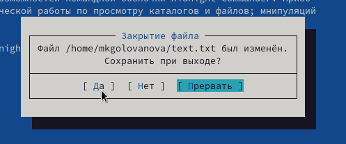{#fig:045 width=70%}

5. Я открыла файл с исходным текстом на некотором языке программирования (Java)(рис. @fig:046).

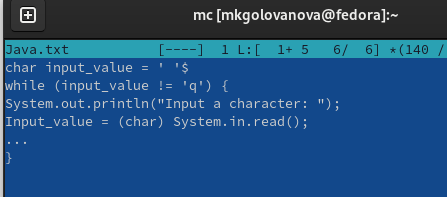{#fig:046 width=70%}

6. Используя меню редактора, я включила подсветку синтаксиса (рис. @fig:047).

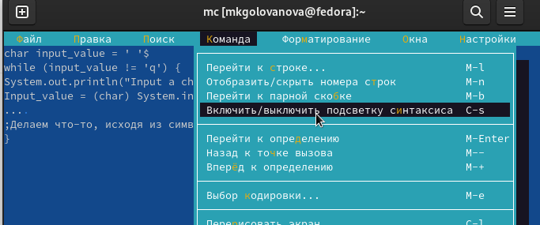{#fig:047 width=70%}

# Выводы

Я освоила основные возможности командной оболочки Midnight Commander и приобрела навыки практической работы по просмотру каталогов и файлов и манипуляций с ними.

# Список литературы{.unnumbered}

::: {#refs}
:::
