---
## Front matter
lang: ru-RU
title: Лабораторная работа № 8
subtitle: Операционные системы
author:
  - Голованова Мария Константиновна
institute:
  - Российский университет дружбы народов, Москва, Россия
date: 1 апреля 2023

## i18n babel
babel-lang: russian
babel-otherlangs: english

## Formatting pdf
toc: false
toc-title: Содержание
slide_level: 2
aspectratio: 169
section-titles: true
theme: metropolis
header-includes:
 - \metroset{progressbar=frametitle,sectionpage=progressbar,numbering=fraction}
 - '\makeatletter'
 - '\beamer@ignorenonframefalse'
 - '\makeatother'
---

# Информация

## Докладчик

  * Голованова Мария Константиновна
  * НММбд-01-22, 1132226478
  * Факультет физико-математических и естественных наук
  * Российский университет дружбы народов
  

# Цель работы

- Познакомиться с операционной системой Linux. Получить практические навыки работы с редактором vi, установленным по умолчанию практически во всех дистрибутивах.

# Задание

##Задание 1. Создание нового файла с использованием vi

1. Создайте каталог с именем ~/work/os/lab06.
2. Перейдите во вновь созданный каталог.
3. Вызовите vi и создайте файл hello.sh
4. Нажмите клавишу i и вводите следующий текст:
- #!/bin/bash
- HELL=Hello
- function hello {
- LOCAL HELLO=World
- echo $HELLO
- }
- echo $HELLO
- hello

##Задание 1. Создание нового файла с использованием vi

5. Нажмите клавишу Esc для перехода в командный режим после завершения ввода текста.
6. Нажмите : для перехода в режим последней строки и внизу вашего экрана появится приглашение в виде двоеточия.
7. Нажмите w (записать) и q (выйти), а затем нажмите клавишу Enter для сохранения вашего текста и завершения работы.
8. Сделайте файл исполняемым

## Задание 2. Редактирование существующего файла

1. Вызовите vi на редактирование файла
2. Установите курсор в конец слова HELL второй строки.
3. Перейдите в режим вставки и замените на HELLO. Нажмите Esc для возврата в командный режим.
4. Установите курсор на четвертую строку и сотрите слово LOCAL.
5. Перейдите в режим вставки и наберите следующий текст: local, нажмите Esc для возврата в командный режим.
6. Установите курсор на последней строке файла. Вставьте после неё строку, содержащую следующий текст: echo $HELLO.
7. Нажмите Esc для перехода в командный режим.
8. Удалите последнюю строку.
9. Введите команду отмены изменений u для отмены последней команды.
10. Введите символ : для перехода в режим последней строки. Запишите произведённые изменения и выйдите из vi.

# Выполнение лабораторной работы

## Создание нового файла с использованием vi

- Я создала каталог с именем ~/work/os/lab06 (рис. 1).

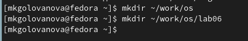{.column width=70%}

- Я перешла во вновь созданный каталог (рис. 2).

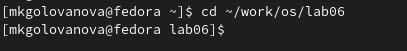{.column width=70%}

## Создание нового файла с использованием vi

- Я вызвала vi и создала файл hello.sh (рис. 3).

{.column width=70%}

## Создание нового файла с использованием vi

- Я нажала клавишу **i** и ввела текст (рис. 4).

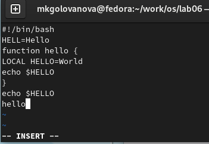{.column width=40%}

## Создание нового файла с использованием vi

- После завершения ввода текста я нажала клавишу **Esc** и перешла в командный режим (рис. 5).

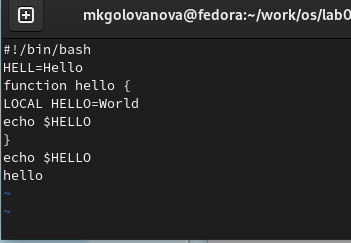{.column width=40%}

## Создание нового файла с использованием vi

- Я нажала **:** для перехода в режим последней строки, внизу моего экрана появилось приглашение в виде двоеточия (рис. 6).

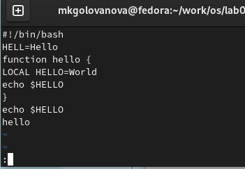{.column width=40%}

## Создание нового файла с использованием vi

- Я нажала **w** (записать) и **q** (выйти), а затем нажала клавишу **Enter** для сохранения текста и завершения работы (рис. 7).

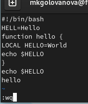{.column width=40%}

## Создание нового файла с использованием vi

- Я сделала файл исполняемым (рис. 8).

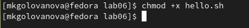{.column width=70%}

## Редактирование существующего файла

- Я вызвала vi на редактирование файла (рис. 9).

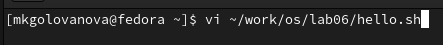{.column width=70%}

## Редактирование существующего файла

- Я установила курсор в конец слова HELL во второй строке (рис. 10).

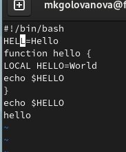{.column width=40%}

## Редактирование существующего файла

- Я перешла в режим вставки и заменила слово HELL на HELLO, а затем нажала **Esc** для возврата в командный режим (рис. 11).

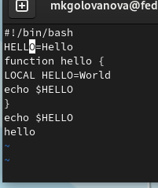{.column width=40%}

## Редактирование существующего файла

- Я установила курсор на четвертую строку и стёрла слово LOCAL с помощью команды **dw** (рис. 12, рис. 13).

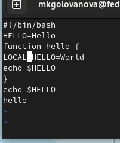{.column width=40%}

## Редактирование существующего файла

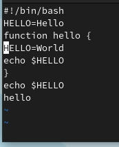{.column width=40%}

## Редактирование существующего файла

- Я перешла в режим вставки и набрала слово local (рис. 14),затем нажала **Esc** для возврата в командный режим .

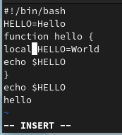{.column width=40%}

## Редактирование существующего файла

- Я установила курсор на последней строке файла и вставила после неё строку, содержащую текст echo $HELLO (рис. 15).

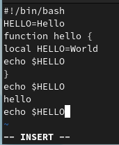{.column width=40%}

## Редактирование существующего файла

- Я нажала **Esc** для перехода в командный режим (рис. 16).

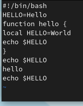{.column width=40%}

## Редактирование существующего файла

- Удалите последнюю строку с помощью команды **dd** (рис. 17).

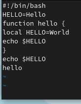{.column width=40%}

## Редактирование существующего файла

- Я ввела команду отмены изменений **u** для отмены последней команды (рис. 18).

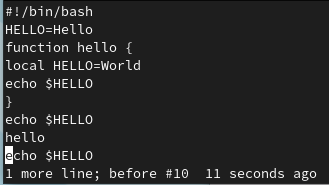{.column width=70%}

## Редактирование существующего файла

- Я ввела символ **:** для перехода в режим последней строки, записала произведённые изменения и вышла из vi (рис. 19).

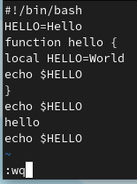{.column width=30%}

# Выводы

Я получила практические навыки работы с редактором vi.

