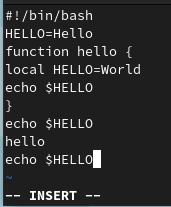

---
## Front matter
title: "Лабораторная работа № 8"
subtitle: "Операционные системы"
author: "Голованова Мария Константиновна"

## Generic otions
lang: ru-RU
toc-title: "Содержание"

## Bibliography
bibliography: bib/cite.bib
csl: pandoc/csl/gost-r-7-0-5-2008-numeric.csl

## Pdf output format
toc: true # Table of contents
toc-depth: 2
lof: true # List of figures
lot: true # List of tables
fontsize: 12pt
linestretch: 1.5
papersize: a4
documentclass: scrreprt
## I18n polyglossia
polyglossia-lang:
  name: russian
  options:
	- spelling=modern
	- babelshorthands=true
polyglossia-otherlangs:
  name: english
## I18n babel
babel-lang: russian
babel-otherlangs: english
## Fonts
mainfont: PT Serif
romanfont: PT Serif
sansfont: PT Sans
monofont: PT Mono
mainfontoptions: Ligatures=TeX
romanfontoptions: Ligatures=TeX
sansfontoptions: Ligatures=TeX,Scale=MatchLowercase
monofontoptions: Scale=MatchLowercase,Scale=0.9
## Biblatex
biblatex: true
biblio-style: "gost-numeric"
biblatexoptions:
  - parentracker=true
  - backend=biber
  - hyperref=auto
  - language=auto
  - autolang=other*
  - citestyle=gost-numeric
## Pandoc-crossref LaTeX customization
figureTitle: "Рис."
tableTitle: "Таблица"
listingTitle: "Листинг"
lofTitle: "Список иллюстраций"
lotTitle: "Список таблиц"
lolTitle: "Листинги"
## Misc options
indent: true
header-includes:
  - \usepackage{indentfirst}
  - \usepackage{float} # keep figures where there are in the text
  - \floatplacement{figure}{H} # keep figures where there are in the text
---

# Цель работы

Познакомиться с операционной системой Linux. Получить практические навыки работы с редактором vi, установленным по умолчанию практически во всех дистрибутивах.

# Задание

##Задание 1. Создание нового файла с использованием vi

1. Создайте каталог с именем ~/work/os/lab06.
2. Перейдите во вновь созданный каталог.
3. Вызовите vi и создайте файл hello.sh
4. Нажмите клавишу i и вводите следующий текст:
- #!/bin/bash
- HELL=Hello
- function hello {
- LOCAL HELLO=World
- echo $HELLO
- }
- echo $HELLO
- hello
5. Нажмите клавишу Esc для перехода в командный режим после завершения ввода текста.
6. Нажмите : для перехода в режим последней строки и внизу вашего экрана появится приглашение в виде двоеточия.
7. Нажмите w (записать) и q (выйти), а затем нажмите клавишу Enter для сохранения вашего текста и завершения работы.
8. Сделайте файл исполняемым

## Задание 2. Редактирование существующего файла

1. Вызовите vi на редактирование файла
2. Установите курсор в конец слова HELL второй строки.
3. Перейдите в режим вставки и замените на HELLO. Нажмите Esc для возврата в командный режим.
4. Установите курсор на четвертую строку и сотрите слово LOCAL.
5. Перейдите в режим вставки и наберите следующий текст: local, нажмите Esc для возврата в командный режим.
6. Установите курсор на последней строке файла. Вставьте после неё строку, содержащую следующий текст: echo $HELLO.
7. Нажмите Esc для перехода в командный режим.
8. Удалите последнюю строку.
9. Введите команду отмены изменений u для отмены последней команды.
10. Введите символ : для перехода в режим последней строки. Запишите произведённые изменения и выйдите из vi.

# Теоретическое введение

В большинстве дистрибутивов Linux в качестве текстового редактора по умолчанию устанавливается интерактивный экранный редактор vi (Visual display editor).
Он имеет три режима работы:
- командный режим — предназначен для ввода команд редактирования и навигации по редактируемому файлу;для перехода в данный режим используется клавиша **Esc** ;
- режим вставки — предназначен для ввода содержания редактируемого файла;
- режим последней (или командной) строки — используется для записи изменений в файл и выхода из редактора.
Для вызова редактора vi необходимо указать команду vi и имя редактируемого файла: vi <имя_файла>. При этом в случае отсутствия файла с указанным именем будет создан такой файл. Для выхода из редактора vi необходимо перейти в режим последней строки: находясь в командном режиме, нажать **Shift-** (**:**), затем:
- набрать символы **wq**, если перед выходом из редактора требуется записать изменения в файл;
- набрать символ **q** (или **q!**), если требуется выйти из редактора без сохранения.

# Выполнение лабораторной работы

## Создание нового файла с использованием vi

1. Я создала каталог с именем ~/work/os/lab06 (рис. @fig:001).

{#fig:001 width=70%}

2. Я перешла во вновь созданный каталог (рис. @fig:002).

{#fig:002 width=70%}

3. Я вызвала vi и создала файл hello.sh (рис. @fig:003).

{#fig:003 width=70%}

4. Я нажала клавишу **i** и ввела текст (рис. @fig:004).

{#fig:004 width=70%}

5. После завершения ввода текста я нажала клавишу **Esc** и перешла в командный режим (рис. @fig:005).

{#fig:005 width=70%}

6. Я нажала **:** для перехода в режим последней строки, внизу моего экрана появилось приглашение в виде двоеточия (рис. @fig:006).

{#fig:006 width=70%}

7. Я нажала **w** (записать) и **q** (выйти), а затем нажала клавишу **Enter** для сохранения текста и завершения работы (рис. @fig:007).

{#fig:007 width=70%}

8. Я сделала файл исполняемым (рис. @fig:008).

{#fig:008 width=70%}

## Редактирование существующего файла

1. Я вызвала vi на редактирование файла (рис. @fig:009).

{#fig:009 width=70%}

2. Я установила курсор в конец слова HELL во второй строке (рис. @fig:010).

{#fig:010 width=70%}

3. Я перешла в режим вставки и заменила слово HELL на HELLO, а затем нажала **Esc** для возврата в командный режим (рис. @fig:011).

{#fig:011 width=70%}

4. Я установила курсор на четвертую строку и стёрла слово LOCAL с помощью команды **dw** (рис. @fig:012, рис. @fig:013).

{#fig:012 width=70%}

{#fig:013 width=70%}

5. Я перешла в режим вставки и набрала слово local (рис. @fig:014),затем нажала **Esc** для возврата в командный режим .

{#fig:014 width=70%}

6. Я установила курсор на последней строке файла и вставила после неё строку, содержащую текст echo $HELLO (рис. @fig:015).

{#fig:015 width=70%}

7. Я нажала **Esc** для перехода в командный режим (рис. @fig:016).

{#fig:016 width=70%}

8. Удалите последнюю строку с помощью команды **dd** (рис. @fig:017).

{#fig:017 width=70%}

9. Я ввела команду отмены изменений **u** для отмены последней команды (рис. @fig:018).

{#fig:018 width=70%}

10. Я ввела символ **:** для перехода в режим последней строки, записала произведённые изменения и вышла из vi (рис. @fig:019).

{#fig:019 width=70%}

# Выводы

Я получила практические навыки работы с редактором vi.

# Список литературы{.unnumbered}

::: {#refs}
:::
