---
## Front matter
lang: ru-RU
title: Лабораторная работа № 9
subtitle: Операционные системы
author:
  - Голованова Мария Константиновна
institute:
  - Российский университет дружбы народов, Москва, Россия
date: 8 апреля 2023

## i18n babel
babel-lang: russian
babel-otherlangs: english

## Formatting pdf
toc: false
toc-title: Содержание
slide_level: 2
aspectratio: 169
section-titles: true
theme: metropolis
header-includes:
 - \metroset{progressbar=frametitle,sectionpage=progressbar,numbering=fraction}
 - '\makeatletter'
 - '\beamer@ignorenonframefalse'
 - '\makeatother'
---

# Информация

## Докладчик

  * Голованова Мария Константиновна
  * НММбд-01-22, 1132226478
  * Факультет физико-математических и естественных наук
  * Российский университет дружбы народов
  
# Цель работы

Познакомиться с операционной системой Linux. Получить практические навыки работы с редактором Emacs.

# Задание

## Задание

1. Открыть emacs.
2. Создать файл lab07.sh с помощью комбинации Ctrl-x Ctrl-f (C-x C-f).
3. Наберите текст:
- #!/bin/bash
- HELL=Hello
- function hello {
- LOCAL HELLO=World
- echo $HELLO
- }
4. Сохранить файл с помощью комбинации Ctrl-x Ctrl-s (C-x C-s).
5. Проделать с текстом стандартные процедуры редактирования, каждое действие должно осуществляться комбинацией клавиш.
5.1. Вырезать одной командой целую строку (С-k).

## Задание

5.2. Вставить эту строку в конец файла (C-y).
5.3. Выделить область текста (C-space).
5.4. Скопировать область в буфер обмена (M-w).
5.5. Вставить область в конец файла.
5.6. Вновь выделить эту область и на этот раз вырезать её (C-w).
5.7. Отмените последнее действие (C-/).
6. Научитесь использовать команды по перемещению курсора.
6.1. Переместите курсор в начало строки (C-a).
6.2. Переместите курсор в конец строки (C-e).
6.3. Переместите курсор в начало буфера (M-<).
6.4. Переместите курсор в конец буфера (M->).

## Задание

7. Управление буферами.
7.1. Вывести список активных буферов на экран (C-x C-b).
7.2. Переместитесь во вновь открытое окно (C-x) o со списком открытых буферов и переключитесь на другой буфер.
7.3. Закройте это окно (C-x 0).
7.4. Теперь вновь переключайтесь между буферами, но уже без вывода их списка на экран (C-x b).
8. Управление окнами.
8.1. Поделите фрейм на 4 части: разделите фрейм на два окна по вертикали (C-x 3), а затем каждое из этих окон на две части по горизонтали (C-x 2).
8.2. В каждом из четырёх созданных окон откройте новый буфер (файл) и введите несколько строк текста.

## Задание

9. Режим поиска
9.1. Переключитесь в режим поиска (C-s) и найдите несколько слов, присутствующих в тексте.
9.2. Переключайтесь между результатами поиска, нажимая C-s.
9.3. Выйдите из режима поиска, нажав C-g.
9.4. Перейдите в режим поиска и замены (M-%), введите текст, который следует найти и заменить, нажмите Enter , затем введите текст для замены. После того как будут подсвечены результаты поиска, нажмите ! для подтверждения замены.
9.5. Испробуйте другой режим поиска, нажав M-s o. 

# Теоретическое введение

Emacs представляет собой мощный экранный редактор текста, написанный на языке высокого уровня Elisp.
Для запуска Emacs необходимо в командной строке набрать emacs (или emacs & для работы в фоновом режиме относительно консоли).
Для работы с Emacs можно использовать как элементы меню, так и различные сочетания клавиш. Например, для выхода из Emacs можно воспользоваться меню **File** и выбрать пункт **Quit** , а можно нажать последовательно **Ctrl-x Ctrl-c** (в обозначениях Emacs: **C-x C-c**).

# Выполнение лабораторной работы

## Выполнение лабораторной работы

1. Я открыла emacs (рис. 1).

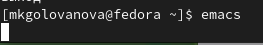{.column width=70%}

## Выполнение лабораторной работы

2. Я создала файл lab07.sh с помощью комбинации **Ctrl-x Ctrl-f** (**C-x C-f**) (рис. 2).

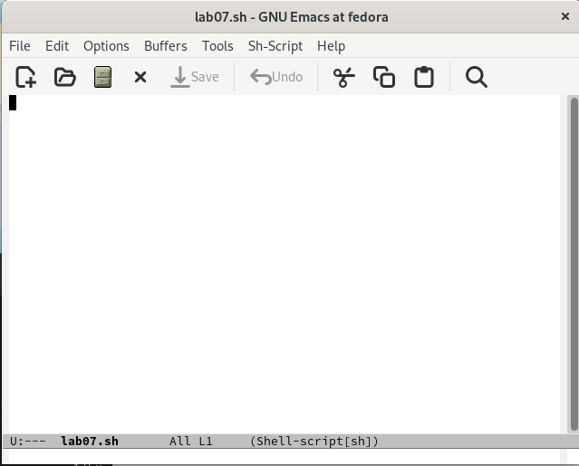{.column width=55%}

## Выполнение лабораторной работы

3. Я набрала данный в задании текст (рис. 3).

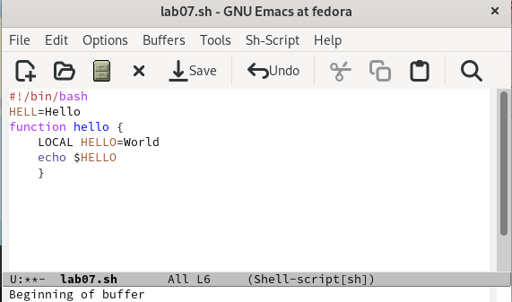{.column width=55%}

## Выполнение лабораторной работы

4. Сохранить файл с помощью комбинации **Ctrl-x Ctrl-s** (**C-x C-s**).(рис. 4).

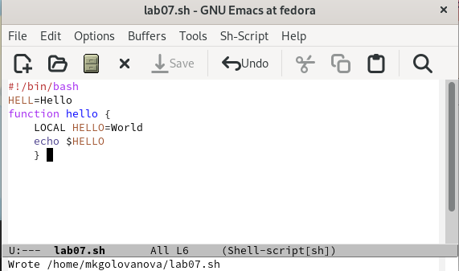{.column width=55%}

## Выполнение лабораторной работы

5. Я проделала с текстом стандартные процедуры редактирования, каждое действие осуществлялось комбинацией клавиш:
5.1. Я вырезала одной командой целую строку (**С-k**)(рис. 5).

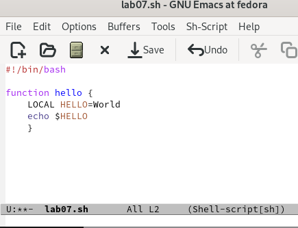{.column width=55%}

## Выполнение лабораторной работы

5.2. Я вставила эту строку в конец файла (**C-y**) (рис. 6).

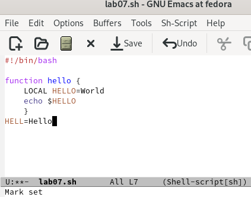{.column width=55%}

## Выполнение лабораторной работы

5.3. Я выделила область текста (**C-space**) (рис. 7).

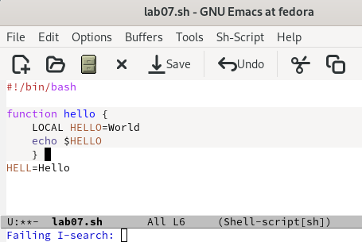{.column width=55%}

## Выполнение лабораторной работы

5.4. Скопировать область в буфер обмена (**M-w**) (рис. 8).

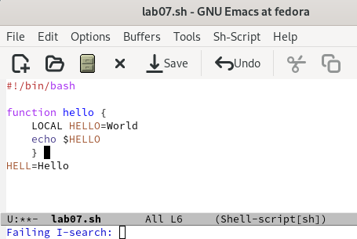{.column width=55%}

## Выполнение лабораторной работы

5.5. Я вставила эту область в конец файла (рис. 9).

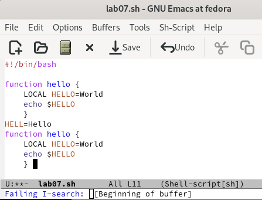{.column width=55%}

## Выполнение лабораторной работы

5.6. Я вновь выделила эту область и вырезала её (**C-w**) (рис. 10).

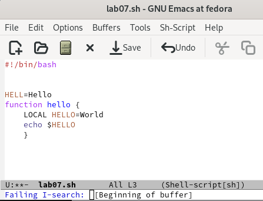{.column width=55%}

## Выполнение лабораторной работы

5.7. Отмените последнее действие (C-/) (рис. 11).

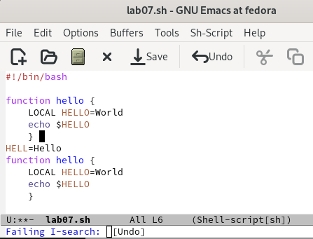{.column width=55%}

## Выполнение лабораторной работы

6. Я научилась использовать команды по перемещению курсора:
6.1. Я переместила курсор в начало строки (**C-a**) (рис. 12).

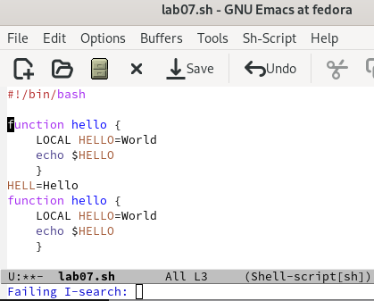{.column width=55%}

## Выполнение лабораторной работы

6.2.Я переместила курсор в конец строки (**C-e**) (рис. 13).

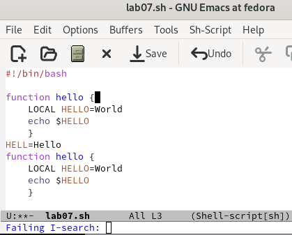{.column width=55%}

## Выполнение лабораторной работы

6.3. Я переместила курсор в начало буфера (**M-<**) (рис. 14).

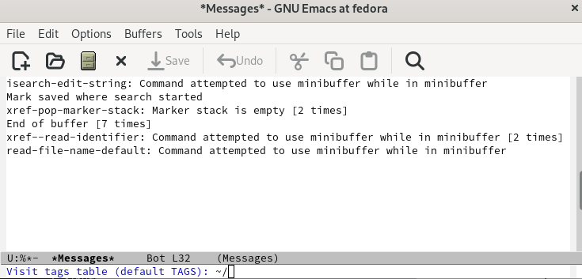{.column width=55%}

## Выполнение лабораторной работы

6.4. Я переместила курсор в конец буфера (**M->**) (рис. 15).

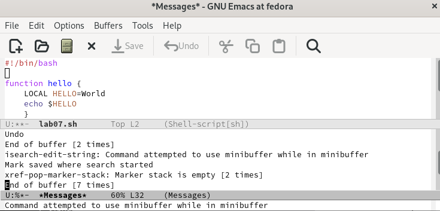{.column width=55%}

## Выполнение лабораторной работы

7. Управление буферами.
7.1. Я вывела список активных буферов на экран (**C-x C-b**) (рис. 16).

{.column width=55%}

## Выполнение лабораторной работы

7.2. Я переместилась во вновь открытое окно (**C-x o**) со списком открытых буферов и переключилась на другой буфер (рис. 17).

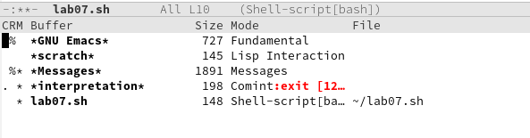{.column width=55%}

## Выполнение лабораторной работы

7.3. Я закрыла это окно (**C-x 0**) (рис. 18).

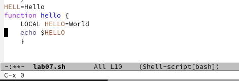{.column width=55%}

## Выполнение лабораторной работы

7.4. Я вновь переключилась между буферами, но уже без вывода их списка на экран (**C-x b**) (рис. 19).

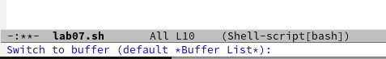{.column width=55%}

## Выполнение лабораторной работы

8. Управление окнами.
8.1. Я поделила фрейм на 4 части: сначала разделила фрейм на два окна по вертикали (**C-x 3**), а затем каждое из этих окон разделила на две части по горизонтали (**C-x 2**) (рис. 20).

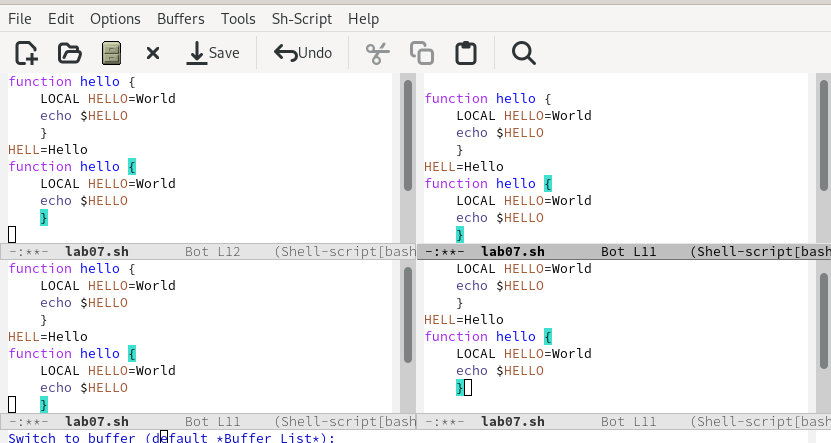{.column width=55%}

## Выполнение лабораторной работы

8.2. В каждом из четырёх созданных окон я открыла новый буфер (файл) и ввела несколько строк текста (рис. 21).

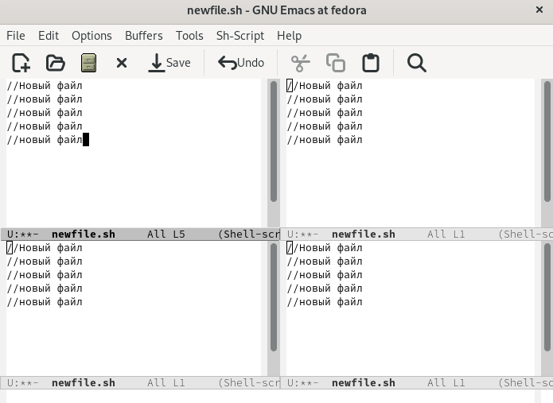{.column width=55%}

## Выполнение лабораторной работы

9. Режим поиска
9.1. Я переключилась в режим поиска (**C-s**) и нашла несколько слов, присутствующих в тексте (рис. 22).

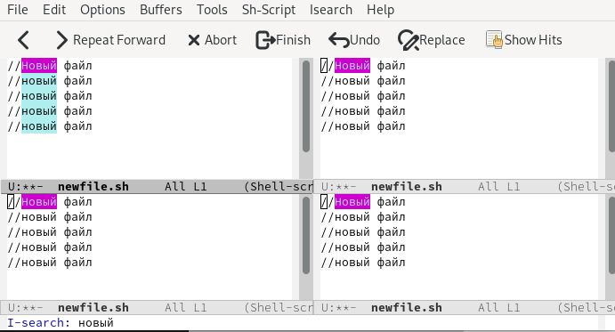{.column width=55%}

## Выполнение лабораторной работы

9.2. Я переключилась между результатами поиска, нажимая **C-s** (рис. 23).

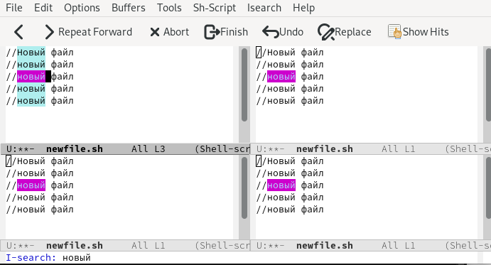{.column width=55%}

## Выполнение лабораторной работы

9.3. Я выщла из режима поиска, нажав **C-g** (рис. 24).

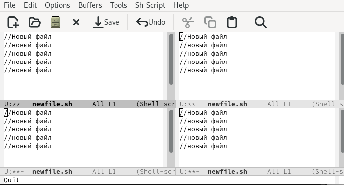{.column width=55%}

## Выполнение лабораторной работы

9.4. Я перешла в режим поиска и замены (**M-%**), ввела текст, который следует найти и заменить, нажала **Enter** и ввела текст для замены. После того как были подсвечены результаты поиска, я нажала ! для подтверждения замены (рис. 25).

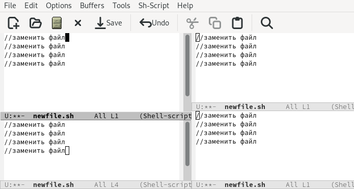{.column width=55%}

## Выполнение лабораторной работы

9.5. Я попробовала использовать другой режим поиска, нажав **M-s o** (рис. 26).

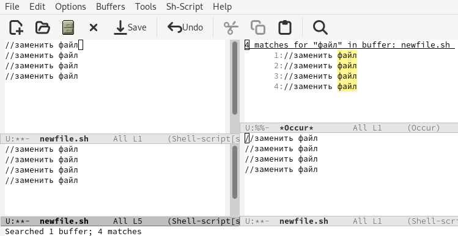{.column width=55%}

# Выводы

Я получила практические навыки работы с редактором Emacs.
