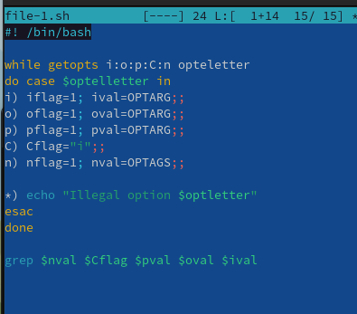
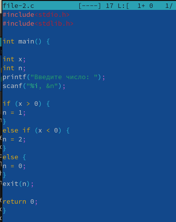
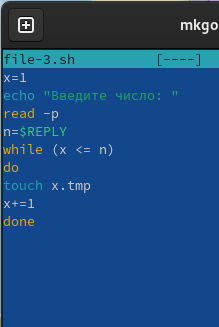
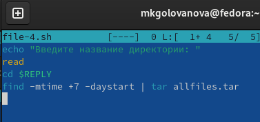

---
## Front matter
lang: ru-RU
title: Лабораторная работа № 11
subtitle: Операционные системы
author:
  - Голованова Мария Константиновна
institute:
  - Российский университет дружбы народов, Москва, Россия
date: 22 апреля 2023

## i18n babel
babel-lang: russian
babel-otherlangs: english

## Formatting pdf
toc: false
toc-title: Содержание
slide_level: 2
aspectratio: 169
section-titles: true
theme: metropolis
header-includes:
 - \metroset{progressbar=frametitle,sectionpage=progressbar,numbering=fraction}
 - '\makeatletter'
 - '\beamer@ignorenonframefalse'
 - '\makeatother'
---

# Информация

## Докладчик

 * Голованова Мария Константиновна
  * НММбд-01-22, 1132226478
  * Факультет физико-математических и естественных наук
  * Российский университет дружбы народов
  

# Цель работы

Изучить основы программирования в оболочке ОС UNIX. Научится писать более сложные командные файлы с использованием логических управляющих конструкций и циклов.

# Задание

## Задание

1. Используя команды getopts grep, написать командный файл, который анализирует командную строку с ключами:
* -iinputfile — прочитать данные из указанного файла;
* -ooutputfile — вывести данные в указанный файл;
* -pшаблон — указать шаблон для поиска;
* -C — различать большие и малые буквы;
* -n — выдавать номера строк.
а затем ищет в указанном файле нужные строки, определяемые ключом -p.
2. Написать на языке Си программу, которая вводит число и определяет, является ли оно больше нуля, меньше нуля или равно нулю. Затем программа завершается с помощью функции exit(n), передавая информацию в о коде завершения в оболочку. Командный файл должен вызывать эту программу и, проанализировав с помощью команды $?, выдать сообщение о том, какое число было введено.

## Задание

3. Написать командный файл, создающий указанное число файлов, пронумерованных последовательно от 1 до N (например 1.tmp, 2.tmp, 3.tmp,4.tmp и т.д.). Число файлов, которые необходимо создать, передаётся в аргументы командной строки. Этот же командный файл должен уметь удалять все созданные им файлы (если они существуют).
4. Написать командный файл, который с помощью команды tar запаковывает в архив все файлы в указанной директории. Модифицировать его так, чтобы запаковывались только те файлы, которые были изменены менее недели тому назад (использовать команду find).

# Выполнение лабораторной работы

## 1. 

Используя команды getopts grep, я написала командный файл, который анализирует командную строку с ключами:
* -iinputfile — прочитать данные из указанного файла;
* -ooutputfile — вывести данные в указанный файл;
* -pшаблон — указать шаблон для поиска;
* -C — различать большие и малые буквы;
* -n — выдавать номера строк.
а затем ищет в указанном файле нужные строки, определяемые ключом -p (рис. 1).

{.column width=50%}

## 2. 

Я написала на языке Си программу, которая вводит число и определяет, является ли оно больше нуля, меньше нуля или равно нулю. Затем программа завершается с помощью функции exit(n), передавая информацию в о коде завершения в оболочку. Командный файл вызывает эту программу и, проанализировав с помощью команды $?, выдаёт сообщение о том, какое число было введено (рис. 2).

{.column width=50%}

## 3. 

Я написала командный файл, создающий указанное число файлов, пронумерованных последовательно от 1 до N (например 1.tmp, 2.tmp, 3.tmp,4.tmp и т.д.). Число файлов, которые необходимо создать, передаётся в аргументы командной строки. Этот же командный файл удаляет все созданные им файлы (если они существуют) (рис. 3).

{.column width=50%}

## 4. 

Я написала командный файл, который с помощью команды tar запаковывает в архив все файлы в указанной директории, и модифицировала его так, чтобы запаковывались только те файлы, которые были изменены менее недели тому назад (использовать команду find) (рис. 4).

{.column width=50%}

# Выводы

Я изучила основы программирования в оболочке ОС UNIX и научилась писать более сложные командные файлы с использованием логических управляющих конструкций и циклов.

