---
## Front matter
lang: ru-RU
title: Лабораторная работа № 13
subtitle: Операционные системы
author:
  - Голованова Мария Константиновна
institute:
  - Российский университет дружбы народов, Москва, Россия
date: 6 мая 2023

## i18n babel
babel-lang: russian
babel-otherlangs: english

## Formatting pdf
toc: false
toc-title: Содержание
slide_level: 2
aspectratio: 169
section-titles: true
theme: metropolis
header-includes:
 - \metroset{progressbar=frametitle,sectionpage=progressbar,numbering=fraction}
 - '\makeatletter'
 - '\beamer@ignorenonframefalse'
 - '\makeatother'
---

# Информация

## Докладчик

* Голованова Мария Константиновна
  * НММбд-01-22, 1132226478
  * Факультет физико-математических и естественных наук
  * Российский университет дружбы народов

# Цель работы

Приобрести простейшие навыки разработки, анализа, тестирования и отладки приложений в ОС типа UNIX/Linux на примере создания на языке программирования С калькулятора с простейшими функциями.

# Задание

Создать на языке программирования С калькулятор, способный складывать, вычитать, умножать и делить, возводить число в степень, брать квадратный корень, вычислять sin, cos, tan. При запуске он будет запрашивать первое число, операцию, второе число. После этого программа выведет результат и остановится.

# Теоретическое введение

## Компиляция исходного текста и построение исполняемого файла

Стандартным средством для компиляции программ в ОС типа UNIX является GCC (GNU Compiler Collection). Это набор компиляторов для разного рода языков программирования (С, C++, Java, Фортран и др.). Работа с GCC производится при помощи одноимённой управляющей программы gcc, которая интерпретирует аргументы командной строки, определяет и осуществляет запуск нужного компилятора для входного файла. Файлы с расширением (суффиксом) .c воспринимаются gcc как программы на языке С, файлы с расширением .cc или .C — как файлы на языке C++, а файлы c расширением .o считаются объектными.

## Компиляция исходного текста и построение исполняемого файла

Для сборки разрабатываемого приложения и собственно компиляции полезно воспользоваться утилитой make. Она позволяет автоматизировать процесс преобразования файлов программы из одной формы в другую, отслеживает взаимосвязи между файлами. Для работы с утилитой make необходимо в корне рабочего каталога с Вашим проектом создать файл с названием makefile или Makefile, в котором будут описаны правила обработки файлов Вашего программного комплекса. Сначала задаётся список целей, разделённых пробелами, за которым идёт двоеточие и список зависимостей. Затем в следующих строках указываются команды. Строки с командами обязательно должны начинаться с табуляции. В качестве цели в Makefile может выступать имя файла или название какого-то действия. Зависимость задаёт исходные параметры (условия) для достижения указанной цели. Зависимость также может быть названием какого-то действия. Команды — собственно действия, которые необходимо выполнить для достижения цели.

## Тестирование и отладка

Во время работы над кодом программы программист неизбежно сталкивается с появлением ошибок в ней. Использование отладчика для поиска и устранения ошибок в программе существенно облегчает жизнь программиста. В комплект программ GNU для ОС типа UNIX входит отладчик GDB (GNU Debugger).
Для использования GDB необходимо скомпилировать анализируемый код программы таким образом, чтобы отладочная информация содержалась в результирующем бинарном файле. Для этого следует воспользоваться опцией -g компилятора gcc:
* gcc -c file.c -g
После этого для начала работы с gdb необходимо в командной строке ввести одноимённую команду, указав в качестве аргумента анализируемый бинарный файл:
* gdb file.o
Затем можно использовать по мере необходимости различные команды gdb.
Для выхода из gdb можно воспользоваться командой quit (или её сокращённым вариантом q) или комбинацией клавиш Ctrl-d . Более подробную информацию по работе с gdb можно получить с помощью команд gdb -h и man gdb.

# Выполнение лабораторной работы

## 1. 

- Я создала в домашнем каталоге подкаталог ~/work/os/lab_prog, а затем создала в нём файлы: calculate.h, calculate.c, main.c. (рис. 1).

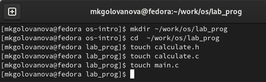{.columnwidth=60%}

## 2.1 

- Я ввела в файл calculate.с текст для реализации функций калькулятора (рис. 2, рис. 3).

## 2.1

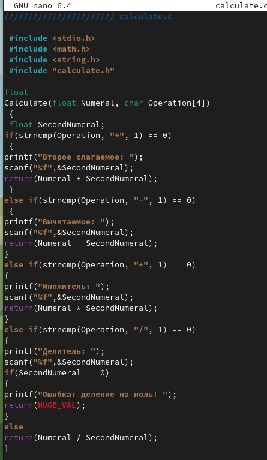{.columnwidth=50%}

## 2.1

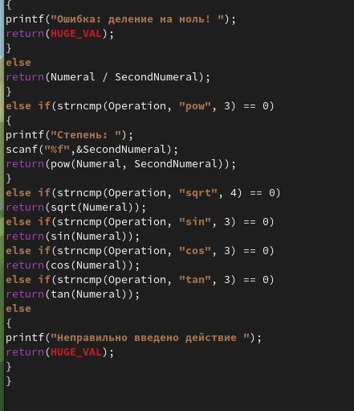{.columnwidth=50%}

##2.2

- Я ввела текст интерфейсного файла calculate.h, описывающий формат вызова функции калькулятора (рис. 4).

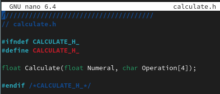{.columnwidth=50%}

## 2.3

- Я ввела текст основного файла main.c, реализующий интерфейс пользователя к калькулятору (рис. 5).

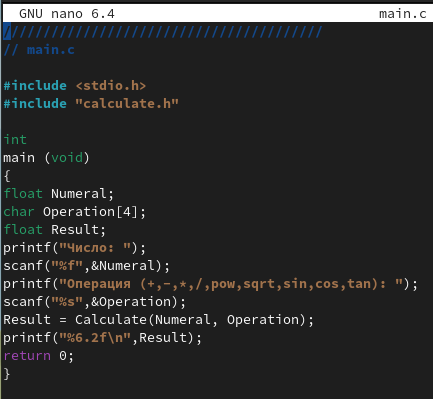{.columnwidth=40%}

## 3. 

- Я выполнила компиляцию программы посредством gcc (рис. 6).

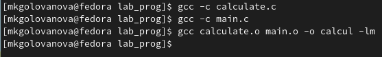{.columnwidth=60%}

## 4. 

- Я создала Makefile со следующим содержанием (рис. 7).

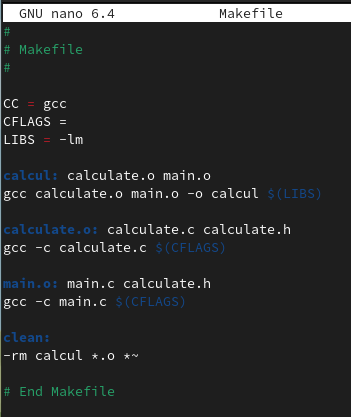{.columnwidth=40%}

## 5. 

- Я исправила Makefile (рис. 8).

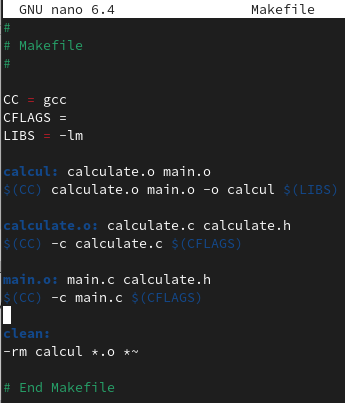{.columnwidth=40%}

## 6.

С помощью gdb я выполнила отладку программы calcul:
- Запустила отладчик GDB, загрузив в него программу для отладки (рис.9).

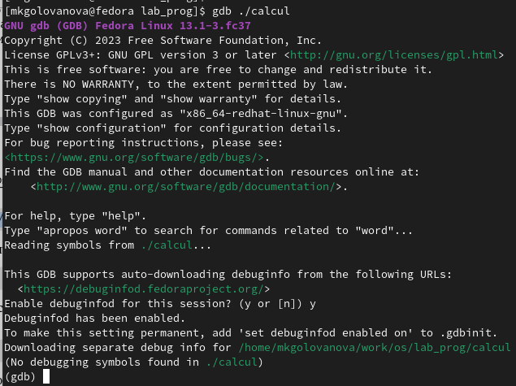{.columnwidth=40%}

## 6.

- Для запуска программы внутри отладчика я ввела команду run (рис. 10).

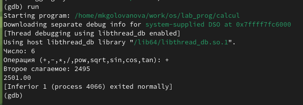{.columnwidth=60%}

## 6.

- Для постраничного (по 9 строк) просмотра исходного кода я использовала команду list (рис. 11).

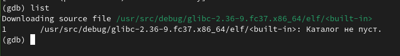{.columnwidth=60%}

## 6.

- Для просмотра строк с 12 по 15 основного файла я использовала list с параметрами (рис. 12).

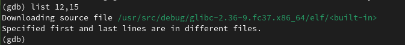{.columnwidth=60%}

## 6.

- Для просмотра определённых строк не основного файла я использовала list с параметрами (рис. 13).

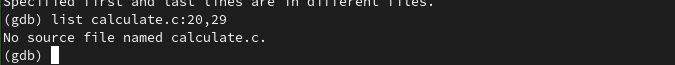{.columnwidth=60%}

## 6.

- Я установила точку останова в файле calculate.c на строке номер 21 и вывела информацию об имеющихся в проекте точка останова (рис. 14).

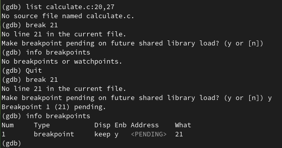{.columnwidth=50%}

## 6.

- Я запустила программу внутри отладчика и убедилась, что программа остановится в момент прохождения точки останова (рис. 15).

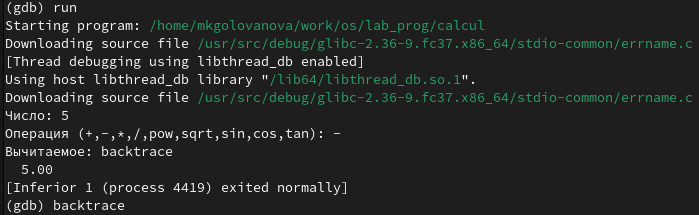{.columnwidth=50%}

- Отладчик выдал следующую информацию (рис. 16).

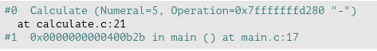{.columnwidth=50%}

## 6.

- Я посмотрела, чему равно на этом этапе значение переменной Numeral и сравнила с результатом вывода на экран после использования команды display Numeral (рис. 17).

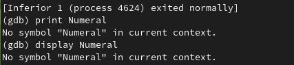{.columnwidth=50%}

## 6.

- Я убрала точки останова (рис. 18).

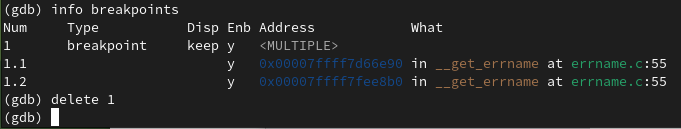{.columnwidth=50%}

## 7. 
- С помощью утилиты splint я проанализировала коды файлов calculate.c и main.c (рис. 19, рис. 20).

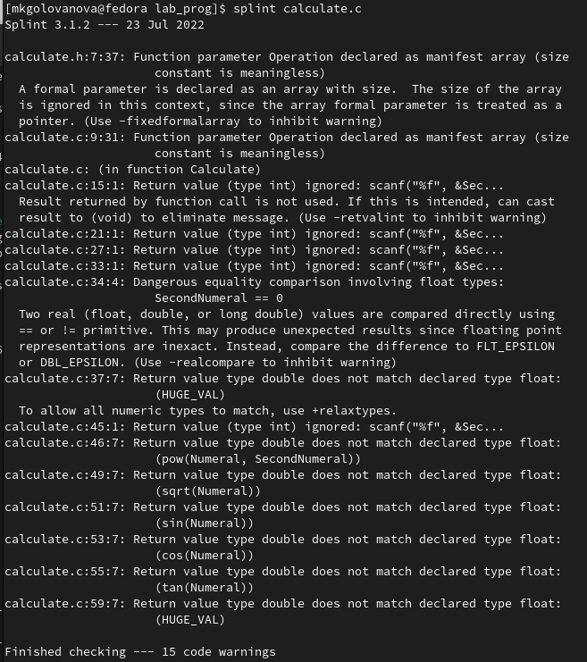{.columnwidth=40%}

## 7. 

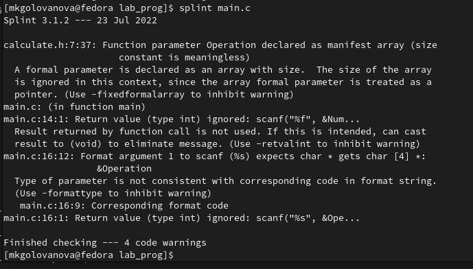{.columnwidth=50%}

# Выводы

Я прио6рела простейшие навыки разработки, анализа, тестирования и отладки приложений в ОС типа UNIX/Linux на примере создания на языке программирования С калькулятора с простейшими функциями.

