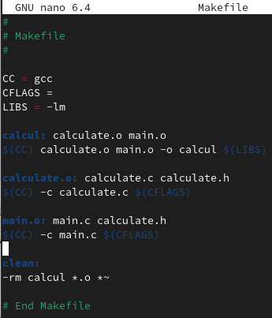
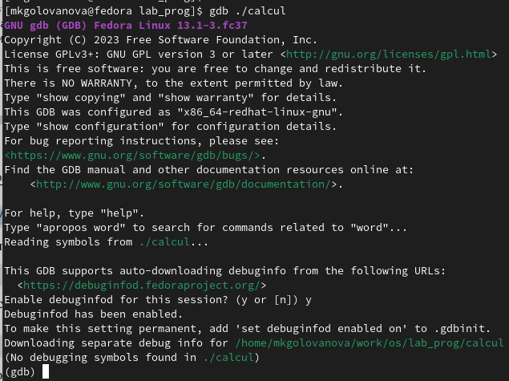
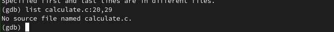
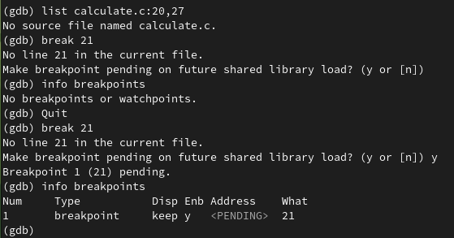
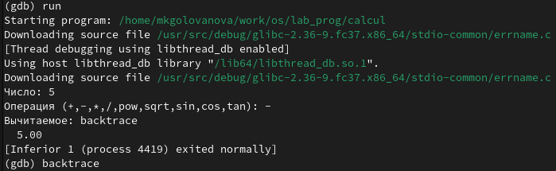
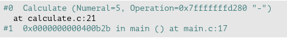
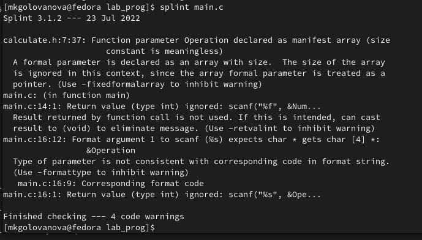

---
## Front matter
title: "Лабораторная работа № 13"
subtitle: "Операционные системы"
author: "Голованова Мария Константиновна"

## Generic otions
lang: ru-RU
toc-title: "Содержание"

## Bibliography
bibliography: bib/cite.bib
csl: pandoc/csl/gost-r-7-0-5-2008-numeric.csl

## Pdf output format
toc: true # Table of contents
toc-depth: 2
lof: true # List of figures
lot: true # List of tables
fontsize: 12pt
linestretch: 1.5
papersize: a4
documentclass: scrreprt
## I18n polyglossia
polyglossia-lang:
  name: russian
  options:
	- spelling=modern
	- babelshorthands=true
polyglossia-otherlangs:
  name: english
## I18n babel
babel-lang: russian
babel-otherlangs: english
## Fonts
mainfont: PT Serif
romanfont: PT Serif
sansfont: PT Sans
monofont: PT Mono
mainfontoptions: Ligatures=TeX
romanfontoptions: Ligatures=TeX
sansfontoptions: Ligatures=TeX,Scale=MatchLowercase
monofontoptions: Scale=MatchLowercase,Scale=0.9
## Biblatex
biblatex: true
biblio-style: "gost-numeric"
biblatexoptions:
  - parentracker=true
  - backend=biber
  - hyperref=auto
  - language=auto
  - autolang=other*
  - citestyle=gost-numeric
## Pandoc-crossref LaTeX customization
figureTitle: "Рис."
tableTitle: "Таблица"
listingTitle: "Листинг"
lofTitle: "Список иллюстраций"
lotTitle: "Список таблиц"
lolTitle: "Листинги"
## Misc options
indent: true
header-includes:
  - \usepackage{indentfirst}
  - \usepackage{float} # keep figures where there are in the text
  - \floatplacement{figure}{H} # keep figures where there are in the text
---

# Цель работы

Приобрести простейшие навыки разработки, анализа, тестирования и отладки приложений в ОС типа UNIX/Linux на примере создания на языке программирования С калькулятора с простейшими функциями.

# Задание

Создать на языке программирования С калькулятор, способный складывать, вычитать, умножать и делить, возводить число в степень, брать квадратный корень, вычислять sin, cos, tan. При запуске он будет запрашивать первое число, операцию, второе число. После этого программа выведет результат и остановится.

# Теоретическое введение

## Компиляция исходного текста и построение исполняемого файла

Стандартным средством для компиляции программ в ОС типа UNIX является GCC (GNU Compiler Collection). Это набор компиляторов для разного рода языков программирования (С, C++, Java, Фортран и др.). Работа с GCC производится при помощи одноимённой управляющей программы gcc, которая интерпретирует аргументы командной строки, определяет и осуществляет запуск нужного компилятора для входного файла. Файлы с расширением (суффиксом) .c воспринимаются gcc как программы на языке С, файлы с расширением .cc или .C — как файлы на языке C++, а файлы c расширением .o считаются объектными.
Для сборки разрабатываемого приложения и собственно компиляции полезно воспользоваться утилитой make. Она позволяет автоматизировать процесс преобразования файлов программы из одной формы в другую, отслеживает взаимосвязи между файлами. Для работы с утилитой make необходимо в корне рабочего каталога с Вашим проектом создать файл с названием makefile или Makefile, в котором будут описаны правила обработки файлов Вашего программного комплекса. Сначала задаётся список целей, разделённых пробелами, за которым идёт двоеточие и список зависимостей. Затем в следующих строках указываются команды. Строки с командами обязательно должны начинаться с табуляции. В качестве цели в Makefile может выступать имя файла или название какого-то действия. Зависимость задаёт исходные параметры (условия) для достижения указанной цели. Зависимость также может быть названием какого-то действия. Команды — собственно действия, которые необходимо выполнить для достижения цели.

## Тестирование и отладка

Во время работы над кодом программы программист неизбежно сталкивается с появлением ошибок в ней. Использование отладчика для поиска и устранения ошибок в программе существенно облегчает жизнь программиста. В комплект программ GNU для ОС типа UNIX входит отладчик GDB (GNU Debugger).
Для использования GDB необходимо скомпилировать анализируемый код программы таким образом, чтобы отладочная информация содержалась в результирующем бинарном файле. Для этого следует воспользоваться опцией -g компилятора gcc:
* gcc -c file.c -g
После этого для начала работы с gdb необходимо в командной строке ввести одноимённую команду, указав в качестве аргумента анализируемый бинарный файл:
* gdb file.o
Затем можно использовать по мере необходимости различные команды gdb.
Для выхода из gdb можно воспользоваться командой quit (или её сокращённым вариантом q) или комбинацией клавиш Ctrl-d . Более подробную информацию по работе с gdb можно получить с помощью команд gdb -h и man gdb.

# Выполнение лабораторной работы

 1. Я создала в домашнем каталоге подкаталог ~/work/os/lab_prog, а затем создала в нём файлы: calculate.h, calculate.c, main.c. (рис. @fig:001).

{#fig:001 width=70%}

2. Я ввела в файл calculate.с текст для реализации функций калькулятора (рис. @fig:002, рис. @fig:003).

{#fig:002 width=70%}

{#fig:003 width=70%}

Я ввела текст интерфейсного файла calculate.h, описывающий формат вызова функции калькулятора (рис. @fig:004).

{#fig:004 width=70%}

Я ввела текст основного файла main.c, реализующий интерфейс пользователя к калькулятору (рис. @fig:005).

{#fig:005 width=70%}

3. Я выполнила компиляцию программы посредством gcc (рис. @fig:006).

{#fig:006 width=70%}

4. Я создала Makefile со следующим содержанием (рис. @fig:007).

{#fig:007 width=70%}

5. Я исправила Makefile (рис. @fig:008).

{#fig:008 width=70%}

6. С помощью gdb я выполнила отладку программы calcul:
* Запустила отладчик GDB, загрузив в него программу для отладки (рис. @fig:009).

{#fig:009 width=70%}

* Для запуска программы внутри отладчика я ввела команду run (рис. @fig:010).

{#fig:010 width=70%}

* Для постраничного (по 9 строк) просмотра исходного кода я использовала команду list (рис. @fig:011).

{#fig:011 width=70%}

* Для просмотра строк с 12 по 15 основного файла я использовала list с параметрами (рис. @fig:012).

{#fig:012 width=70%}

* Для просмотра определённых строк не основного файла я использовала list с параметрами (рис. @fig:013).

{#fig:013 width=70%}

* Я установила точку останова в файле calculate.c на строке номер 21 и вывела информацию об имеющихся в проекте точка останова (рис. @fig:014).

{#fig:014 width=70%}

* Я запустила программу внутри отладчика и убедилась, что программа остановится в момент прохождения точки останова (рис. @fig:015).

{#fig:015 width=70%}

Отладчик выдал следующую информацию (рис. @fig:016).

{#fig:016 width=70%}

* Я посмотрела, чему равно на этом этапе значение переменной Numeral и сравнила с результатом вывода на экран после использования команды display Numeral (рис. @fig:017).

{#fig:017 width=70%}

* Я убрала точки останова (рис. @fig:018).

{#fig:018 width=70%}

7. С помощью утилиты splint я проанализировала коды файлов calculate.c и main.c (рис. @fig:019, рис. @fig:020).

{#fig:019 width=70%}

{#fig:020 width=70%}

# Выводы

Я приобрела простейшие навыки разработки, анализа, тестирования и отладки приложений в ОС типа UNIX/Linux на примере создания на языке программирования С калькулятора с простейшими функциями.

# Список литературы{.unnumbered}

::: {#refs}
:::
