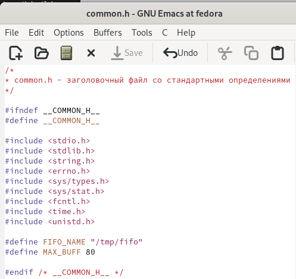
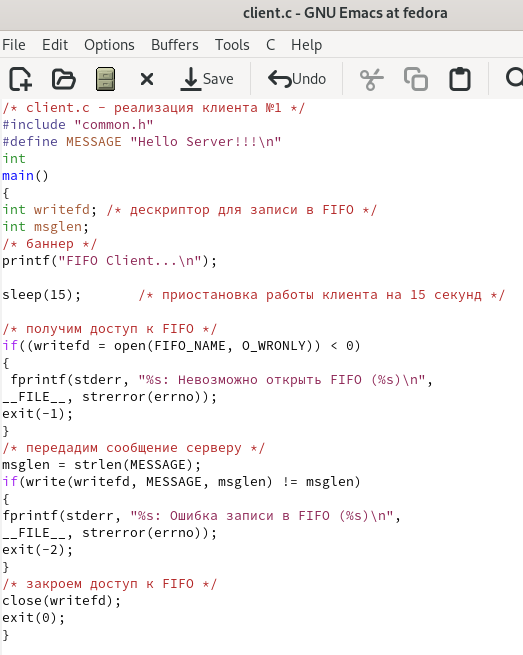
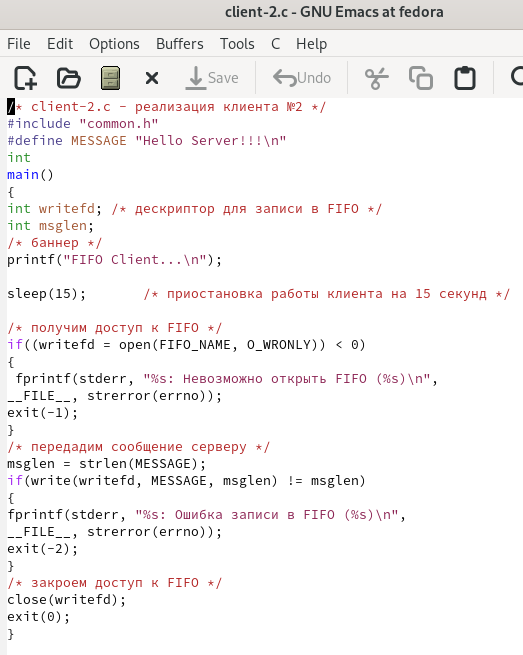
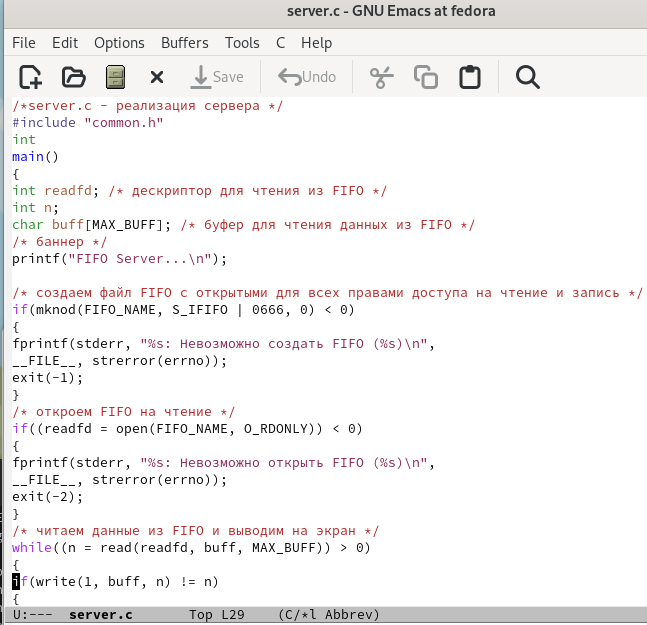
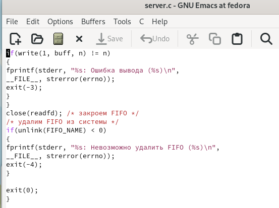
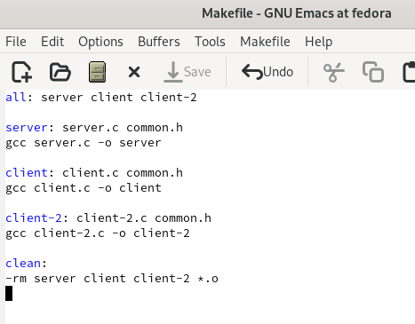

---
## Front matter
lang: ru-RU
title: Лабораторная работа № 14
subtitle: Операционные системы
author:
  - Голованова Мария Константиновна
institute:
  - Российский университет дружбы народов, Москва, Россия
date: 13 мая 2023

## i18n babel
babel-lang: russian
babel-otherlangs: english

## Formatting pdf
toc: false
toc-title: Содержание
slide_level: 2
aspectratio: 169
section-titles: true
theme: metropolis
header-includes:
 - \metroset{progressbar=frametitle,sectionpage=progressbar,numbering=fraction}
 - '\makeatletter'
 - '\beamer@ignorenonframefalse'
 - '\makeatother'
---

# Информация

## Докладчик

  * Голованова Мария Константиновна
  * НММбд-01-22, 1132226478
  * Факультет физико-математических и естественных наук
  * Российский университет дружбы народов

# Цель работы

- Приобретение практических навыков работы с именованными каналами.

# Задание

- Изучите приведённые в тексте программы server.c и client.c. Взяв данные примеры за образец, напишите аналогичные программы, внеся следующие изменения:
1. Работает не 1 клиент, а несколько (например, два).
2. Клиенты передают текущее время с некоторой периодичностью (например, раз в пять секунд). Используйте функцию sleep() для приостановки работы клиента.
3. Сервер работает не бесконечно, а прекращает работу через некоторое время (например, 30 сек). Используйте функцию clock() для определения времени работы сервера. Что будет в случае, если сервер завершит работу, не закрыв канал?

# Теоретическое введение

## Теоретическое введение

Одним из видов взаимодействия между процессами в операционных системах является обмен сообщениями. Под сообщением понимается последовательность байтов, передаваемая от одного процесса другому.
В операционных системах типа UNIX есть 3 вида межпроцессорных взаимодействий: общеюниксные (именованные каналы, сигналы), System V Interface Definition (SVID - разделяемая память, очередь сообщений, семафоры) и BSD (сокеты).

## Теоретическое введение

Для передачи данных между неродственными процессами можно использовать механизм именованных каналов (named pipes). Данные передаются по принципу FIFO (First In First Out) (первым записан — первым прочитан), поэтому они называются также FIFO pipes или просто FIFO. Именованные каналы отличаются от неименованных наличием идентификатора канала, который представлен как специальный файл (соответственно имя именованного канала — это имя файла). Поскольку файл находится на локальной файловой системе, данное IPC используется внутри одной системы.

# Выполнение лабораторной работы

## Выполнение лабораторной работы

- Я изучила приведённые в тексте программы server.c и client.c и, взяв данные примеры за образец, написала аналогичные программы, внеся следующие изменения:
1. Работает не 1 клиент, а несколько два.
2. Клиенты передают текущее время с некоторой периодичностью раз в 15 секунд (Использовала функцию sleep() для приостановки работы клиента).
3. Сервер работает не бесконечно, а прекращает работу через некоторое время 40 сек. (Использовала функцию clock() для определения времени работы сервера). (рис. 1, рис. 2, рис. 3, рис. 4, рис. 5, рис. 6).

## Выполнение лабораторной работы

{.columnwidth=50%}

## Выполнение лабораторной работы

{.columnwidth=50%}

## Выполнение лабораторной работы

{.columnwidth=50%}

## Выполнение лабораторной работы

{.columnwidth=50%}

## Выполнение лабораторной работы

{.columnwidth=50%}

## Выполнение лабораторной работы

{.columnwidth=50%}

# Выводы

- Я приобрела практические навыки работы с именованными каналами.

