---
## Front matter
title: "Прохождение внешнего курса"
subtitle: "Операционные системы"
author: "Голованова Мария Константиновна"

## Generic otions
lang: ru-RU
toc-title: "Содержание"

## Bibliography
bibliography: bib/cite.bib
csl: pandoc/csl/gost-r-7-0-5-2008-numeric.csl

## Pdf output format
toc: true # Table of contents
toc-depth: 2
lof: true # List of figures
lot: true # List of tables
fontsize: 12pt
linestretch: 1.5
papersize: a4
documentclass: scrreprt
## I18n polyglossia
polyglossia-lang:
  name: russian
  options:
	- spelling=modern
	- babelshorthands=true
polyglossia-otherlangs:
  name: english
## I18n babel
babel-lang: russian
babel-otherlangs: english
## Fonts
mainfont: PT Serif
romanfont: PT Serif
sansfont: PT Sans
monofont: PT Mono
mainfontoptions: Ligatures=TeX
romanfontoptions: Ligatures=TeX
sansfontoptions: Ligatures=TeX,Scale=MatchLowercase
monofontoptions: Scale=MatchLowercase,Scale=0.9
## Biblatex
biblatex: true
biblio-style: "gost-numeric"
biblatexoptions:
  - parentracker=true
  - backend=biber
  - hyperref=auto
  - language=auto
  - autolang=other*
  - citestyle=gost-numeric
## Pandoc-crossref LaTeX customization
figureTitle: "Рис."
tableTitle: "Таблица"
listingTitle: "Листинг"
lofTitle: "Список иллюстраций"
lotTitle: "Список таблиц"
lolTitle: "Листинги"
## Misc options
indent: true
header-includes:
  - \usepackage{indentfirst}
  - \usepackage{float} # keep figures where there are in the text
  - \floatplacement{figure}{H} # keep figures where there are in the text
---

# Цель работы

Пройти курс по операционной системе Linux; освоить основные навыки работы с Linux.

# Задание

Пройти курс по операционной системе Linux; освоить основные навыки работы с Linux.

# Выполнение заданий курса

Первые несколько вопросов были вводными и не требовали особых знаний Linux (рис. @fig:001, рис. @fig:002, рис. @fig:003, рис. @fig:004, рис. @fig:005).

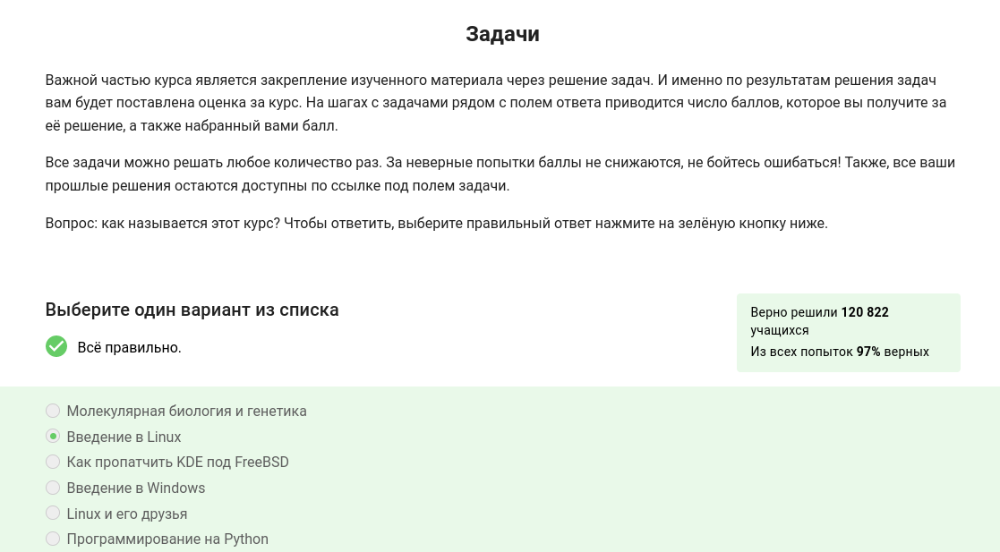{#fig:001 width=70%}

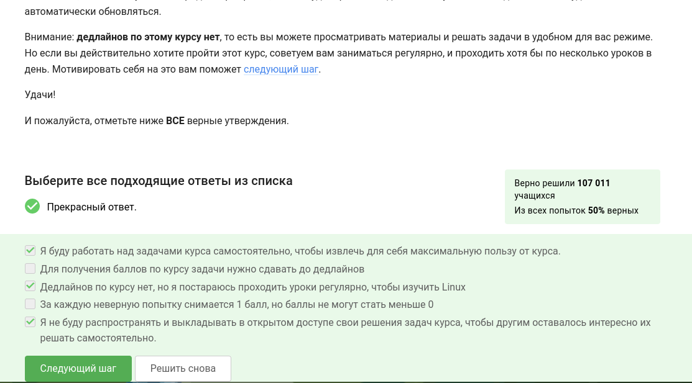{#fig:002 width=70%}

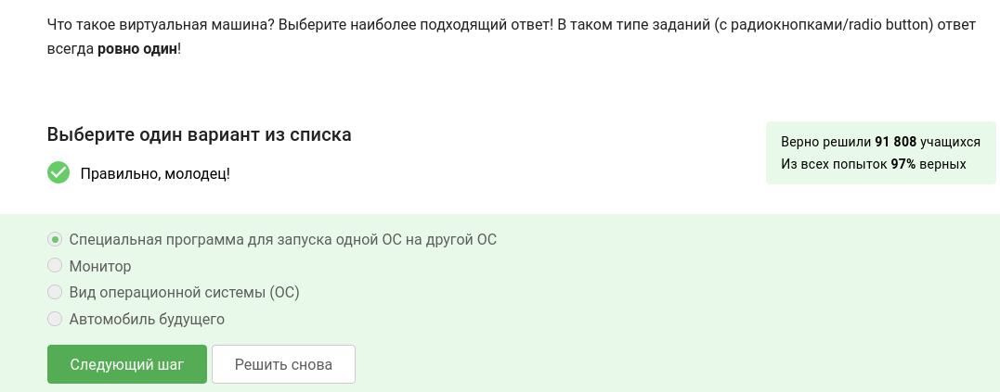{#fig:003 width=70%}

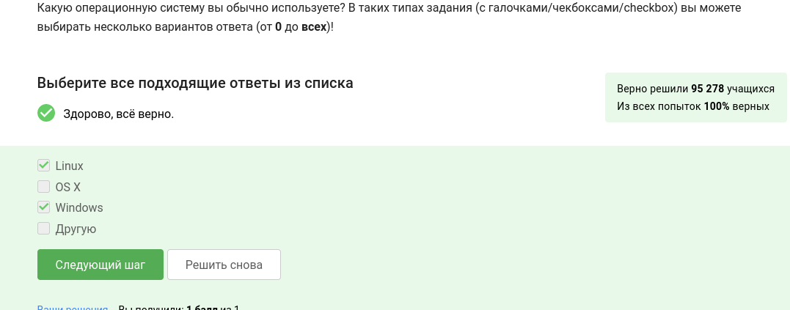{#fig:004 width=70%}

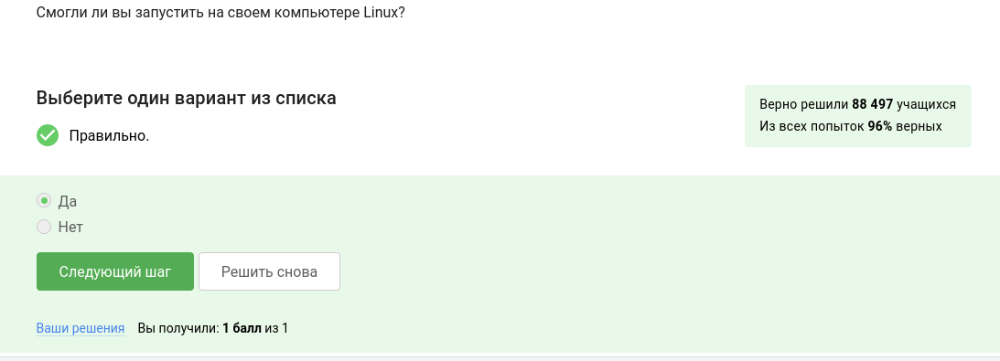{#fig:005 width=70%}

Затем я создала документ в LibreOffice Writer и написала в нём шрифтом FreeMono строчку Hello, Linux! После этого я сохранила документ в формате XML и загрузила в форму (рис. @fig:006, рис. @fig:007).

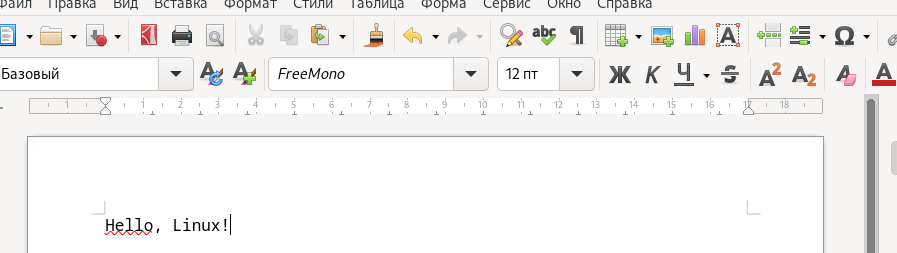{#fig:006 width=70%}

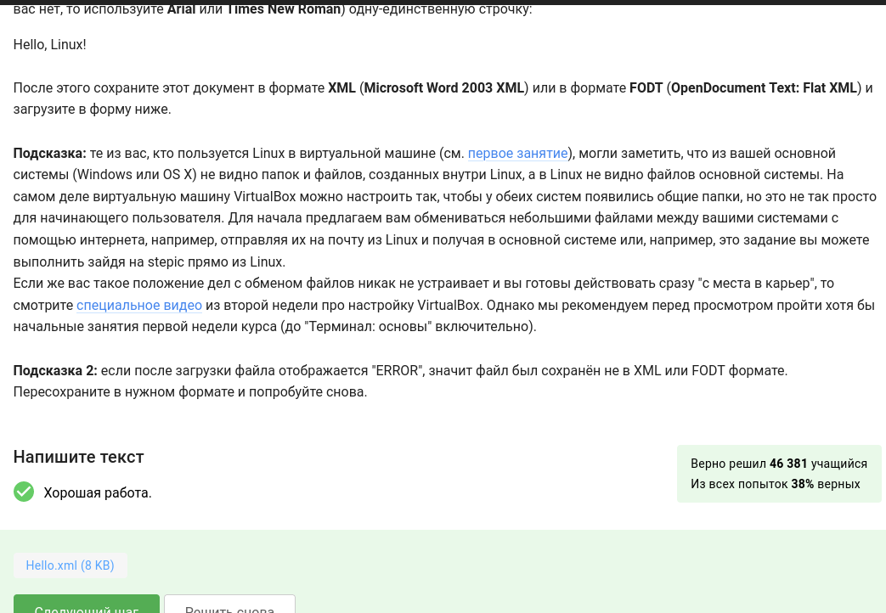{#fig:007 width=70%}

Далее, опираясь на материал из видео об установке приложений и работе приложения Update Manager, я ответила на следующие вопросы (рис. @fig:008, рис. @fig:009).

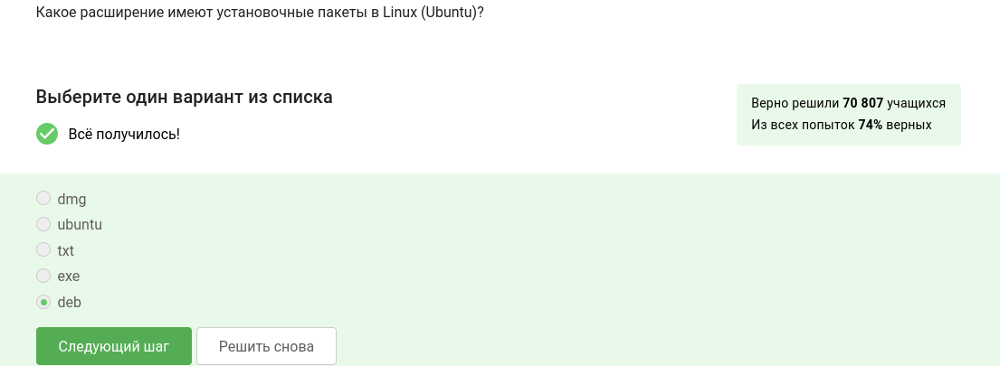{#fig:008 width=70%}

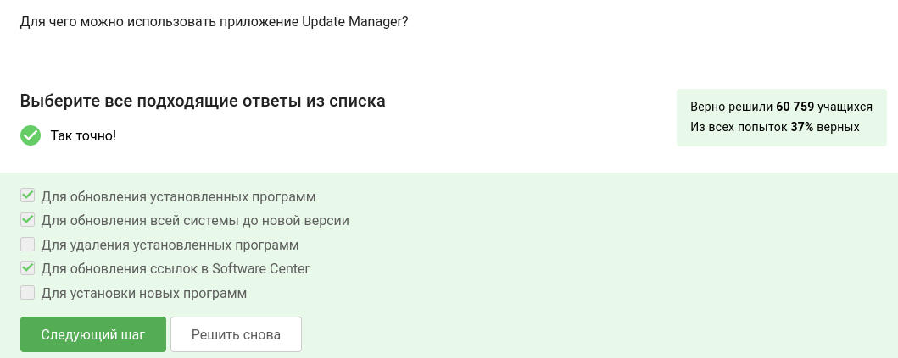{#fig:009 width=70%}

Используя информацию из видео и также проверяя в терминале работу некоторых команд, я выполнила следующие задания (рис. @fig:010, рис. @fig:011, рис. @fig:012, рис. @fig:013, рис. @fig:014, рис. @fig:015).

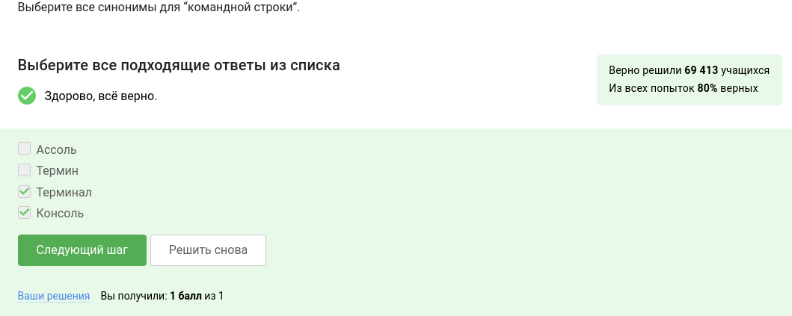{#fig:010 width=70%}

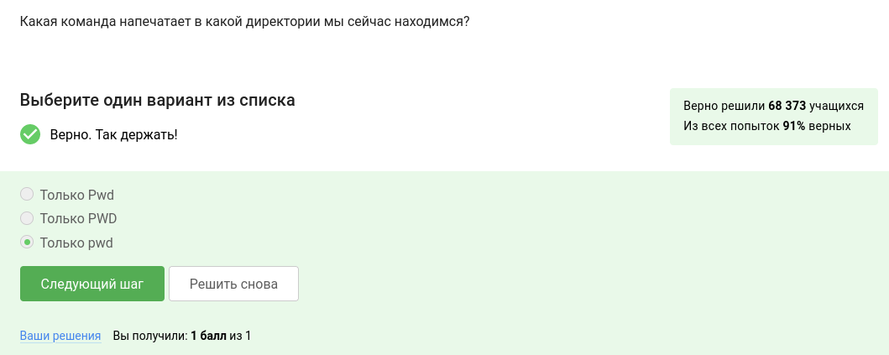{#fig:011 width=70%}

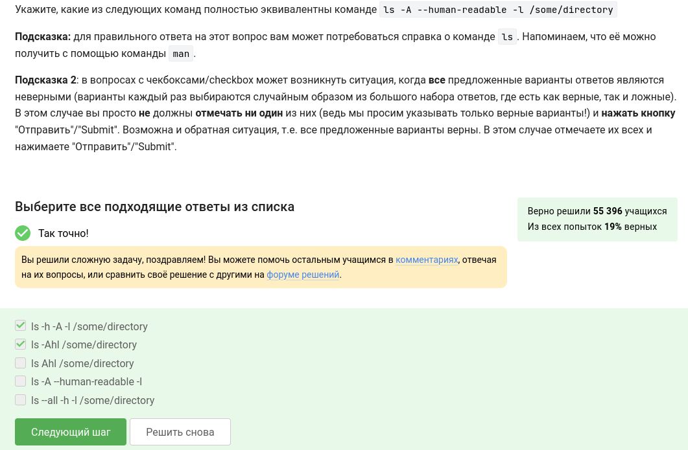{#fig:012 width=70%}

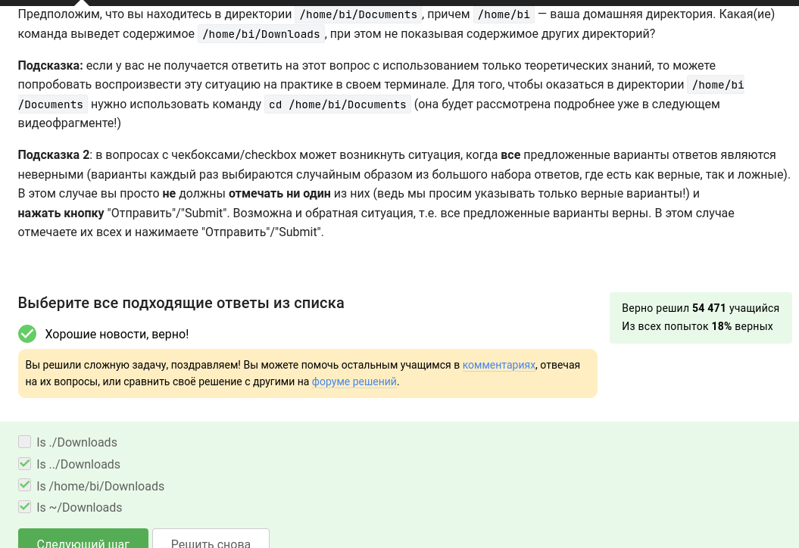{#fig:013 width=70%}

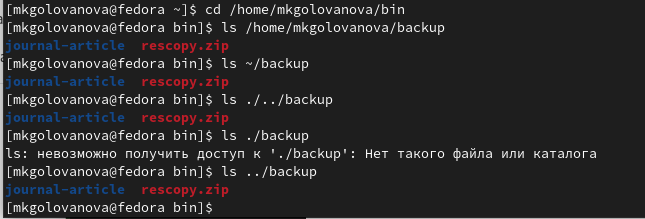{#fig:014 width=70%}

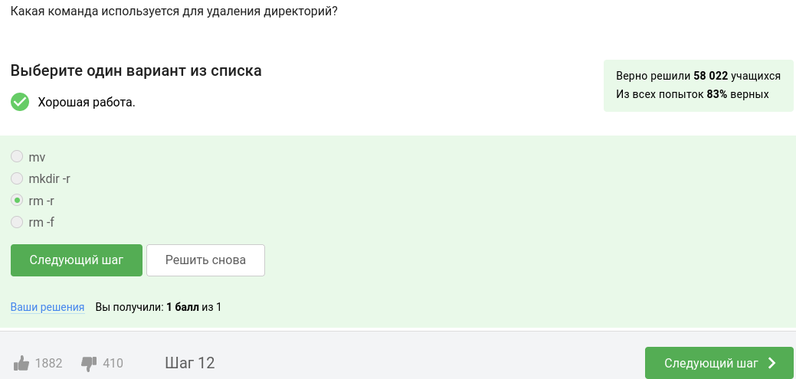{#fig:015 width=70%}

(рис. @fig:01).

{#fig:01 width=70%}

рис. @fig:01).

{#fig:01 width=70%}

рис. @fig:01).

{#fig:01 width=70%}

рис. @fig:01).

{#fig:01 width=70%}

рис. @fig:01).

{#fig:01 width=70%}

рис. @fig:01).

{#fig:01 width=70%}

рис. @fig:01).

{#fig:01 width=70%}

рис. @fig:01).

{#fig:01 width=70%}

# Выводы

Я прошла курс по операционной системе Linux и освоить основные навыки работы с данной ОС.

# Список литературы{.unnumbered}

::: {#refs}
:::
