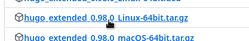
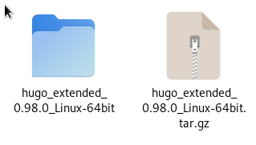
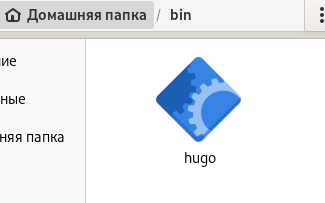
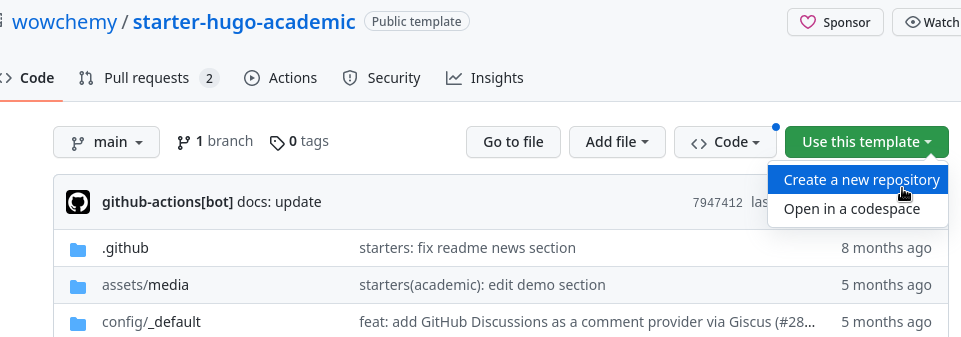
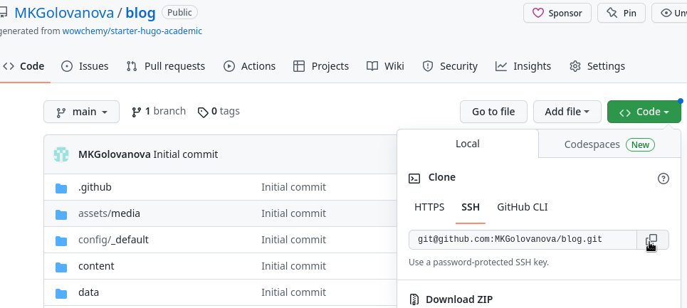
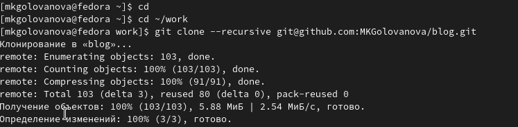
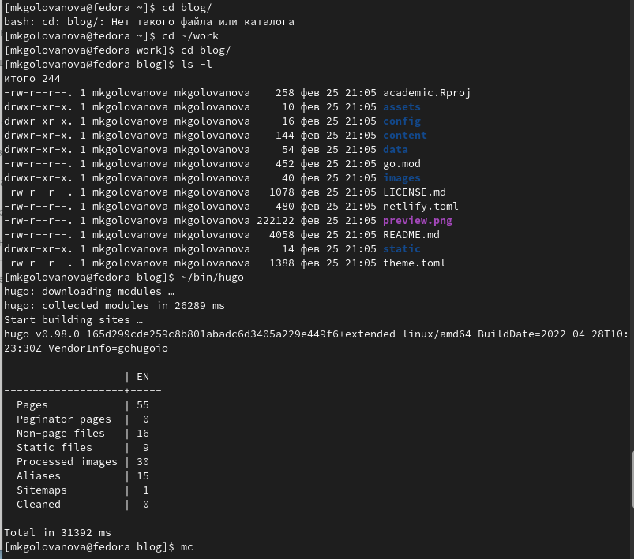
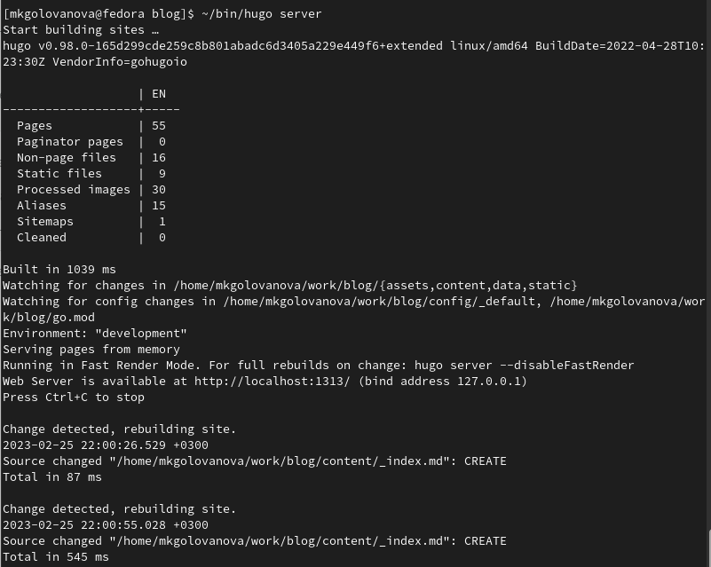
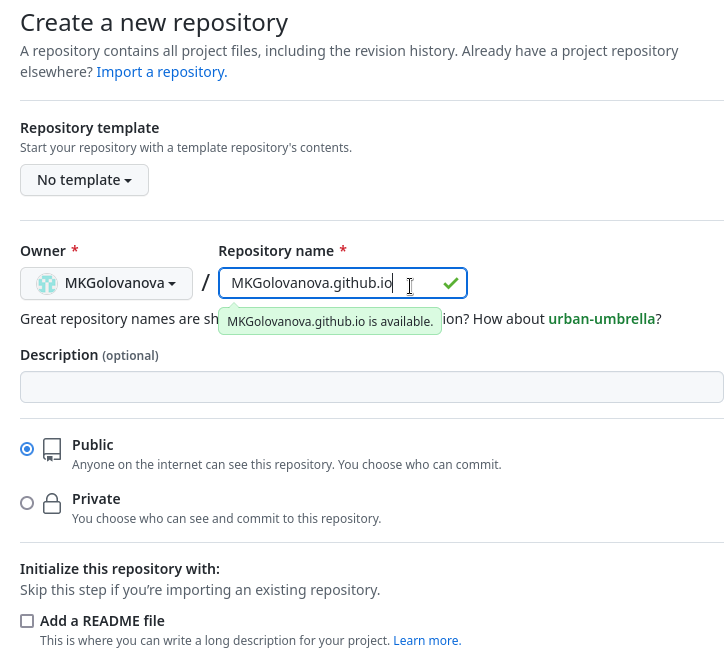

---
## Front matter
title: "Индивидуальный проект. Этап 1"
subtitle: "Операционные системы"
author: "Голованова Мария Константиновна"

## Generic otions
lang: ru-RU
toc-title: "Содержание"

## Bibliography
bibliography: bib/cite.bib
csl: pandoc/csl/gost-r-7-0-5-2008-numeric.csl

## Pdf output format
toc: true # Table of contents
toc-depth: 2
lof: true # List of figures
lot: true # List of tables
fontsize: 12pt
linestretch: 1.5
papersize: a4
documentclass: scrreprt
## I18n polyglossia
polyglossia-lang:
  name: russian
  options:
	- spelling=modern
	- babelshorthands=true
polyglossia-otherlangs:
  name: english
## I18n babel
babel-lang: russian
babel-otherlangs: english
## Fonts
mainfont: PT Serif
romanfont: PT Serif
sansfont: PT Sans
monofont: PT Mono
mainfontoptions: Ligatures=TeX
romanfontoptions: Ligatures=TeX
sansfontoptions: Ligatures=TeX,Scale=MatchLowercase
monofontoptions: Scale=MatchLowercase,Scale=0.9
## Biblatex
biblatex: true
biblio-style: "gost-numeric"
biblatexoptions:
  - parentracker=true
  - backend=biber
  - hyperref=auto
  - language=auto
  - autolang=other*
  - citestyle=gost-numeric
## Pandoc-crossref LaTeX customization
figureTitle: "Рис."
tableTitle: "Таблица"
listingTitle: "Листинг"
lofTitle: "Список иллюстраций"
lotTitle: "Список таблиц"
lolTitle: "Листинги"
## Misc options
indent: true
header-includes:
  - \usepackage{indentfirst}
  - \usepackage{float} # keep figures where there are in the text
  - \floatplacement{figure}{H} # keep figures where there are in the text
---

# Цель работы

Размещение на Github pages заготовки для персонального сайта.

# Задание

Установить необходимое программное обеспечение.
Скачать шаблон темы сайта.
Разместить его на хостинге git.
Установить параметр для URLs сайта.
Разместить заготовку сайта на Github pages.

# Теоретическое введение

# Выполнение лабораторной работы

Я скачала архив необходимой версии hugo с репозитория https://github.com/gohugoio/hugo/releases (рис. @fig:001) и распаковала его (рис. @fig:002).

{#fig:001 width=70%}

{#fig:002 width=70%}

Я создала папку bin в домашнем каталоге и перенесла туда файл hugo (рис. @fig:003).

{#fig:003 width=70%}

По шаблону я создала репозиторий blog индивидуального сайта (рис. @fig:004, рис. @fig:00)5. 

{#fig:004 width=70%}

{#fig:005 width=70%}

 Я перешла в папку work и создала каталог blog, содержащий файлы созданного репозитория (рис. @fig:006).

{#fig:006 width=70%}

 Я перешла в созданный каталог, проверила его содержимое и выполнила команды ~/bin/hugo и ~/bin/hugo server(рис. @fig:007, рис. @fig:008).

{#fig:007 width=70%}

{#fig:008 width=70%}

 Я скопировала ссылку, перешла по ней на сайт(рис. @fig:009).

{#fig:009 width=70%}

Я создала ещё один репозиторий под именем MKGolovanova.github.io (рис. @fig:010).

{#fig:010 width=70%}

(рис. @fig:00).

{#fig:00 width=70%}

(рис. @fig:00).

{#fig:00 width=70%}

(рис. @fig:00).

{#fig:00 width=70%}

# Выводы

Здесь кратко описываются итоги проделанной работы.

# Список литературы{.unnumbered}

::: {#refs}
:::
