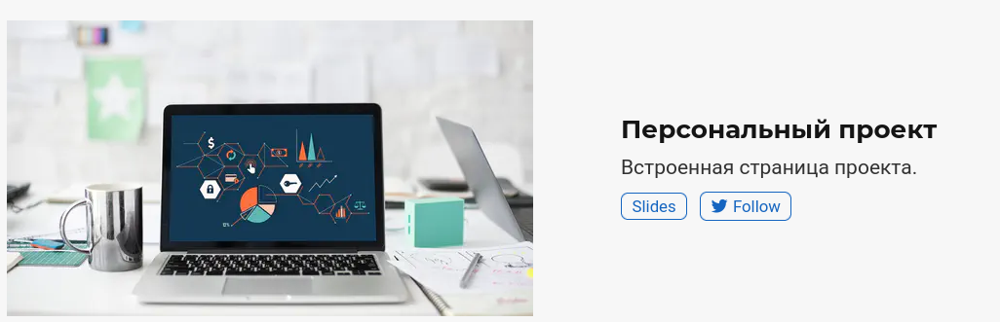
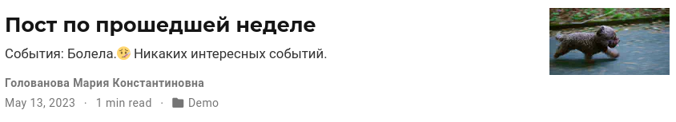
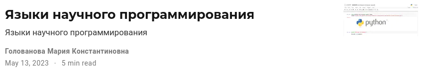

---
## Front matter
lang: ru-RU
title: Индивидуальный проект. Этап 5
subtitle: Операционные системы
author:
  - Голованова Мария Константиновна
institute:
  - Российский университет дружбы народов, Москва, Россия
date: 13 мая 2023

## i18n babel
babel-lang: russian
babel-otherlangs: english

## Formatting pdf
toc: false
toc-title: Содержание
slide_level: 2
aspectratio: 169
section-titles: true
theme: metropolis
header-includes:
 - \metroset{progressbar=frametitle,sectionpage=progressbar,numbering=fraction}
 - '\makeatletter'
 - '\beamer@ignorenonframefalse'
 - '\makeatother'
---

# Информация

## Докладчик

* Голованова Мария Константиновна
  * НММбд-01-22, 1132226478
  * Факультет физико-математических и естественных наук
  * Российский университет дружбы народов

# Цель работы

- Научиться создавать собственный сайт.

# Задание

Добавить с сайту все остальные элементы:
- Сделать записи для персональных проектов.
- Сделать пост по прошедшей неделе.
- Добавить пост на тему по выбору:
  Языки научного программирования.

# Выполнение лабораторной работы

## 1

- Я сделала записи для персональных проектов (рис.1).

{.columnwidth=70%}

## 2

- Я сделала пост по прошедшей неделе (рис.2).

{.columnwidth=70%}

## 3

- Я добавила пост на тему "Языки научного программирования" (рис.3).

{.columnwidth=70%}

# Выводы

- Я выполнила 5 этап создания собственного сайта.

