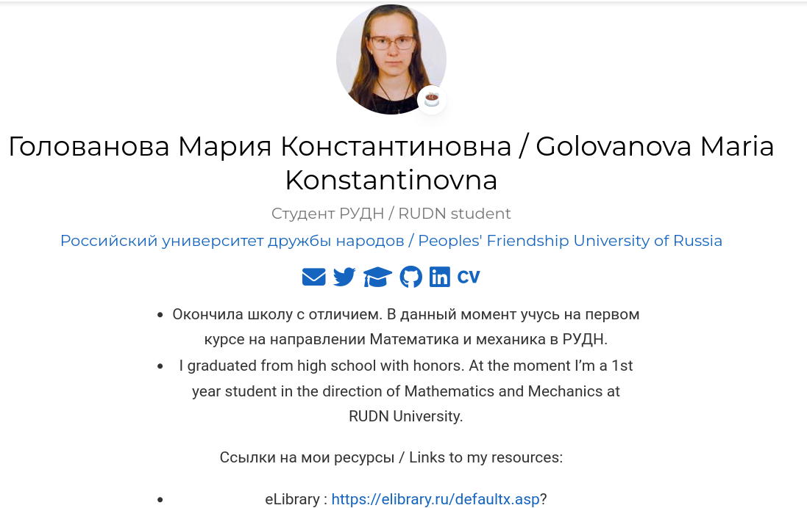
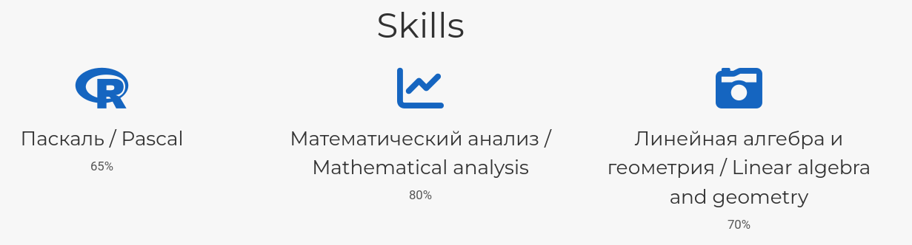
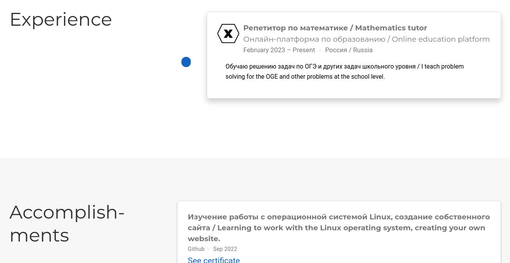
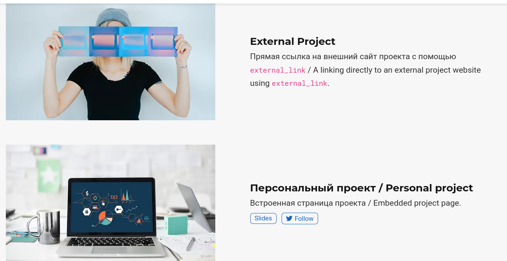
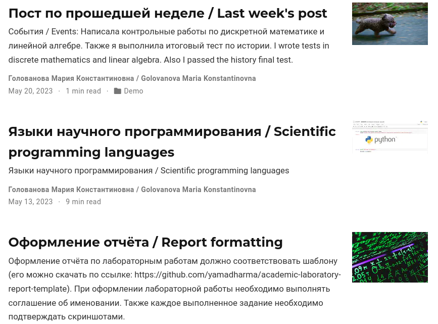
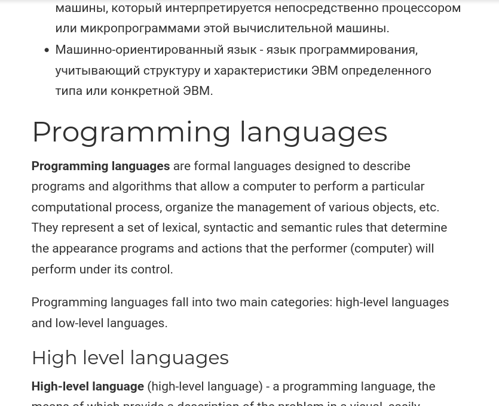

---
## Front matter
lang: ru-RU
title: Индивидуальный проект. Этап 6
subtitle: Операционные системы
author:
  - Голованова Мария Константиновна
institute:
  - Российский университет дружбы народов, Москва, Россия
date: 20 мая 2023

## i18n babel
babel-lang: russian
babel-otherlangs: english

## Formatting pdf
toc: false
toc-title: Содержание
slide_level: 2
aspectratio: 169
section-titles: true
theme: metropolis
header-includes:
 - \metroset{progressbar=frametitle,sectionpage=progressbar,numbering=fraction}
 - '\makeatletter'
 - '\beamer@ignorenonframefalse'
 - '\makeatother'
---

# Информация

## Докладчик

* Голованова Мария Константиновна
  * НММбд-01-22, 1132226478
  * Факультет физико-математических и естественных наук
  * Российский университет дружбы народов

# Цель работы

- Научиться создавать собственный сайт.

# Задание

- Размещение двуязычного сайта на Github:

- Сделать поддержку английского и русского языков.
- Разместить элементы сайта на обоих языках.
- Разместить контент на обоих языках.
- Сделать пост по прошедшей неделе.
- Добавить пост на тему по выбору (на двух языках).

# Выполнение лабораторной работы

## 1

- Я сделала поддержку английского и русского языков и разместила элементы сайта на обоих языках (рис.1, рис.2).

{.columnwidth=50%}

## 2

{.columnwidth=70%}

## 3

 - Я разместила контент на обоих языках (рис.3, рис.4).

{.columnwidth=50%}

## 4

{.columnwidth=60%}

## 5

 -  Я сделала пост по прошедшей неделе и добавила пост на тему по выбору (на двух языках) (рис.5, рис.6).

{.columnwidth=40%}

## 6

{.columnwidth=70%}

# Выводы

- Я выполнила 6 этап индивидуального проекта и научилась создавать собственный сайт.

